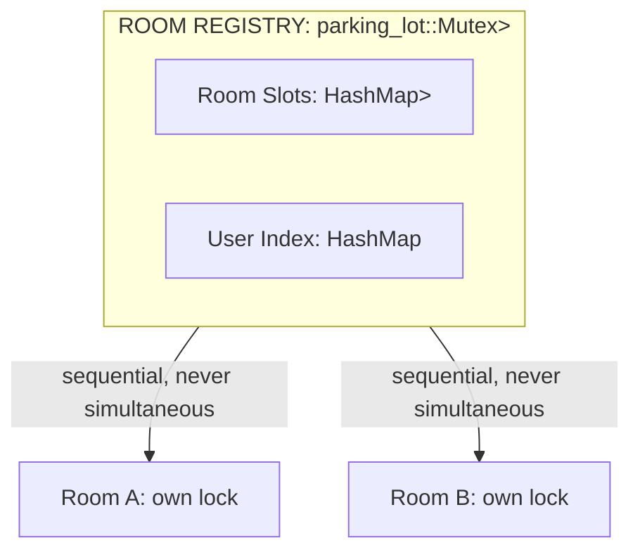

# Room Registry: Design Specification & Concurrency Analysis

**Status**: Implementation-ready specification, amended 2026-04-11 with stream_room bridge integration
**Date**: 2026-04-06
**Amended**: 2026-04-11
**Scope**:
- `backend/src/stream/room_registry.rs` (new file)
- `backend/src/stream/stream_room.rs` (modifications: `LeaveDispatcher` bridge trait, `LeaveReason` / `LeaveDisposition` / `MemberLeftResult`, `RoomProtocol` callback changes, `with_dispatcher`, dispatcher storage, and post-lock cleanup wiring at the cleanup / `remove()` / `reserve_pending` call sites)
- `backend/src/stream/mod.rs` (re-export the registry surface and the new public `stream_room` bridge/protocol types)
- `backend/src/stream/tests/mod.rs`, `backend/src/stream/tests/room_registry.rs`, and `backend/src/stream/tests/bridge_integration.rs` (test module hookup and new tests)

---

## 1. Abstract

This document specifies a generic, thread-safe room registry. The registry manages room lifecycles (loading, active, destroyed), maintains a `user_id -> room(s)` index with **structural** cardinality constraints, and deduplicates concurrent room loading. It stores `Arc<R>` for any `R: Send + Sync + 'static` without inspecting or invoking methods on `R`. Concurrency complexity remains within the registry; rooms operate as independent actors with own locks. The registry optionally supports rejoins: rooms transition a user's index entry to `Reserved` on disconnect, allowing slot reclamation via `claim_reserved` without reloading. The Live→Reserved (or Live→Leave) transition is routed through a `LeaveDispatcher` bridge (see §5.6 and §7.10 for the concrete `RegistryLink`), so the **protocol** — not the application — decides the disposition from inside `on_member_left` under its own lock, while the dispatcher fires after the room lock has been released to preserve INV-3. Identity-safe dispatch across ULID-reused slots (persistent rooms whose ULIDs are stable across every in-memory incarnation) is guaranteed via a per-slot monotonic `u64` incarnation counter compared atomically under the registry lock — see §3.5, §6.1 INV-5, and §7.4x / §7.4y / §7.5x.

The registry is generic over a **`UserSlot` trait** abstracting per-user index storage. Two implementations ship: `SingleSlot` and `UnlimitedSlot<N>`. Each guarantees zero overhead in memory layout and code generation. A registry strictly limiting one room per user stores a bare `UserIndexEntry` without `Option`, `SmallVec`, or runtime capacity fields. `UnlimitedSlot<N>` uses `SmallVec<[UserIndexEntry; N]>` internally: no heap allocation when the user is in at most `N` rooms simultaneously.

The design implements **optimistic concurrency control** with **no lock nesting**. A single `parking_lot::Mutex` protects internal maps, typically held only for synchronous HashMap operations (single-digit microseconds under uncontended conditions). Async work (database loading, stream opening) executes outside the lock. Room-internal operations (broadcast, kick, state mutation) strictly bypass the registry lock.

This specification is self-contained requiring no prior context beyond referenced codebase files (Section 13).

---

## 2. Problem Statement

### 2.1 What We Are Building

A module-level utility that:

- Stores rooms identified by external `Ulid` keys
- Tracks user-room associations via reverse index
- Enforces a **structural** maximum on concurrent user rooms, chosen at the type level via a `UserSlot` implementation
- Deduplicates concurrent attempts to load the same room into memory
- Provides cancel-safe operations with RAII-based rollback

### 2.2 Requirements

**R1 — External Room IDs.** Callers assign room ULIDs. A ULID originates from `Ulid::new()` or database records. One ULID identically maps to one logical room.

**R2 — Structural Per-User Room Limit.** `S: UserSlot` enforces per-user cardinality at compile time. `SingleSlot` strictly caps at one room with zero bookkeeping. `UnlimitedSlot<N>` allows uncapped rooms, stored in a `SmallVec<[UserIndexEntry; N]>` that uses inline storage for at most `N` simultaneous rooms before spilling to the heap. No runtime `max_rooms_per_user` configuration exists.

**R3 — Loading Deduplication.** For unmapped rooms, callers provide an async loader function. Concurrent loader calls for the same room execute exactly once. Subsequent callers that reach the slot-state check without already failing user-index validation receive `RoomLoading` and must retry. Retries post-activation return the identical `Arc<R>` instance (verified via `Arc::ptr_eq`).

**R4 — Room Agnosticism.** The registry stores `Arc<R>` and manages its lifecycle. It ignores room internals and never invokes `R` methods. `R` satisfies `Send + Sync + 'static`.

**R5 — Room Independence.** Rooms operate independently. Room-level actions (broadcast, member management, state mutation) avoid registry lock contention. Registry and room locks are never held simultaneously.

**R6 — Cancel Safety.** Dropping futures cleanly rolls back registry state, preventing leaked index entries or stuck loading slots.

**R7 — No Lock Nesting.** Operations acquire at most one lock simultaneously. The registry lock is strictly released prior to room lock acquisition, eliminating deadlocks.

**R8 — Rejoin Support.** Opt-in per disconnect: in bridge-backed rooms, `on_member_left` chooses `LeaveDisposition::{Reserve, Leave}` under the room lock, the room releases that lock, and the dispatcher performs the registry mutation via `mark_reserved_if_matches` or `leave_if_matches`. Reserved entries consume slot capacity (`S::CAPACITY`). Users rejoin via `claim_reserved(user_id, room_id, generation)`, reusing existing `Arc<R>` without loader invocation. Failed or cancelled rejoins demote entries to `Reserved { same generation }` unless `destroy` already swept the slot. Destroy invalidates in-flight rejoins: they must fail at `ClaimGuard::commit()`, not succeed into a ghost room. The unchecked `mark_reserved` / `leave` APIs remain for immediate manual current-incarnation callers only.

**R9 — Identity Safety Under ULID Reuse.** Captured references to a room slot (`RegistryLink`, `ClaimGuard`) must no-op safely if the slot has been destroyed and replaced by a new incarnation with the same ULID. Implemented via per-slot monotonic `u64` incarnation counters, assigned in Phase 1 of `ensure_and_claim` / `ensure_room`, compared atomically under the registry lock before any identity-sensitive mutation. See §3.5 for the full rationale, §6.1 INV-5 for the invariant, and §5.5b (`LoaderContext`), §5.3 (`ClaimGuard`), §7.4x / §7.4y / §7.5x (`_if_matches` methods), and §7.10 (`RegistryLink`) for the machinery.

### 2.3 Non-Requirements

- **Atomic cross-system consistency**: Brief index/room discrepancies (microseconds to milliseconds) self-heal.
- **Automatic retry on `RoomLoading`**: Callers implement retries.
- **Room-internal membership tracking**: The registry tracks associations; rooms handle internal membership.
- **Stream/transport management**: Callers manage streams and transports post-room acquisition.
- **Backwards compatibility**: New module, no existing consumers.

---

## 3. Design Principles

### 3.1 Optimistic Concurrency Control

Traditional pessimistic concurrency (reserve slot, perform async work, finalize) introduces race conditions between pending states, destroys, cancellations, and cleanups.

This design implements **optimistic** concurrency: synchronously claim index entries under lock, perform async work, then commit. Failed or cancelled async work triggers claim rollbacks. The registry lock is held exclusively for synchronous claim/rollback operations (typically single-digit microseconds under uncontended conditions).

**Trade-off**: Duplicate join requests from misbehaving clients waste milliseconds of async I/O. This is acceptable because it isolates to bad clients, prevents resource leaks, and strictly maintains invariants.

### 3.2 No Lock Nesting

Operations acquire **at most one lock** at any time. The registry lock releases before room-level work begins. Registry methods never hold room locks. This eliminates deadlocks and lock-ordering bugs.

### 3.3 Room Agnosticism

`R` requires `Send + Sync + 'static`. The registry stores and returns `Arc<R>`, never dereferencing or invoking methods on it. Callers handle room-specific logic.

Consequences:

- Registry tests utilize trivial types (`R = ()`, `R = Ulid`) without transport dependencies.
- The registry applies to any room-like resource.
- Room implementations evolve independently.

### 3.4 Eventual Consistency for Non-Critical Properties

**Hard invariant**: Max rooms per user enforced atomically (count check and index insertion happen in one lock scope).

**Soft properties**: Index/room agreement is eventually consistent within the self-healing windows in `§6.2`. `S-3` remains the only structural zero-window property there; the other durations are typical or uncontended budgets, not correctness requirements.

### 3.5 Identity Safety Under ULID Reuse

**The hazard.** The registry supports **persistent rooms** whose ULIDs are assigned by the database, not by `Ulid::new()`, and are therefore reused across every in-memory incarnation of the same logical room. Each load of the room produces a fresh `Arc<R>` under the same key in `slots`. The registry sees these as successive slots under the same `Ulid`. Without identity awareness, any asynchronous cleanup that captured an `(room_id)` or `(user_id, room_id)` reference from incarnation #1 and fires after incarnation #2 has been installed under the same ULID will mutate state that belongs to incarnation #2.

Concrete example. A room `R` is loaded (incarnation #1). User A joins, disconnects; the cleanup task for user A is queued but has not yet fired. `R` is destroyed, then loaded again (incarnation #2). User A reconnects and joins incarnation #2 cleanly: `index[A] = {R, Live}`. The delayed cleanup task for user A from incarnation #1 now fires with its captured `Arc<R>` from incarnation #1, reads the protocol's `MemberLeftResult { disposition: LeaveDisposition::Reserve, .. }` from *incarnation #1's* state, drops the room lock, and calls the dispatcher. A naïve dispatcher would then call `registry.mark_reserved(A, R)`, which silently downgrades incarnation #2's live entry to `Reserved`. Similar corruption can fire from `destroy_after: true` (tearing down incarnation #2) and from `ClaimGuard::drop` across a destroy + reload window (rolling back incarnation #2's entries).

**The fix — per-slot incarnation counters.** The registry assigns a monotonic `u64` incarnation to every slot at creation time (in Phase 1 of `ensure_and_claim` / `ensure_room`, §7.2, §7.3). The incarnation is stamped on `Slot::Loading`, carried unchanged into `Slot::Active`, and captured at creation time by every identity-sensitive piece of state:

- `ClaimGuard` records it at guard construction (§5.3).
- `RegistryLink` records it at dispatcher construction via `LoaderContext::make_link()` (§5.5b, §7.10).

Every mutation that could be affected by ULID reuse compares incarnations under the same registry lock acquisition as the mutation:

- `ClaimGuard::drop` checks against `slots[room_id]` before each of its three rollback branches (§5.3).
- `RegistryLink` routes all three of its dispatch paths through identity-safe registry methods: `leave_if_matches` (§7.4x), `mark_reserved_if_matches` (§7.4y), and `destroy_if_matches` (§7.5x).

A mismatch is a pure no-op — no panic, no unreachable path, no error return — because the dispatcher or guard legitimately belongs to a slot that no longer exists, and the correct action is to do nothing. The unchecked `leave`, `mark_reserved`, and `destroy` methods remain available for callers that operate synchronously with the current incarnation (tests, shutdown paths, application-level Path A destroys on non-persistent rooms); they are clearly marked as "unchecked variants" in their doc comments and cross-reference the identity-safe alternatives.

This is a pure `u64` compare — no references, no cycles, no cache lines — and fits naturally into the existing single-mutex architecture. The incarnation lookup is a `HashMap::get` the registry would already be doing, and the compare is a sub-nanosecond register operation. Throughput is unaffected (§11).

**Why `Arc::ptr_eq` via `Weak<StreamRoom>` was rejected.** The obvious-looking alternative is to have the dispatcher hold a `Weak<StreamRoom<P>>` and compare via `Arc::ptr_eq` against the registry's stored `Arc<StreamRoom<P>>`. This creates a construction cycle: the `RegistryLink` is embedded in the `StreamRoom` via `Box<dyn LeaveDispatcher>` at `StreamRoom::with_dispatcher` time, but `Weak<StreamRoom>` can only be taken *after* the `Arc<StreamRoom>` exists. The only clean resolution is a post-construction "install" hook that breaks room-agnosticism (the registry would have to know about `StreamRoom`). A per-slot `u64` incarnation, captured through the loader context *before* the `Arc<StreamRoom>` exists, sidesteps the cycle entirely and preserves `R4` (Room Agnosticism).

---

## 4. Architecture

### 4.1 Component Diagram



### 4.2 Lock Topology

The registry contains exactly **one lock**: `parking_lot::Mutex<RegistryInner<R>>`.

Rule:

- **Registry lock -> release -> room work**
- **Room work -> release -> registry lock**

No code path holds both simultaneously. Deadlocks are structurally impossible.

The `LeaveDispatcher` bridge (§5.6, §6.3, §7.10) honours this rule: the room's cleanup task releases the room lock *before* invoking `dispatcher.dispatch_leave` or `dispatcher.dispatch_destroy`, which in turn acquire the registry lock. The dispatcher call therefore runs on the "Room work -> release -> registry lock" side of the rule, never on both sides at once.

### 4.3 Information Flow Per Operation

**ensure_and_claim**
- **Registry Lock:** ~3μs
- **Async Work:** loader (1-100ms)
- **Room Lock:** (caller)

**ensure_room**
- **Registry Lock:** ~3μs
- **Async Work:** loader (1-100ms)
- **Room Lock:** none

**leave**
- **Registry Lock:** ~2μs
- **Async Work:** none
- **Room Lock:** none

**mark_reserved**
- **Registry Lock:** ~2μs
- **Async Work:** none
- **Room Lock:** none

**claim_reserved**
- **Registry Lock:** ~2μs
- **Async Work:** none
- **Room Lock:** (caller)

**leave_if_reserved**
- **Registry Lock:** ~2μs
- **Async Work:** none
- **Room Lock:** none

**destroy**
- **Registry Lock:** ~5-20μs
- **Async Work:** none
- **Room Lock:** none

**lookup_user**
- **Registry Lock:** ~1μs
- **Async Work:** none
- **Room Lock:** none

**lookup_room**
- **Registry Lock:** ~1μs
- **Async Work:** none
- **Room Lock:** none

*(caller)* indicates the caller may acquire a room lock after the registry method returns. The registry method itself does not.

**Dispatcher methods** (`LeaveDispatcher::dispatch_leave`, `LeaveDispatcher::dispatch_destroy` — §5.6, §7.10) are *not* `RoomRegistry` methods and are therefore omitted from the table above. Their cost profile is a `Weak::upgrade` + vtable call (sub-microsecond) plus exactly one inner `RoomRegistry` call: `leave_if_matches` or `mark_reserved_if_matches` for `dispatch_leave` (~2μs registry lock), and `destroy_if_matches` for `dispatch_destroy` (~5-20μs registry lock). Both are invoked by the room's cleanup task with the room lock already released (§6.3).

---

## 5. Data Structures

Registry core types live in `backend/src/stream/room_registry.rs`. The bridge trait and protocol-facing integration types in §5.6-§5.7 live in `backend/src/stream/stream_room.rs`. The concrete `RegistryLink` remains in `room_registry.rs` (§7.10).

### 5.1 Core Types

```rust
use std::sync::{Arc, Weak};
use std::sync::atomic::{AtomicU64, Ordering};
use std::collections::HashMap;

use ahash::RandomState;
use parking_lot::Mutex;
use smallvec::SmallVec;
use ulid::Ulid;

/// Thread-safe room registry with user index and loading deduplication.
///
/// Generic over:
/// - `R`: the room type. The registry stores `Arc<R>` and never inspects or
///   invokes methods on `R`.
/// - `S`: the per-user index slot type. Defaults to `SingleSlot`. Concrete
///   deployments should pick the tightest slot for their needs: `SingleSlot`
///   for exclusive registries, `UnlimitedSlot<N>` for multi-room ones.
///
/// Wrap in `Arc` and share across tasks. Methods that create `ClaimGuard`s
/// require `self: &Arc<Self>`.
pub struct RoomRegistry<R: Send + Sync + 'static, S: UserSlot = SingleSlot> {
    inner: Mutex<RegistryInner<R, S>>,
    next_generation: AtomicU64,  // monotonic counter for Reserved generations
    next_incarnation: AtomicU64, // monotonic counter for per-slot incarnations
                                 // (see §3.5, §5.2, §5.5b LoaderContext).
                                 // Initialized to 1; 0 is reserved as "never assigned".
}

/// Protected interior state.
struct RegistryInner<R: Send + Sync + 'static, S: UserSlot> {
    /// Room slots, keyed by externally-provided ULID.
    slots: HashMap<Ulid, Slot<R>, RandomState>,

    /// Reverse index: user_id → per-user slot containing their index entries.
    ///
    /// The slot type `S` structurally enforces the per-user room limit. A
    /// `HashMap` entry exists if and only if the slot contains at least one
    /// `UserIndexEntry` — empty slots are removed eagerly (see `S::remove`
    /// returning `RemovedAndEmpty`).
    index: HashMap<i32, S, RandomState>,
}

/// State of a user's index entry for a specific room.
#[derive(Debug, Clone, Copy, PartialEq, Eq)]
pub enum EntryState {
    /// User is actively joined (or pending join) in the room.
    Live,
    /// User disconnected; the slot is held open for rejoin.
    /// The `generation` identifies this specific reservation epoch.
    Reserved { generation: u64 },
}

/// A single entry in the user index: the room the user is associated with
/// and the current state of that association.
///
/// `Clone` is required because `lookup_user` clones the containing slot.
#[derive(Debug, Clone, Copy)]
pub struct UserIndexEntry {
    pub room_id: Ulid,
    pub state: EntryState,
}
```

`RoomRegistry::new` must initialize `next_generation: AtomicU64::new(1)` and `next_incarnation: AtomicU64::new(1)`. Both counters reserve 0 as a sentinel meaning "never assigned"; no live `EntryState::Reserved { generation }` ever uses generation 0. No live `Slot::{Loading, Active}` ever uses incarnation 0.

### 5.1a `UserSlot` — Per-User Index Storage Abstraction

The per-user index storage is abstracted behind a trait so that different cardinality regimes pay zero cost over each other. The registry never stores a runtime room limit — the slot type is the limit.

```rust
/// Outcome of removing an entry from a `UserSlot`.
#[derive(Debug, Clone, Copy, PartialEq, Eq)]
pub enum RemoveResult {
    /// No entry matching the given room_id existed in the slot.
    NotFound,
    /// The entry was removed and the slot still contains other entries.
    Removed,
    /// The entry was removed and the slot is now logically empty. The caller
    /// MUST remove the slot from the outer `HashMap` to preserve the
    /// "HashMap entry exists iff slot is non-empty" invariant.
    RemovedAndEmpty,
}

/// Per-user index storage. Structurally enforces the per-user room cardinality.
///
/// # Contract
///
/// - A slot that exists in the registry's `HashMap<i32, S>` always contains
///   at least one `UserIndexEntry`. "Empty slot in the map" is not a valid
///   state; on removal, the registry deletes the map key on
///   `RemoveResult::RemovedAndEmpty`.
/// - `new_with` is the ONLY constructor and is only called on the vacant path.
///   There is no `Default` bound.
/// - `insert` is only called on the occupied path (slot already contains
///   at least one entry from a prior `new_with`). It must return `false` if
///   and only if the structural capacity has been reached; the registry
///   converts `false` into `RegistryError::MaxRoomsReached`.
/// - All methods are synchronous and must not take any lock. They are called
///   while the registry `Mutex` is held; cancel safety depends on this.
pub trait UserSlot: Send + Sync + Sized + 'static {
    /// Structural capacity. `None` = unlimited. Used for the `max` field of
    /// `RegistryError::MaxRoomsReached` (unlimited slots can never produce
    /// that error, so the value is never observed for `None`).
    const CAPACITY: Option<usize>;

    /// Construct a new slot containing exactly one initial entry.
    ///
    /// Only called on the `Entry::Vacant` path — never called on an existing
    /// slot. Implementations may assume the slot starts with exactly this
    /// one entry.
    fn new_with(entry: UserIndexEntry) -> Self;

    /// Number of entries currently in the slot.
    fn len(&self) -> usize;

    /// True if the slot contains no entries. For slots whose structural
    /// invariant is "never empty while in the HashMap" (`SingleSlot`), this
    /// method is not relied upon for map cleanup — the registry uses
    /// `RemoveResult::RemovedAndEmpty` for that purpose. `is_empty` is
    /// provided for symmetry and diagnostics.
    fn is_empty(&self) -> bool;

    /// Find an entry by room_id.
    fn find(&self, room_id: Ulid) -> Option<&UserIndexEntry>;

    /// Find an entry by room_id, mutably.
    fn find_mut(&mut self, room_id: Ulid) -> Option<&mut UserIndexEntry>;

    /// Add an entry. Returns `false` if the slot is already at structural
    /// capacity. Only called on the occupied path (slot already non-empty).
    fn insert(&mut self, entry: UserIndexEntry) -> bool;

    /// Remove the entry matching `room_id`, if any. See `RemoveResult` for
    /// the three-valued return. The caller MUST delete the outer HashMap
    /// key on `RemovedAndEmpty`.
    fn remove(&mut self, room_id: Ulid) -> RemoveResult;

    /// Iterate all entries.
    fn for_each(&self, f: impl FnMut(&UserIndexEntry));
}
```

### 5.1b `UserSlot` Implementations

Two first-class implementations ship with the registry:

```rust
/// Exactly-one room per user. Zero overhead over a bare `UserIndexEntry`.
///
/// Invariant: a `SingleSlot` that exists in the registry's `index` map
/// always holds exactly one entry. There is no `Option` wrapper; the slot is
/// never "empty while in the map".
#[derive(Debug, Clone)]
pub struct SingleSlot(UserIndexEntry);

impl UserSlot for SingleSlot {
    const CAPACITY: Option<usize> = Some(1);

    fn new_with(entry: UserIndexEntry) -> Self { Self(entry) }
    fn len(&self) -> usize { 1 }
    /// Always `false`. A `SingleSlot` present in the map is by construction
    /// non-empty. The registry relies on `remove` returning
    /// `RemovedAndEmpty`, not on polling `is_empty`, to know when to evict
    /// the map key.
    fn is_empty(&self) -> bool { false }

    fn find(&self, room_id: Ulid) -> Option<&UserIndexEntry> {
        (self.0.room_id == room_id).then_some(&self.0)
    }
    fn find_mut(&mut self, room_id: Ulid) -> Option<&mut UserIndexEntry> {
        (self.0.room_id == room_id).then_some(&mut self.0)
    }

    /// Always returns `false`: a `SingleSlot` is at capacity after
    /// `new_with`, and `insert` is only called on the occupied path.
    fn insert(&mut self, _entry: UserIndexEntry) -> bool { false }

    fn remove(&mut self, room_id: Ulid) -> RemoveResult {
        if self.0.room_id == room_id {
            // No in-place "clear" — we signal the registry to drop the
            // whole slot from the map.
            RemoveResult::RemovedAndEmpty
        } else {
            RemoveResult::NotFound
        }
    }

    fn for_each(&self, mut f: impl FnMut(&UserIndexEntry)) {
        f(&self.0);
    }
}

/// Unbounded per-user capacity with inline storage for the common case.
///
/// Uses `SmallVec<[UserIndexEntry; N]>` internally. When the user is in at
/// most `N` rooms simultaneously, no heap allocation occurs; beyond `N` rooms
/// it spills to the heap automatically. There is no structural capacity cap —
/// `insert` always succeeds.
///
/// `N` is a const generic with default `4`. Choose it to match the **typical**
/// concurrent-room count for your workload:
/// - `N = 1`: user is almost always in exactly one room (e.g. exclusive game +
///   rare lobby overlap).
/// - `N = 4`: lobby + game + spectator + tournament (common scenario).
/// - Larger values reduce spill probability at the cost of larger stack frames.
///
/// Deployments that need a **hard cap** (not just an inline hint) should use
/// `SingleSlot` (cap = 1) or implement a custom `UserSlot`.
#[derive(Debug, Clone)]
pub struct UnlimitedSlot<const N: usize = 4>(SmallVec<[UserIndexEntry; N]>);

impl<const N: usize> UserSlot for UnlimitedSlot<N> {
    const CAPACITY: Option<usize> = None;

    fn new_with(entry: UserIndexEntry) -> Self {
        let mut sv = SmallVec::new();
        sv.push(entry);
        Self(sv)
    }

    fn len(&self) -> usize { self.0.len() }
    fn is_empty(&self) -> bool { self.0.is_empty() }

    fn find(&self, room_id: Ulid) -> Option<&UserIndexEntry> {
        self.0.iter().find(|e| e.room_id == room_id)
    }
    fn find_mut(&mut self, room_id: Ulid) -> Option<&mut UserIndexEntry> {
        self.0.iter_mut().find(|e| e.room_id == room_id)
    }

    /// Always returns `true`: `UnlimitedSlot` has no structural capacity.
    fn insert(&mut self, entry: UserIndexEntry) -> bool {
        self.0.push(entry);
        true
    }

    fn remove(&mut self, room_id: Ulid) -> RemoveResult {
        if let Some(idx) = self.0.iter().position(|e| e.room_id == room_id) {
            self.0.swap_remove(idx);
            if self.0.is_empty() { RemoveResult::RemovedAndEmpty } else { RemoveResult::Removed }
        } else {
            RemoveResult::NotFound
        }
    }

    fn for_each(&self, mut f: impl FnMut(&UserIndexEntry)) {
        for e in &self.0 { f(e); }
    }
}
```

**Choosing a slot type:**

**SingleSlot**
- **Capacity:** 1 (hard cap)
- **Memory per user:** `sizeof(UserIndexEntry)` — no discriminant, no SmallVec header, no length
- **Use when:** Registry is strictly exclusive (a user is in at most one room at a time)

**UnlimitedSlot\<N\>**
- **Capacity:** ∞ (no cap, but inline storage for ≤ N entries)
- **Memory per user:** `SmallVec` inline for `len ≤ N`, heap-spill otherwise
- **Use when:** No hard cap needed, or cap enforced by application logic; `N` should match the typical concurrent-room count to avoid heap allocation

The default type parameter `S = SingleSlot` suits the most common case (exclusive registries). For multi-room use cases, specify `S = UnlimitedSlot<N>` explicitly.

### 5.2 Slot

```rust
/// The state of a room slot in the registry.
///
/// Every slot carries a monotonic `incarnation: u64` assigned by
/// `RoomRegistry::next_incarnation` at slot-creation time. The incarnation
/// is the identity token used by `ClaimGuard`, `RegistryLink`, and every
/// `_if_matches` registry method to distinguish "the slot I was talking
/// about" from a later slot with the same ULID after a destroy + reload
/// cycle (ULID reuse — see §3.5 and §15 Glossary). The incarnation is
/// assigned exactly once, in Phase 1 of `ensure_and_claim` / `ensure_room`
/// (when the `Loading` slot is inserted), and carried unchanged into the
/// `Active` slot in Phase 3. A loader that retries after a failed load
/// re-enters Phase 1 and receives a fresh incarnation.
enum Slot<R: Send + Sync + 'static> {
    /// An async loader is running for this room. Exactly one task owns
    /// this slot. Other callers receive `RegistryError::RoomLoading`.
    Loading { incarnation: u64 },

    /// Room is loaded and available.
    Active { room: Arc<R>, incarnation: u64 },
}
```

### 5.3 ClaimGuard

```rust
/// RAII guard for an in-flight registry claim.
///
/// Created by `ensure_and_claim`, and internally by `ensure_room` when a
/// load must roll back a `Loading` slot without any user index entry.
/// Tracks a loading slot and, when applicable, an index entry. `commit()` is
/// the checked finalization seam: it revalidates that the same slot
/// incarnation still owns the claim before disarming the guard. On drop (if
/// not committed), the guard rolls back all claimed state.
///
/// # Warning
///
/// Dropping this guard without calling `commit()` rolls back any
/// uncommitted claimed state.
/// Binding to `_` (e.g. `let (room, _) = ...`) drops the guard immediately.
/// Always bind to a named variable and call `commit()` on success.
///
/// `commit()` MUST be called with no room lock held.
/// An armed guard MUST NOT drop while a room lock is held.
/// If room-local work required taking a room lock, release that lock first,
/// then either call `commit()` or let the guard drop.
///
/// # Commit Behavior
///
/// `commit()` succeeds only if, at the moment of finalization under the
/// registry lock:
/// - `slots[room_id]` is still `Active`
/// - that slot's `incarnation` still equals `self.incarnation`
/// - and, when `user_id` is `Some`, `index[user_id]` still contains a `Live`
///   entry for `room_id`
///
/// If any check fails, `commit()` returns
/// `Err(ClaimCommitError::ClaimLost { .. })` and leaves the guard armed.
/// The caller MUST treat this as failed finalization, immediately undo any
/// room-local activation that already happened, and return failure. `destroy`
/// is registry-authoritative: room-local work may run against a held `Arc<R>`,
/// but it MUST NOT report success once finalization fails.
///
/// `commit()` acquires the registry mutex and therefore MUST run only after
/// all room-local locks for this activation path have been released.
/// # Drop Behavior
///
/// If not committed, behavior depends on the `ClaimGuardKind`. Every branch
/// of the drop path is **incarnation-checked** (see `self.incarnation`
/// below) so that a drop that runs after its slot has been destroyed and
/// replaced by a new incarnation under the same ULID touches only the
/// incarnation it owns — never the current one. See §3.5 and §6.1 INV-5
/// for the full rationale.
///
/// **FreshJoin:**
/// 1. Attempt to upgrade `Weak<RoomRegistry>` → if registry is dropped, done.
/// 2. Acquire registry lock.
/// 3. Inspect `inner.slots.get(&self.room_id)`.
///    - If `Some(Slot::Active { incarnation, .. })` with `incarnation !=
///      self.incarnation`: the slot belongs to a different (later)
///      incarnation. Our incarnation was destroyed and replaced; any
///      index entry we created was already swept by that destroy. Skip
///      the index rollback entirely — there is nothing of ours to remove.
///    - Otherwise (slot absent, or slot matches `self.incarnation`, or
///      `Loading { incarnation: self.incarnation }`): if `user_id` is
///      `Some`, remove `room_id` from `index[user_id]`. Remove the user's
///      index entry entirely if the set becomes empty.
/// 4. If `owns_loading_slot` is true AND `published` is false:
///    remove `slots[room_id]` only if it is currently `Slot::Loading {
///    incarnation }` with `incarnation == self.incarnation`. If a
///    different incarnation is loading under the same ULID (our Loading
///    was destroyed and a fresh Loading was installed by another task),
///    leave it alone.
/// 5. Release lock.
///
/// **Rejoin:**
/// 1. Attempt to upgrade `Weak<RoomRegistry>` → if registry is dropped, done.
/// 2. Acquire registry lock.
/// 3. Verify that `inner.slots.get(&self.room_id)` is `Some(Slot::Active {
///    incarnation, .. })` with `incarnation == self.incarnation`. If not
///    (slot absent, slot is `Loading`, or slot has a different
///    incarnation), the `Live` entry — if any — belongs to a different
///    incarnation and must NOT be demoted. Skip the demotion entirely.
/// 4. Otherwise: find `index[user_id]` entry for `room_id`. If found and
///    currently `Live`, set it back to `Reserved { generation:
///    self.generation }`. If not found (destroy removed it) or already
///    `Reserved`, no-op.
/// 5. Release lock. **Never touches `slots`.**
///
/// # Identity Safety
///
/// Every mutation performed by drop is gated on the slot at `self.room_id`
/// having the same `incarnation` this guard was constructed against. A
/// concurrent `destroy` that replaced our incarnation with a new one makes
/// every drop-path mutation a no-op, so a stale `ClaimGuard` cannot
/// corrupt a newer incarnation's state under the same ULID. The
/// incarnation check runs under the same registry lock acquisition as the
/// mutation — no TOCTOU. See §6.1 INV-5.
#[derive(Debug, Clone, Copy, PartialEq, Eq, thiserror::Error)]
pub enum ClaimCommitError {
    #[error("claim lost before finalization for room {room_id}")]
    ClaimLost { room_id: Ulid, user_id: Option<i32> },
}

#[must_use = "dropping without commit() rolls back uncommitted registry state"]
pub struct ClaimGuard<R: Send + Sync + 'static, S: UserSlot = SingleSlot> {
    registry: Weak<RoomRegistry<R, S>>,
    room_id: Ulid,
    /// Slot incarnation this guard was created against. Compared against
    /// `slots[room_id]`'s current incarnation under the registry lock in
    /// every drop-path mutation to reject stale rollbacks under ULID reuse.
    incarnation: u64,
    user_id: Option<i32>,   // Some if an index entry was claimed
    kind: ClaimGuardKind,
    committed: bool,         // true if commit() succeeded
}

enum ClaimGuardKind {
    /// Fresh join: may own a Loading slot and/or an index entry.
    FreshJoin {
        owns_loading_slot: bool,
        published: bool,
    },
    /// Rejoin: index entry was promoted from Reserved → Live.
    /// On drop (uncommitted): demote back to Reserved { generation }.
    /// Never touches slots.
    Rejoin {
        generation: u64,
    },
}

impl<R: Send + Sync + 'static, S: UserSlot> ClaimGuard<R, S> {
    /// Checked finalization. Revalidates the slot / claim under the registry
    /// lock and disarms the guard only on success.
    pub fn commit(&mut self) -> Result<(), ClaimCommitError>;

    /// The room ULID this guard is associated with.
    pub fn room_id(&self) -> Ulid {
        self.room_id
    }

    /// The user ID this guard claimed an index entry for, if any.
    pub fn user_id(&self) -> Option<i32> {
        self.user_id
    }

    /// The slot incarnation this guard was created against.
    pub fn incarnation(&self) -> u64 {
        self.incarnation
    }
}

impl<R: Send + Sync + 'static, S: UserSlot> Drop for ClaimGuard<R, S> {
    fn drop(&mut self) {
        if self.committed {
            return;
        }
        let Some(registry) = self.registry.upgrade() else {
            return;
        };
        let mut inner = registry.inner.lock();
        match self.kind {
            ClaimGuardKind::FreshJoin { owns_loading_slot, published } => {
                // Identity check: only roll back the index entry if the
                // slot at `self.room_id` is either absent OR matches our
                // incarnation. A different incarnation means our slot was
                // destroyed and replaced; any index entry we created was
                // swept by that destroy — we must not touch the new
                // incarnation's entry.
                let slot_ok_for_index = match inner.slots.get(&self.room_id) {
                    None => true,
                    Some(Slot::Loading { incarnation })
                    | Some(Slot::Active { incarnation, .. }) => {
                        *incarnation == self.incarnation
                    }
                };
                if slot_ok_for_index {
                    // Rollback index entry via `S::remove`. Drop the outer
                    // HashMap key if the slot becomes empty.
                    if let Some(user_id) = self.user_id {
                        if let Some(slot) = inner.index.get_mut(&user_id) {
                            match slot.remove(self.room_id) {
                                RemoveResult::RemovedAndEmpty => {
                                    inner.index.remove(&user_id);
                                }
                                RemoveResult::Removed | RemoveResult::NotFound => {}
                            }
                        }
                    }
                }
                // Rollback loading slot (only if we own it, never
                // published, AND the currently-present Loading slot
                // matches our incarnation).
                if owns_loading_slot && !published {
                    if matches!(
                        inner.slots.get(&self.room_id),
                        Some(Slot::Loading { incarnation }) if *incarnation == self.incarnation
                    ) {
                        inner.slots.remove(&self.room_id);
                    }
                }
            }
            ClaimGuardKind::Rejoin { generation } => {
                // Identity check: only demote if the slot at
                // `self.room_id` is currently `Active` with our
                // incarnation. If the slot is absent, loading, or a
                // different incarnation, any Live entry under that key
                // belongs to a different incarnation — leave it alone.
                let slot_matches = matches!(
                    inner.slots.get(&self.room_id),
                    Some(Slot::Active { incarnation, .. }) if *incarnation == self.incarnation
                );
                if !slot_matches {
                    return;
                }
                // Demote the entry back to Reserved { generation } if still Live.
                // Never touches slots.
                if let Some(user_id) = self.user_id {
                    if let Some(slot) = inner.index.get_mut(&user_id) {
                        if let Some(entry) = slot.find_mut(self.room_id) {
                            if entry.state == EntryState::Live {
                                entry.state = EntryState::Reserved { generation };
                            }
                            // If already Reserved or entry missing: no-op.
                        }
                    }
                }
            }
        }
    }
}
```

### 5.4 Error Types

```rust
/// Errors from registry operations.
#[derive(Debug, thiserror::Error)]
pub enum RegistryError {
    /// User has reached the structural maximum number of simultaneous rooms.
    ///
    /// `max` is the slot type's `S::CAPACITY`. It is `Some(N)` when the slot
    /// type has a finite structural capacity and `None` for `UnlimitedSlot`.
    /// Because `UnlimitedSlot::insert` unconditionally returns `true`, the
    /// `None` variant is unreachable in practice — the registry never
    /// produces a `MaxRoomsReached` error for an unlimited slot — but the
    /// type is honest about the domain rather than smuggling a sentinel
    /// value (`0` or `usize::MAX`) into the error.
    #[error("user {user_id} has reached the room limit ({max:?})")]
    MaxRoomsReached { user_id: i32, max: Option<usize> },

    /// The room is currently being loaded by another task. Retry later.
    #[error("room {room_id} is currently loading")]
    RoomLoading { room_id: Ulid },

    /// The user already has an index claim for this room (already joining
    /// or already joined). Used by fresh-claim paths such as
    /// `ensure_and_claim`, not by `claim_reserved` when the reservation is gone.
    #[error("user {user_id} already claimed in room {room_id}")]
    AlreadyClaimed { user_id: i32, room_id: Ulid },

    /// The async loader function returned an error.
    #[error("failed to load room {room_id}: {source}")]
    LoadFailed {
        room_id: Ulid,
        #[source]
        source: anyhow::Error,
    },

    /// The loading slot was removed while the loader was running
    /// (room was destroyed during loading).
    #[error("room {room_id} was destroyed during loading")]
    LoadingAborted { room_id: Ulid },

    /// Room not found in registry (never loaded, already destroyed, or a
    /// defensive invariant-violation path such as a reservation whose slot was
    /// already swept).
    #[error("room {room_id} not found")]
    RoomNotFound { room_id: Ulid },

    /// The user has a Reserved index entry for this room. Use `claim_reserved`
    /// with the returned generation to rejoin.
    #[error("user {user_id} has a reserved slot in room {room_id} (generation {generation})")]
    UserReserved { user_id: i32, room_id: Ulid, generation: u64 },

    /// `claim_reserved` was called but the reservation no longer exists.
    #[error("reservation for user {user_id} in room {room_id} no longer exists")]
    ReservationNotFound { user_id: i32, room_id: Ulid },

    /// The generation provided to `claim_reserved` does not match the current
    /// Reserved entry (the slot was removed and re-reserved under a newer generation).
    #[error("generation mismatch for user {user_id} in room {room_id}")]
    GenerationMismatch { user_id: i32, room_id: Ulid },

    /// `claim_reserved` was called but the user's index entry is Live, not Reserved.
    /// The user is already actively joined.
    #[error("user {user_id} is already live in room {room_id}")]
    AlreadyLive { user_id: i32, room_id: Ulid },
}
```

### 5.5 Destroy Result

```rust
/// Returned by `destroy()` with information about what was removed.
pub struct DestroyResult<R: Send + Sync + 'static> {
    /// The room that was destroyed, if it was Active. `None` if the room
    /// was still in `Loading` state (no published `Arc<R>` exists in the
    /// registry slot yet, though the loader may already hold one locally).
    /// The `Arc` is valid but the room is no longer in the registry.
    /// Caller should perform room-level cleanup (cancel streams, notify
    /// members, etc.).
    pub room: Option<Arc<R>>,

    /// User IDs that had index entries pointing to this room.
    /// These entries have been removed from the index.
    pub users: Vec<i32>,
}
```

### 5.5b `LoaderContext` — Identity-Bearing Loader Input

`ensure_and_claim` and `ensure_room` pass a `LoaderContext<R, S>` to the
loader closure so the loader can construct identity-bearing bridges (most
commonly a `RegistryLink`, §7.10) that are safe under ULID reuse. Without
this context the loader would have to `Arc::downgrade` the registry and
pass `room_id` in separately, and — crucially — would have no way to
capture the correct `incarnation` at slot-creation time.

```rust
/// Context passed to loader closures so they can build identity-bearing
/// bridges (e.g. `RegistryLink`) before the room is published.
///
/// Every field is captured at Phase 1 of the loader call (the moment the
/// `Slot::Loading` was installed under the registry lock), and the
/// `incarnation` is the incarnation stamped on that `Slot::Loading`. Any
/// bridge built from this context will be bound to this specific slot
/// incarnation, so dispatches from it will be rejected by the registry's
/// `_if_matches` methods if the slot has been destroyed and replaced by a
/// later incarnation under the same ULID.
pub struct LoaderContext<R: Send + Sync + 'static, S: UserSlot> {
    pub room_id: Ulid,
    pub incarnation: u64,
    pub registry: Weak<RoomRegistry<R, S>>,
}

impl<R: Send + Sync + 'static, S: UserSlot> LoaderContext<R, S> {
    /// Convenience constructor for a `RegistryLink` bound to this specific
    /// room incarnation. The returned link is safe against ULID reuse:
    /// dispatches from a stale link will be rejected by the registry's
    /// incarnation check (§7.10, §7.4x, §7.4y, §7.5x).
    pub fn make_link(&self) -> RegistryLink<R, S> {
        RegistryLink::new(self.registry.clone(), self.room_id, self.incarnation)
    }
}
```

The registry never exposes the `next_incarnation` counter directly.
`LoaderContext::incarnation` is the loader-side way to observe the slot's
incarnation before publication; callers that already hold a `ClaimGuard`
use `ClaimGuard::incarnation()` instead.

`LoaderContext::incarnation` exists to build identity-bearing
post-publication machinery such as `RegistryLink`; it does **not** authorize
delayed or stale-capable destroy against a still-`Loading` slot. This spec
does not support stale-capable destroy before publication. Before publication
succeeds, loaders and loader-created helpers MUST NOT schedule delayed
registry mutations for that room. If synchronous current-incarnation code must
cancel an observed `Loading` slot, plain `destroy(room_id)` remains the
supported API (§7.5, §7.5x).

### 5.6 Stream Room Bridge Types

This subsection defines the new types that couple `StreamRoom<P>` (defined in `backend/src/stream/stream_room.rs`) to the registry. They live in `stream_room.rs`: the room module owns the trait and the `RoomProtocol` integration types, and the registry module provides the concrete implementation (see §7.10 `RegistryLink`).

The bridge exists because the **protocol**, not the application, is the only party that knows whether a given disconnect should release or reserve a slot (a running game wants `Reserve`, a pre-game lobby wants `Leave`). That decision must happen inside `on_member_left` while the protocol holds its own lock. The registry call cannot happen under that lock (INV-3 forbids holding any lock while taking the registry mutex), so the room's cleanup task captures the protocol's decision, drops the room lock, and then invokes the dispatcher.

```rust
/// Bridge between a `StreamRoom<P>` and the outside world (typically a
/// `RoomRegistry`). Called by the room's cleanup task after the room lock
/// has been released. Implementations MUST be cheap and non-blocking; they
/// are invoked from cleanup hot paths. Custom dispatchers are outside the
/// structural INV-3 proof and therefore MUST NOT:
/// - re-enter the same room as supported production behavior
/// - create room-lock / registry-lock nesting
/// - block on I/O or expensive work
pub trait LeaveDispatcher: Send + Sync + 'static {
    /// Act on a member leaving. In the registry-backed implementation
    /// (`RegistryLink`, §7.10), `Reserve` routes to
    /// `registry.mark_reserved_if_matches` and `Leave` routes to
    /// `registry.leave_if_matches` using the captured slot incarnation.
    /// Called with the room lock NOT held.
    fn dispatch_leave(&self, user_id: i32, disposition: LeaveDisposition);

    /// Act on the protocol signalling self-destroy via
    /// `MemberLeftResult::destroy_after`. The dispatcher internally invokes
    /// `registry.destroy_if_matches(room_id, incarnation)` using the
    /// identity captured at construction.
    /// Takes no arguments because the bridge already knows which room it
    /// represents. Called with the room lock NOT held.
    fn dispatch_destroy(&self);
}
```

**Design rationale:**

1. **`dyn` dispatch, not a generic parameter.** `StreamRoom<P>` stores an `Option<Box<dyn LeaveDispatcher>>` rather than growing a second type parameter `B: LeaveDispatcher`. Every `&StreamRoom<P>` call site in the codebase stays monomorphic in `P` only. One vtable call per leave is negligible next to the room lock acquisition that precedes it; the ergonomic win — no generic sprawl through every caller — is decisive.

2. **`Option<Box<dyn LeaveDispatcher>>`, not a mandatory field.** Rooms constructed standalone (tests, one-shot rooms, rooms that never participate in a registry) pay zero: no bridge, no dispatch, no registry interaction. The cleanup task checks `self.dispatcher.is_some()` and short-circuits when absent.

3. **Called after the room lock is released.** The cleanup task acquires the inner lock, reads the protocol's `MemberLeftResult`, performs its local bookkeeping (remove from `handles`, broadcast under lock as today), drops the lock, then invokes the dispatcher. This preserves INV-3 ("no code path acquires the registry Mutex while holding a room's lock") and keeps `RoomRegistry` and `StreamRoom` locks on parallel, never-nested tracks.

The concrete implementation of this trait used by the registry is `RegistryLink` (§7.10). Tests MAY provide their own `LeaveDispatcher` impls to observe disposition decisions without wiring a real registry.

**Identity-safe dispatchers.** Any delayed, async, queued, timer-driven, or bridge-dispatched registry mutation that can go stale across a destroy + reload window MUST capture a slot incarnation at construction time and use the registry's `_if_matches` variants (`leave_if_matches`, `mark_reserved_if_matches`, `destroy_if_matches` — §7.4x, §7.4y, §7.5x) for all mutations. The unchecked `leave` / `mark_reserved` / `destroy` methods are only for synchronous current-incarnation callers acting immediately on freshly observed state. See §3.5 and §7.10 for the full argument and the `RegistryLink` implementation.

### 5.7 RoomProtocol Integration Types

These types are the values that flow between `RoomProtocol::on_member_left` and the cleanup task. They live in `stream_room.rs` alongside the `RoomProtocol` trait.

```rust
/// Why a member is leaving the room. Passed to `RoomProtocol::on_member_left`
/// so the protocol can choose its disposition.
#[derive(Debug, Clone, Copy)]
pub enum LeaveReason {
    /// Normal disconnect (sink cancelled by transport) or self-heal ghost
    /// eviction. The `CancelReason` carries the precise transport cause
    /// (see `backend/src/stream/cancel.rs`).
    Disconnect(CancelReason),
    /// Explicit `room.remove(user_id)` call (admin kick, protocol-driven
    /// expulsion, etc.). Not a disconnect.
    Removed,
}

/// What the protocol wants to happen to the leaving user's registry slot.
#[derive(Debug, Clone, Copy, PartialEq, Eq)]
pub enum LeaveDisposition {
    /// Release the registry index entry fully. User is gone.
    Leave,
    /// Hold the registry index entry as `Reserved { generation }` so the
    /// user can rejoin via `registry.claim_reserved`. Only meaningful when
    /// the reason is `Disconnect`; the protocol is responsible for not
    /// returning `Reserve` for `Removed` unless it actually wants to allow
    /// an admin-kicked user to rejoin.
    Reserve,
}

/// Return value of the new `on_member_left` signature. Bundles the broadcast
/// message (if any), the registry disposition, and an optional self-destroy
/// signal.
pub struct MemberLeftResult<Msg> {
    /// Message to broadcast to remaining members, if any. Broadcast semantics
    /// are unchanged from the pre-amendment `Option<P::Send>` return.
    pub broadcast: Option<Msg>,
    /// What should happen to this user's registry index entry. The cleanup
    /// task forwards this to `dispatcher.dispatch_leave(user_id, disposition)`
    /// after releasing the room lock.
    pub disposition: LeaveDisposition,
    /// If `true`, the cleanup task invokes `dispatcher.dispatch_destroy()`
    /// after dispatching the leave. This is a terminal-state declaration, not
    /// a generic "destroy now" hint. It MUST be used only when, after the
    /// current leave is processed, no remaining live member handles or other
    /// room-local work still require cancellation or externally observed
    /// cleanup. Any final room-local broadcast must already be represented by
    /// `broadcast`. Reserved users may still exist and may be intentionally
    /// swept. External strong `Arc`s may remain only as inert references, not
    /// as still-live membership. Pending or rejoining work is not an
    /// exception: destroy invalidates it and any later `ClaimGuard::commit()`
    /// MUST fail.
    /// The destroy happens **after** the current leave is fully processed, not
    /// before (see §7.5.1 Destroy Entry Points).
    pub destroy_after: bool,
}
```

**Updated `RoomProtocol` method shapes.** Only the methods that change are shown here; all other trait items (associated types, `stream_type`, `on_member_joining`, `init_messages`, `on_member_joined`) are unchanged from the existing `stream_room.rs` definition.

```rust
pub trait RoomProtocol: Send + 'static {
    // ... unchanged: Send, Recv, JoinContext, JoinReject, stream_type,
    //     on_member_joining, init_messages, on_member_joined ...

    /// Called when a member leaves the room due to a real leave event
    /// (disconnect or explicit removal). The protocol returns its choice
    /// of broadcast, disposition, and optional self-destroy signal.
    ///
    /// NOT called for join-failure rollbacks — those go through
    /// `on_join_rollback`.
    ///
    /// Under the room lock. Same "no panic / no I/O / no other locks"
    /// contract as the other callbacks.
    fn on_member_left(
        &mut self,
        user_id: i32,
        reason: LeaveReason,
    ) -> MemberLeftResult<Self::Send>;

    /// Called to undo state mutations from `on_member_joining` when the
    /// join fails AFTER `on_member_joining` returned `Ok` but before the
    /// member was fully established (e.g. the sink's `try_send` failed).
    ///
    /// Never broadcasts; never interacts with the registry. This callback is
    /// room-local state undo only; the outer `ClaimGuard` from
    /// `ensure_and_claim` or `claim_reserved` owns the registry rollback.
    /// Exists specifically to decouple the rollback path from real leaves,
    /// so protocols do not need to discriminate a `JoinFailed` reason inside
    /// `on_member_left`.
    ///
    /// Under the room lock. No broadcast, no dispatcher invocation, no
    /// return value: this is pure state-undo.
    fn on_join_rollback(&mut self, user_id: i32);
}
```

**No default implementation for `on_member_left`.** The old default returned `None` for the broadcast, which is trivial. The new return type (`MemberLeftResult`) has no sensible default because the protocol *must* choose a disposition — returning `Leave` by default would be wrong for any rejoin-aware protocol, and returning `Reserve` by default would be wrong for any lobby-style protocol. Every implementer writes this method.

Protocols that want the old "no broadcast, just leave" behavior simply return:

```rust
MemberLeftResult {
    broadcast: None,
    disposition: LeaveDisposition::Leave,
    destroy_after: false,
}
```

**Why `on_join_rollback` is split from `on_member_left`.** Join rollback is semantically different from a real leave:

- State is being **undone**, not released. The user never became a member.
- No broadcast (nothing to announce — no one knew they were joining).
- No protocol-driven registry disposition choice. The failed activation path is not a real leave, so it must not route through `LeaveDisposition` or the dispatcher.
- Registry rollback stays with the outer `ClaimGuard`: FreshJoin drops remove the claimed `Live` entry; Rejoin drops demote `Live` back to `Reserved { generation }`.

Combining the two forced every caller to pass a `LeaveReason::JoinFailed` variant that was a trap: protocols could accidentally return `Reserve` or a broadcast for a failure path, producing wrong behavior. The split makes each path well-typed: callers that fire `on_join_rollback` physically cannot return a `MemberLeftResult`, and callers that fire `on_member_left` physically cannot choose to return nothing.

The split is made concrete in `§6.3`: pre-activation cancellation paths fail before `on_member_joining`, mid-activation failure paths call `on_join_rollback`, and real leave paths (`cleanup task`, live-handle `remove()`, stale-handle self-heal in `reserve_pending`) call `on_member_left` with their own call-site-specific ordering and bookkeeping.

---

## 6. Invariants

### 6.1 Hard Invariants (never violated, not even transiently)

**INV-1: Per-user room count.**

```
∀ user_id, if S::CAPACITY == Some(N):
    index[user_id].len()  ≤  N
    (counting both Live and Reserved entries)
```

**Enforcement mechanism**: *Structural.* The slot type `S` enforces the limit. On the vacant path, `S::new_with(entry)` inserts exactly one entry (the only constructor; no `Default`). On the occupied path, `S::insert` returns `false` when the slot reaches `S::CAPACITY`. The registry converts this to `RegistryError::MaxRoomsReached` under the same lock scope as the lookup. `SingleSlot` physically represents only one entry and returns `false` on all `insert` calls. `UnlimitedSlot<N>` always returns `true` from `insert` and has `CAPACITY = None`; it is structurally uncapped. The registry lacks a runtime count field, preventing data desynchronization. No code path bypasses `insert` or `new_with`.

**INV-2: Loading slot uniqueness.**

```
∀ room_id: at most one Slot entry exists in the slots map
```

**Enforcement mechanism**: `HashMap<Ulid, Slot>` maps each key to exactly one value. The same `Mutex` guards insertions. A second `ensure_room` or `ensure_and_claim` for the same ULID sees `Loading` or `Active` and never creates a duplicate.

**INV-3: No lock nesting.**

```
No code path acquires the registry Mutex while already holding it.
No code path acquires a room's lock while holding the registry Mutex.
No code path acquires the registry Mutex while holding a room's lock.
```

**Enforcement mechanism**: *Structural for registry-owned code paths plus a hard caller contract for `ClaimGuard` finalization.* `RoomRegistry` never calls `R` methods while holding the registry mutex. `RegistryLink` is invoked only after the room lock has been released (§6.3). For `ClaimGuard`, callers MUST call `commit()` with no room lock held and MUST NOT let an armed guard drop while a room lock is held. Under that contract, `ClaimGuard` only re-enters the registry after room work has finished. Arbitrary custom `LeaveDispatcher` implementations are not automatically covered by this proof; they MUST obey the contract in §5.6 (no supported room re-entry, no lock nesting, cheap, non-blocking).

**INV-4: Reserved entries point to Active slots only.**

```
∀ (user_id, room_id) where index[user_id] contains Reserved { .. } for room_id:
    slots[room_id] = Active { .. }
    (never Loading, never absent)
```

**Enforcement**: A user's entry transitions `Live` → `Reserved` only via `mark_reserved` or `mark_reserved_if_matches`, both of which operate on current `Active` rooms. `destroy` then removes the slot and all related index entries in the same lock scope, so `Reserved -> absent slot` is not a legal steady state. If `claim_reserved` ever observes a matching reservation paired with `Loading` or an absent slot, treat it as a defensive invariant-violation path (`RoomNotFound` plus debug assertion), not as a normal race contract.

**INV-5: Identity-checked captured operations.**

```
∀ mutation or finalization M performed by ClaimGuard::drop,
  ClaimGuard::commit, or by a LeaveDispatcher (RegistryLink)
  under the registry lock:
    the slot referenced by M's room_id at the moment of mutation
    belongs to the same incarnation that M's owner captured at its creation time,
    OR M is a no-op / `ClaimLost` failure.
```

**Enforcement mechanism**: *Structural.* Every identity-sensitive captured state (`ClaimGuard` and `RegistryLink`) records the slot incarnation at its creation time. `ClaimGuard::drop` compares that incarnation against `slots[room_id].incarnation` before each of its three mutation points (FreshJoin index rollback, FreshJoin loading-slot rollback, Rejoin Live→Reserved demotion) — see §5.3. `ClaimGuard::commit` performs the same under-lock revalidation before it disarms, returning `ClaimCommitError::ClaimLost` on mismatch instead of reporting success. `RegistryLink` routes every dispatch through one of the `_if_matches` registry methods (`leave_if_matches` §7.4x, `mark_reserved_if_matches` §7.4y, `destroy_if_matches` §7.5x), each of which performs the incarnation comparison under the same single lock acquisition as the mutation. No TOCTOU window exists between the check and the mutation. This invariant is what makes ULID reuse (persistent rooms, §3.5) safe: a stale rollback, stale finalization, or stale dispatch from a prior incarnation cannot corrupt a newer incarnation's state under the same ULID.

### 6.2 Soft Consistency Properties (eventually true, self-healing)

- **S-1**: `index[user]=room` implies room has user as member. **Typical budget**: caller async work dependent (often 1-100ms). **Cause**: Between registry-side `Live` claim/promotion and room-local join or rejoin finalization.
- **S-2**: Room removes user internally, but index entry is still `Live`. **Typical uncontended budget**: low single-digit microseconds. **Cause**: Between the protocol's `on_member_left` returning under the room lock and the post-lock invocation of `dispatcher.dispatch_leave`, which routes to `mark_reserved_if_matches` or `leave_if_matches` via a `Weak::upgrade` + vtable call (see §6.3 and §7.10).
- **S-3**: Slot removed implies no index entries reference it. **Structural window**: 0μs. **Cause**: Single lock scope — `destroy` removes slot and all index entries atomically.
- **S-4**: `Loading` slot implies a loader is running. **Typical uncontended budget**: low single-digit microseconds. **Cause**: Between loader completion and publish.

**All windows are self-healing.** Hard invariants (INV-1, INV-2, INV-3, INV-4, INV-5) remain intact during these windows. Correctness does not depend on the listed durations; the numbers are operational estimates, not contractual maxima.

The inverse state — room-local join or rejoin work appears to succeed after the registry has already destroyed the slot — is not a supported soft-consistency window. Checked `ClaimGuard::commit()` converts that race into `ClaimLost` plus immediate room-local rollback.

**S-2 note:** On the bridge path, S-2 self-heals via `mark_reserved_if_matches` (`Reserved`) or `leave_if_matches` (removal); synchronous callers may use the unchecked variants when identity is already known. The consistency class is the same; only the outcome differs.

### 6.3 StreamRoom Bridge Wiring

This subsection specifies how `StreamRoom<P>` holds and invokes a `LeaveDispatcher`, and the two cleanup flows (real leave vs. join rollback) that replace the pre-amendment behaviour of calling `state.on_member_left` directly. The bridge types themselves are defined in §5.6; the concrete `RegistryLink` is defined in §7.10.

**`StreamRoom<P>` fields and constructors.**

```rust
pub struct StreamRoom<P: RoomProtocol> {
    // ... existing fields (inner: Mutex<StreamRoomInner<P>>, cleanup
    //     infrastructure, optional test_gate, etc.) ...
    dispatcher: Option<Box<dyn LeaveDispatcher>>,
}

impl<P: RoomProtocol> StreamRoom<P> {
    /// Construct a room with no dispatcher. Used for tests, standalone
    /// rooms, and any room not participating in a `RoomRegistry`.
    /// Behaves exactly as today: leaves and destroys are purely local —
    /// no registry interaction, regardless of what the protocol returns
    /// in `MemberLeftResult::disposition` or `destroy_after`.
    pub fn new(state: P) -> Arc<Self> { /* dispatcher: None */ }

    /// Construct a room wired to a dispatcher (typically a `RegistryLink`).
    /// The dispatcher is called by the cleanup task after the room lock
    /// is released. See §6.3 (leave flow, join-rollback flow) for the
    /// exact ordering.
    pub fn with_dispatcher(
        state: P,
        dispatcher: Box<dyn LeaveDispatcher>,
    ) -> Arc<Self>;
}
```

Both constructors return `Arc<Self>` by design. This matches the loader contract in §7.2 / §7.3: registry loaders return `Arc<R>` directly, and the registry clones that handle into `Slot::Active` during Phase 3 publication.

**`StreamRoom<P>` gains no new type parameter.** All existing functions that take `&StreamRoom<P>` stay monomorphic in `P` only: adding the dispatcher is a field change, not a generic change. This is the whole point of using `Option<Box<dyn LeaveDispatcher>>` over a generic `B: LeaveDispatcher` parameter — there is no generic sprawl through every call site, and the `None` branch is a single `is_some()` check in the cleanup task.

**Shared post-lock dispatcher rule** (member leaves, *not* a join rollback). The three `stream_room.rs` call sites are not identical, but whenever a real leave path captures a `MemberLeftResult`, the dispatcher rule is shared: the room finishes its lock-held local bookkeeping first, drops the room lock, then invokes `dispatch_leave(user_id, disposition)` and, if `destroy_after`, `dispatch_destroy()`. `dispatch_leave` always precedes `dispatch_destroy` for the same leave event. This post-lock ordering is load-bearing for INV-3 and for preserving the protocol's chosen Live→Reserved or Live→gone transition before any room-wide destroy sweeps the slot.

If `self.dispatcher.is_none()` (tests and standalone rooms), the post-lock dispatcher step is a single `is_some()` check and exits. Protocol disposition and `destroy_after` are silently ignored — the room acts as a pure in-process actor, which is the intended behaviour for non-registry rooms.

**Call site A — cleanup task disconnect path.**

```
Step 1 [room lock held]:
    Acquire inner lock.
    Verify the cleanup task still owns the currently-registered sink for
    user_id (match the stored handle against the captured sink snapshot).
    If the sink does not match:
        Drop inner lock → return. No callback, no removal, no dispatch.

    Read the current CancelHandle reason.
    Call state.on_member_left(user_id, LeaveReason::Disconnect(reason))
        → MemberLeftResult { broadcast, disposition, destroy_after }.
    If broadcast.is_some(): broadcast_except_inner(..) under the lock.
    Remove user_id from handles.

Step 2 [lock released]:
    Drop inner lock.

Step 3 [post-lock dispatcher rule]:
    If dispatcher exists:
        dispatch_leave(user_id, disposition).
        If destroy_after: dispatch_destroy().
```

The sink-identity check is mandatory. Incarnation checks protect cross-incarnation staleness; this check additionally prevents same-incarnation stale-cleanup ABA from sink A evicting a fresh sink B for the same user.

**Call site B — `remove(user_id)`.**

```
Step 1 [room lock held]:
    Acquire inner lock.
    If user_id is in handles:
        Clone the sink for explicit Removed cancellation.
        Call state.on_member_left(user_id, LeaveReason::Removed)
            → MemberLeftResult { broadcast, disposition, destroy_after }.
        If broadcast.is_some(): broadcast_except_inner(..) under the lock.
        Remove user_id from handles.
        Record that post-lock dispatch is required.
    Else if user_id is only in pending:
        Remove user_id from pending.
        Drop inner lock → return true.
        // Pending-only path is silent: no callback, no broadcast, no
        // dispatcher. But it is authoritative cancellation of the in-flight
        // join or rejoin for this user.
    Else:
        Drop inner lock → return false.

Step 2 [lock released]:
    Drop inner lock.

Step 3 [post-lock follow-through for the live-handle path only]:
    Cancel the cloned sink with CancelReason::Removed.
    If dispatcher exists:
        dispatch_leave(user_id, disposition).
        If destroy_after: dispatch_destroy().
    Return true.
```

The load-bearing distinctions are preserved: the pending-only path remains silent at the protocol / dispatcher layer, while the live-handle path still delivers `LeaveReason::Removed` to the protocol and explicitly cancels the removed sink with `CancelReason::Removed`.

**Pending-marker revalidation before activation.** `reserve_pending` only reserves the room-local entry point; the activation path (`activate_member` / `join_with`) MUST re-check under the room lock that `pending` still contains `user_id` immediately before calling `on_member_joining`. If the pending marker has been removed (for example by the pending-only `remove(user_id)` path above), activation fails deterministically before any room-local membership mutation begins and returns `Err(JoinError::Cancelled { user_id })` for this pre-activation case. No `on_member_left`, no `on_join_rollback`, no broadcast, and no dispatcher call occur on that path. The outer `ClaimGuard` then owns the registry rollback on drop: FreshJoin removes the claimed `Live` entry; Rejoin demotes `Live` back to `Reserved { generation }`.

**Call site C — `reserve_pending` stale-handle self-heal.**

```
Step 1 [room lock held]:
    Acquire inner lock.
    If handles[user_id] exists and is not cancelled:
        Drop inner lock → return Err(AlreadyMember).
    If handles[user_id] exists and is cancelled:
        Read that stale handle's cancel reason.
        Call state.on_member_left(user_id, LeaveReason::Disconnect(reason))
            → MemberLeftResult { broadcast, disposition, destroy_after }.
        If broadcast.is_some(): broadcast_except_inner(..) under the lock.
        Remove the stale handle from handles.
        Insert user_id into pending in the same lock scope.
        Record the MemberLeftResult for post-lock dispatch.
    Else if pending already contains user_id:
        Drop inner lock → return Err(AlreadyMember).
    Else:
        Insert user_id into pending.
        Drop inner lock → return Ok(stream_type).

Step 2 [lock released]:
    Drop inner lock.

Step 3 [post-lock dispatcher rule, stale-handle branch only]:
    If dispatcher exists:
        dispatch_leave(user_id, disposition).
        If destroy_after: dispatch_destroy().
    Return Ok(stream_type).
```

The stale-handle cleanup and the new `pending.insert(user_id)` remain atomic with respect to the room lock: both happen in one lock scope before any post-lock dispatch. This preserves the current duplicate-join protection instead of reopening a gap between stale-handle cleanup and pending reservation.

Any custom dispatcher used here remains outside the structural INV-3 proof. Production dispatchers MUST follow the §5.6 contract exactly. If a test harness uses same-room probing to prove post-lock ordering, that probe is instrumentation only, not endorsed runtime behavior.

**Join rollback flow.** This fires on any mid-activation failure after `on_member_joining` returned `Ok`: FreshJoin and Rejoin both use it. A subsequent setup step inside the same lock scope (the `try_send` of an init message, most commonly) failed after room-local state had already been mutated, so that room-local state must be undone even though the activation never became a real leave / rejoin success.

```
Step 1 [room lock held, mid join_with]:
    state.on_join_rollback(user_id);
    Undo any membership bookkeeping inside the activation step
    (cancel the sink with the appropriate CancelReason, etc.).

Step 2 [lock released]:
    Drop inner lock. Return Err from join_with.

No dispatcher invocation. The outer ClaimGuard performs the registry rollback
when the caller drops it uncommitted: FreshJoin removes the claimed `Live`
entry; Rejoin demotes `Live` back to `Reserved { generation }` (per §5.3).
```

Because `on_join_rollback` takes no `reason` and returns nothing, there is no way for the protocol to smuggle a broadcast or a `Reserve` disposition into a failed-join path — the type system forbids it.

---

## 7. Operations

### 7.1 `RoomRegistry::new`

```rust
impl<R: Send + Sync + 'static, S: UserSlot> RoomRegistry<R, S> {
    pub fn new() -> Arc<Self> {
        Arc::new(Self {
            inner: Mutex::new(RegistryInner {
                slots: HashMap::default(),
                index: HashMap::default(),
            }),
            next_generation: AtomicU64::new(1),
            next_incarnation: AtomicU64::new(1),
        })
    }
}
```

Creates a new registry. Returns `Arc<Self>` because `ClaimGuard` requires `Weak` references. Both monotonic counters (`next_generation` for `Reserved` epoch tagging, `next_incarnation` for per-slot identity tagging; see §5.1, §5.2, §3.5) start at `1` — zero is reserved as a sentinel meaning "never assigned". `S` determines per-user cardinality:

```rust
// Exclusive registry: zero overhead per user.
let reg: Arc<RoomRegistry<MyRoom, SingleSlot>> = RoomRegistry::new();

// Unlimited with inline storage for ≤4 rooms (lobby + game + spectator + tournament).
let reg: Arc<RoomRegistry<MyRoom, UnlimitedSlot<4>>> = RoomRegistry::new();

// Unlimited with inline storage for ≤1 room (most users are in exactly one room).
let reg: Arc<RoomRegistry<MyRoom, UnlimitedSlot<1>>> = RoomRegistry::new();

// Default: SingleSlot. Prefer for exclusive registries; specify S explicitly for multi-room.
let reg: Arc<RoomRegistry<MyRoom>> = RoomRegistry::new();
```

The registry has no `max_rooms_per_user` parameter and no runtime limit field.

### 7.2 `ensure_and_claim` — The Primary Operation

```rust
pub async fn ensure_and_claim<F, Fut>(
    self: &Arc<Self>,
    user_id: i32,
    room_id: Ulid,
    loader: F,
) -> Result<(Arc<R>, ClaimGuard<R, S>), RegistryError>
where
    F: FnOnce(LoaderContext<R, S>) -> Fut,
    Fut: Future<Output = Result<Arc<R>, anyhow::Error>>,
```

Ensures a room loads into the registry and claims an index entry for the user. Returns a room reference and a `ClaimGuard`. The caller must `commit()` the guard after completing room-specific work (e.g., stream open, member insertion). `commit()` is fallible: it revalidates the slot and claim under the registry lock. If it returns `ClaimLost`, the caller MUST immediately undo any room-local activation already performed and return failure. Dropping an uncommitted guard rolls back the index entry and any applicable loading slot. `commit()` and armed-guard drop are post-room-lock actions: callers MUST finalize or let the guard drop only when no room lock is held.

**Loader argument.** The loader closure receives a `LoaderContext<R, S>` (§5.5b) carrying `room_id`, `incarnation`, and `Weak<RoomRegistry>`. It returns the room as `Arc<R>` — not bare `R` — so room types whose constructors must produce `Arc<Self>` (notably `StreamRoom::with_dispatcher`) fit the contract directly. The loader is expected to use this context when constructing any bridge that mutates the registry (most commonly a `RegistryLink` via `ctx.make_link()`). The `incarnation` is the one stamped on the `Slot::Loading` that was just installed in Phase 1 and is guaranteed to match the incarnation of the `Slot::Active` that Phase 3 publishes if publication succeeds. Loaders that do not need identity awareness may ignore the context with `|_ctx| async { ... }`. This incarnation is for identity-bearing post-publication machinery, not for authorizing delayed destroy against a still-`Loading` slot.

**Publication rule.** The `Arc<R>` created by the loader is still logically unpublished until Phase 3 stores it in `slots`. The loader MUST NOT hand clones to outside code, insert it into any other global structure, start room-visible work from it, or schedule delayed registry mutations for that room before `ensure_and_claim` / `ensure_room` returns successfully.

**Flow:**

```
PHASE 1 — Classify and claim [registry lock, ~3μs]:

    Acquire lock(registry.inner)

    Step 1a: If index[user_id] exists, call slot.find(room_id):
        If Some(entry) with entry.state == EntryState::Live:
            Release lock → return Err(AlreadyClaimed)
            // Check this BEFORE MaxRoomsReached so a user already in room R
            // with SingleSlot gets AlreadyClaimed (actionable) not MaxRoomsReached.
        If Some(entry) with entry.state == EntryState::Reserved { generation }:
            Release lock → return Err(UserReserved { user_id, room_id, generation })
            // Caller should use claim_reserved(user_id, room_id, generation) instead.

    Step 1b: Match on slots[room_id]:

        Case Active { room, incarnation }:
            // Claim the index entry. On the vacant path use `S::new_with`;
            // on the occupied path use `S::insert` and convert `false` →
            // MaxRoomsReached. This replaces the runtime count check.
            match inner.index.entry(user_id):
                Vacant(v):
                    v.insert(S::new_with(UserIndexEntry { room_id, state: Live }))
                Occupied(mut o):
                    if !o.get_mut().insert(UserIndexEntry { room_id, state: Live }):
                        Release lock → return Err(MaxRoomsReached {
                            user_id,
                            max: S::CAPACITY,  // Some(N) for capped slots; unreachable for UnlimitedSlot
                        })
            // Capture the existing slot's incarnation for the guard.
            let captured_incarnation = incarnation
            Clone room Arc
            Release lock
            Create ClaimGuard {
                user_id: Some,
                incarnation: captured_incarnation,
                kind: ClaimGuardKind::FreshJoin {
                    owns_loading_slot: false,
                    published: true,
                },
            }
            → return Ok((room, guard))

        Case Loading { .. }:
            Release lock → return Err(RoomLoading)

        Case absent:
            // Claim the index entry FIRST, so that MaxRoomsReached does not
            // leak a Loading slot.
            match inner.index.entry(user_id):
                Vacant(v):
                    v.insert(S::new_with(UserIndexEntry { room_id, state: Live }))
                Occupied(mut o):
                    if !o.get_mut().insert(UserIndexEntry { room_id, state: Live }):
                        Release lock → return Err(MaxRoomsReached {
                            user_id,
                            max: S::CAPACITY,
                        })
            // Assign a fresh incarnation for this slot and install Loading.
            // The incarnation is carried into Phase 3's Active slot unchanged.
            let incarnation = self.next_incarnation.fetch_add(1, Ordering::Relaxed)
            inner.slots.insert(room_id, Slot::Loading { incarnation })
            Release lock
            Create ClaimGuard {
                user_id: Some,
                incarnation,
                kind: ClaimGuardKind::FreshJoin {
                    owns_loading_slot: true,
                    published: false,
                },
            }
            → proceed to PHASE 2 carrying `incarnation`

PHASE 2 — Load room [no lock, async]:

    // Build the LoaderContext with the freshly-assigned incarnation and
    // a Weak to self. The loader uses this to construct identity-safe
    // bridges (§5.5b, §7.10) — e.g. `ctx.make_link()`.
    let ctx = LoaderContext {
        room_id,
        incarnation,
        registry: Arc::downgrade(self),
    };

    Call loader(ctx).await
    // ← CANCELLATION POINT: if future dropped here, ClaimGuard::drop
    //   rolls back the Loading slot and the index entry (incarnation-checked).

    On Err(e):
        // ClaimGuard::drop handles rollback automatically
        → return Err(LoadFailed { room_id, source: e })

    On Ok(room):
        // `room` is already Arc<R>; Phase 3 clones it into the slot.
        → proceed to PHASE 3

PHASE 3 — Publish room [registry lock, ~2μs]:

    Acquire lock(registry.inner)

    Step 3a: Check slots[room_id]:
        If not Slot::Loading { incarnation: ours } (i.e. absent, Active, or
        a different Loading incarnation because our Loading was destroyed
        and a fresh Loading was installed by another task):
            // Someone destroyed our loading slot while we were loading.
            // Do NOT insert. The guard will roll back the index entry
            // under its own incarnation check.
            Release lock
            Update the FreshJoin guard so it no longer owns a Loading slot
                // the slot for our incarnation is already gone
            Drop guard (rolls back index entry under incarnation check)
            → return Err(LoadingAborted)

        If Slot::Loading { incarnation: ours }:
            Replace slots[room_id] = Slot::Active {
                room: room.clone(),
                incarnation,  // same value, carried forward
            }
            Update the FreshJoin guard so this claim is now marked published
            Release lock
            → return Ok((room, guard))
```

`ensure_and_claim` always creates new index entries with `state: EntryState::Live`.

**Caller usage pattern:**

```rust
let (room, mut guard) = registry.ensure_and_claim(user_id, room_id, |ctx| async move {
    // `ctx: LoaderContext<R, S>` carries room_id, incarnation, and
    // Weak<RoomRegistry>. Use it to build an identity-safe bridge:
    //     let link = ctx.make_link();
    // or ignore it entirely for loaders that do not build bridges.
    let room_data = db.load_game(ctx.room_id).await?;
    Ok(Arc::new(room_data))  // produces Arc<R>
}).await?;

let claim_incarnation = guard.incarnation();
// Capture `claim_incarnation` only if later Path A work may destroy this room
// asynchronously or otherwise cross a stale window.

// Caller does room-specific work (open stream, add member, etc.)
// If this fails, guard drops and rolls back the index entry.
// The room stays Active (it was published) — other users can still join it.
let join_result = do_room_specific_join(&room, user_id).await;

match join_result {
    Ok(_) => {
        // `do_room_specific_join` has returned; finalize only after all
        // room-local locks have been released.
        if guard.commit().is_err() {
            rollback_room_local_activation(&room, user_id);  // illustrative helper name
            return Err(JoinFlowError::ClaimLost);
        }
    }
    Err(e) => return Err(e),  // guard drops, index entry rolled back
}
```

`rollback_room_local_activation(..)` in the sketch above is illustrative pseudocode for the required room-specific undo step, not a mandated API surface.

### 7.3 `ensure_room` — Load Without Claiming

```rust
pub async fn ensure_room<F, Fut>(
    self: &Arc<Self>,
    room_id: Ulid,
    loader: F,
) -> Result<Arc<R>, RegistryError>
where
    F: FnOnce(LoaderContext<R, S>) -> Fut,
    Fut: Future<Output = Result<Arc<R>, anyhow::Error>>,
```

Ensures a room loads into the registry without claiming a user index entry. Use for pre-loading or warm-caching rooms.

**Flow:** Matches `ensure_and_claim` Phases 1-3, but skips `user_id` checks (1a, 1b) and inserts no index entry. The registry internally creates and manages `ClaimGuard` with `user_id: None`; the caller never sees it. Phase 1 still assigns a fresh `incarnation` via `next_incarnation.fetch_add(..)` and installs `Slot::Loading { incarnation }`; Phase 2 builds the `LoaderContext` with that `incarnation` and calls `loader(ctx).await`, which returns `Arc<R>`; Phase 3 publishes `Slot::Active { room: room.clone(), incarnation }` carrying the same underlying room identity. The internal guard is constructed with the same `incarnation`, so a cancellation rollback is identity-safe against ULID reuse exactly as in §7.2.

On success, the registry commits the guard internally and returns `Arc<R>`. On failure or cancellation, the guard rolls back the loading slot (under the incarnation check described in §5.3). Because the public return value is only `Arc<R>`, `ensure_room` does not by itself provide a stale-safe mutation token for delayed Path A destroy; callers that need that capability must have captured an incarnation elsewhere from a claim-based flow.

### 7.4 `leave` — Release Index Entry (Unchecked)

```rust
pub fn leave(&self, user_id: i32, room_id: Ulid) -> bool
```

**Unchecked variant — no identity protection.** This method removes the `(user_id, room_id)` index entry regardless of the current state of `slots[room_id]`. Under ULID reuse (a persistent room destroyed and re-loaded under the same ULID as a new incarnation), a stale caller capturing `(user_id, room_id)` from incarnation #1 can remove an entry belonging to incarnation #2. This method is only for synchronous current-incarnation callers acting immediately on freshly observed state (tests, shutdown paths, non-persistent deployments). Delayed, async, queued, timer-driven, bridge-dispatched, or otherwise stale-capable work MUST use `leave_if_matches` (§7.4x) instead. `RegistryLink::dispatch_leave` uses `leave_if_matches` internally (§7.10).

Removes the `user_id` and `room_id` association from the index. Returns `true` if the entry existed and was removed, `false` otherwise.

**Flow [registry lock, ~2μs]:**

```
Acquire lock
match inner.index.get_mut(&user_id).map(|slot| slot.remove(room_id)):
    Some(RemoveResult::RemovedAndEmpty):
        inner.index.remove(&user_id)
        Release lock → return true
    Some(RemoveResult::Removed):
        Release lock → return true
    Some(RemoveResult::NotFound) | None:
        Release lock → return false
```

This strictly performs an index operation. It ignores the room slot and room object. The caller must perform room-level cleanup (e.g., removing members, cancelling streams) before or after calling `leave`.

**Called by**: Application code that wants to drop a user from a room without touching the room itself. **Not** used by `RegistryLink::dispatch_leave` — the concrete bridge uses the identity-safe `leave_if_matches` (§7.4x, §7.10) to stay correct under ULID reuse. See §6.3 and §7.10 for the bridge flow and §7.4x for the identity-safe alternative.

### 7.4a `mark_reserved` — Preserve Index Entry for Rejoin (Unchecked)

```rust
pub fn mark_reserved(&self, user_id: i32, room_id: Ulid) -> Option<u64>
```

**Unchecked variant — no identity protection.** Mirrors the caveat on §7.4 `leave`: this method transitions `(user_id, room_id)` from `Live` to `Reserved` regardless of which incarnation currently holds `slots[room_id]`. Under ULID reuse a stale caller can silently downgrade a newer incarnation's Live entry. This method is only for synchronous current-incarnation callers acting immediately on freshly observed state. Delayed, async, queued, timer-driven, bridge-dispatched, or otherwise stale-capable work MUST use `mark_reserved_if_matches` (§7.4y); `RegistryLink::dispatch_leave` uses that variant internally for a `Reserve` disposition.

Transitions the user's index entry for a room from `Live` to `Reserved`. Returns the new generation on success. Returns `None` if the entry does not exist (e.g., `destroy` removed it). Operates idempotently if the entry is already `Reserved` (returns `Some(existing_generation)`).

**Called by**: Application code operating under a single room incarnation (tests, shutdown paths, non-persistent rooms). Bridge-wired rooms route through `LeaveDispatcher::dispatch_leave` with a `LeaveDisposition::Reserve`, which internally calls `mark_reserved_if_matches` (§7.4y), not this unchecked variant — see §6.3 (leave dispatch flow) and §7.10 (`RegistryLink::dispatch_leave`) for the full post-lock sequence.

**Flow [registry lock, ~2μs]:**

```
Acquire lock
Find entry in index[user_id] for room_id:
    Not found:
        Release lock → return None
    Found, state == EntryState::Reserved { generation }:
        // Already reserved, idempotent
        Release lock → return Some(generation)
    Found, state == EntryState::Live:
        generation = registry.next_generation.fetch_add(1, Ordering::Relaxed)
        entry.state = EntryState::Reserved { generation }
        Release lock → return Some(generation)
```

**Lock ordering**: Callers invoke `mark_reserved` AFTER releasing the room lock. Never call it while holding the room lock.

### 7.4b `claim_reserved` — Rejoin a Reserved Slot

```rust
pub fn claim_reserved(
    self: &Arc<Self>,
    user_id: i32,
    room_id: Ulid,
    generation: u64,
) -> Result<(Arc<R>, ClaimGuard<R, S>), RegistryError>
```

The explicit rejoin operation. Promotes a `Reserved` index entry to `Live` and returns the existing room `Arc` with a `ClaimGuardKind::Rejoin { generation }` guard. **Does not invoke a loader.** The registry always yields the existing room instance from `slots`.

**Flow [registry lock, ~2μs]:**

```
Acquire lock

Step 1: Find entry in index[user_id] for room_id:
    Not found:
        Release lock → return Err(ReservationNotFound)
    Found, state == EntryState::Live:
        Release lock → return Err(AlreadyLive)
    Found, state == EntryState::Reserved { gen } where gen != generation:
        Release lock → return Err(GenerationMismatch)
    Found, state == EntryState::Reserved { gen } where gen == generation:
        → proceed to Step 2

Step 2: Check slots[room_id]:
    Loading { .. }:
        Release lock → return Err(RoomNotFound)
        // Reserved -> Loading is not a legal steady state (INV-4).
        // Assert in debug builds.
    Absent:
        Release lock → return Err(RoomNotFound)
        // Reserved -> absent is not a legal steady state (INV-4).
        // Assert in debug builds.
    Active { room, incarnation }:
        Promote entry.state = EntryState::Live
        Clone room Arc
        // Capture the slot's current incarnation for the guard. Any
        // rollback from ClaimGuardKind::Rejoin drop must only demote a
        // Live entry that still belongs to this incarnation (§5.3).
        Create ClaimGuard {
            kind: ClaimGuardKind::Rejoin { generation },
            user_id: Some(user_id),
            incarnation,
            ..
        }
        Release lock
        → return Ok((room, guard))
```

**Cancel safety**: `claim_reserved` lacks an `.await` point. It executes synchronously and guarantees cancel safety. Dropping an uncommitted guard rolls back the `Live` entry to `Reserved { generation }` unless `destroy` already swept it, in which case the drop path cleanly no-ops under the incarnation check. Destroy invalidates in-flight rejoins: the required caller-visible outcome is a later `commit()` failure, not success into a ghost room.

**Caller usage pattern:**

```rust
// On reconnect, after detecting a UserReserved error from ensure_and_claim,
// or after consulting lookup_user:
let (room, mut guard) = registry.claim_reserved(user_id, room_id, generation)?;

// Caller does room-level rejoin (open new stream, re-add member, etc.)
// If this fails, guard drops → entry demoted back to Reserved { generation }.
// The user can retry claim_reserved with the same generation.
room.join_with(user_id, context, &stream_manager, handler).await?;

// Finalize only after room-local locks for the activation path are released.
if guard.commit().is_err() {
    rollback_room_local_activation(&room, user_id);  // illustrative helper name
    return Err(RejoinFlowError::ClaimLost);
}
```

A matching reservation paired with `Loading` or an absent slot is not a supported race outcome. It is a defensive invariant-violation path: return `RoomNotFound`, debug-assert, and rely on the preceding destroy/sweep logic to keep it unreachable in correct implementations.

### 7.4c `leave_if_reserved` — Conditional Removal of Reserved Entry

```rust
pub fn leave_if_reserved(&self, user_id: i32, room_id: Ulid, generation: u64) -> bool
```

Removes the user's index entry only if it is `Reserved` with the exact matching generation. Returns `true` if removed, `false` if not found, `Live`, or generation mismatched.

**Used by**: The room or caller when a TTL expires or the room invalidates a rejoin slot. Safe to call if the user already rejoined (`Live`); the generation mismatch prevents accidental removal.

**ABA safety**: Generation checking prevents accidental removal of a re-reserved entry from a subsequent disconnect cycle. A TTL task capturing generation `G` silently no-ops if the user rejoined and disconnected again (producing generation `G+N`). The same argument continues to hold across destroy + reload under the same ULID: a later incarnation's reservation necessarily carries a strictly newer generation.

**ULID-reuse safety (correctness argument).** `leave_if_reserved` is safe across ULID reuse *without* an explicit incarnation check, and therefore does not need a `leave_if_reserved_if_matches` variant. Argument: the generation is drawn from `RoomRegistry::next_generation`, a registry-wide monotonic counter shared across all rooms and all incarnations. When a caller captures `generation = G` from a successful `mark_reserved` call, that `G` is globally unique to the reservation epoch for this user in this room incarnation — no other reservation, in any incarnation, in any room, will ever carry the same `G`. If a later incarnation's cleanup task calls the identity-safe reserve path for the same `(user_id, room_id)`, it receives a strictly larger `G' > G`. A stale `leave_if_reserved(G)` then matches an entry with `state == EntryState::Reserved { generation: G }`, which by definition is absent (the only such entry would have belonged to the old incarnation, and `destroy` on the old incarnation swept it). The method no-ops. The incarnation check would be redundant. **This is the only ABA-safe-by-generation registry operation and the only one exempt from the `_if_matches` convention.**

**Flow [registry lock, ~2μs]:**

```
Acquire lock
let slot = inner.index.get_mut(&user_id):
    None → Release lock → return false
match slot.find(room_id):
    None → Release lock → return false
    Some(entry) if entry.state != EntryState::Reserved { generation } → Release lock → return false
    Some(entry) if entry.state == EntryState::Reserved { generation }:
        match slot.remove(room_id):
            RemoveResult::RemovedAndEmpty:
                inner.index.remove(&user_id)
            RemoveResult::Removed | RemoveResult::NotFound: {}
        Release lock → return true
```

### 7.4x `leave_if_matches` — Identity-Safe Release

```rust
pub fn leave_if_matches(&self, user_id: i32, room_id: Ulid, incarnation: u64) -> bool
```

Identity-safe variant of `leave` (§7.4). Removes the `(user_id, room_id)` index entry only if `slots[room_id]` is currently `Active` with the given `incarnation`. Returns `true` if the entry was removed, `false` if the slot is absent, loading, a different incarnation, or no matching index entry exists.

The identity check and the mutation happen under the same single registry lock acquisition — there is no TOCTOU window.

**Called by**: `RegistryLink::dispatch_leave` (§7.10) for the `LeaveDisposition::Leave` path. Any other delayed, async, queued, timer-driven, bridge-dispatched, or otherwise stale-capable cleanup MUST use this instead of unchecked `leave`.

**Flow [registry lock, ~2μs]:**

```
Acquire lock
Match inner.slots.get(&room_id):
    Some(Slot::Active { incarnation: slot_inc, .. }) if slot_inc == incarnation:
        // Incarnation matches — safe to mutate.
        match inner.index.get_mut(&user_id).map(|slot| slot.remove(room_id)):
            Some(RemoveResult::RemovedAndEmpty):
                inner.index.remove(&user_id)
                Release lock → return true
            Some(RemoveResult::Removed):
                Release lock → return true
            Some(RemoveResult::NotFound) | None:
                Release lock → return false
    _ (absent, Loading, or Active with different incarnation):
        Release lock → return false
```

**Soundness under ULID reuse**: A stale caller holding `incarnation_1` that fires after incarnation #1 has been destroyed and replaced by incarnation #2 sees `slot_inc == incarnation_2 != incarnation_1` and no-ops. It cannot reach a mutation path.

### 7.4y `mark_reserved_if_matches` — Identity-Safe Reserve

```rust
pub fn mark_reserved_if_matches(
    &self,
    user_id: i32,
    room_id: Ulid,
    incarnation: u64,
) -> Option<u64>
```

Identity-safe variant of `mark_reserved` (§7.4a). Transitions the `(user_id, room_id)` entry from `Live` to `Reserved { generation }` only if `slots[room_id]` is currently `Active` with the given `incarnation`. Returns the new generation on success; `None` if the slot is absent, loading, a different incarnation, or the entry is missing.

Idempotent if the entry is already `Reserved` AND the slot incarnation matches: returns the existing generation.

**Called by**: `RegistryLink::dispatch_leave` (§7.10) for the `LeaveDisposition::Reserve` path. Any other delayed, async, queued, timer-driven, bridge-dispatched, or otherwise stale-capable cleanup MUST use this instead of unchecked `mark_reserved`.

**Flow [registry lock, ~2μs]:**

```
Acquire lock
Match inner.slots.get(&room_id):
    Some(Slot::Active { incarnation: slot_inc, .. }) if slot_inc == incarnation:
        // Incarnation matches — proceed with the Live→Reserved transition.
        Find entry in index[user_id] for room_id:
            Not found:
                Release lock → return None
            Found, state == EntryState::Reserved { generation }:
                // Already reserved, idempotent under matching incarnation.
                Release lock → return Some(generation)
            Found, state == EntryState::Live:
                generation = self.next_generation.fetch_add(1, Ordering::Relaxed)
                entry.state = EntryState::Reserved { generation }
                Release lock → return Some(generation)
    _ (absent, Loading, or Active with different incarnation):
        Release lock → return None
```

**Soundness under ULID reuse**: A stale caller firing after a destroy + reload under the same ULID sees `slot_inc != incarnation` and no-ops. It cannot silently demote a newer incarnation's Live entry to Reserved. This is the bug originally described in the §3.5 motivating scenario.

### 7.5 `destroy` — Remove Room (Unchecked)

```rust
pub fn destroy(&self, room_id: Ulid) -> Option<DestroyResult<R>>
```

**Unchecked variant — no identity protection.** Destroys whatever slot currently sits at `room_id`, regardless of incarnation. A stale caller holding an `(room_id)` reference from incarnation #1 can therefore tear down a freshly-published incarnation #2. This method is only for immediate synchronous current-incarnation callers. Any delayed, async, queued, timer-driven, bridge-dispatched, or otherwise stale-capable destroy MUST capture an incarnation and use `destroy_if_matches` (§7.5x) instead; `RegistryLink::dispatch_destroy` does so internally (§7.10).

Note: `destroy` remains the only way to cancel a `Loading` slot, because no published room identity exists in the registry slot yet. The loader may already hold an `Arc<R>` locally, but `destroy_if_matches` intentionally targets only published `Active` slots. This is deliberate: stale-capable destroy before publication is not supported in this spec, and `LoaderContext::incarnation` does not create such a path.

Removes a room from the registry and cleans up all associated index entries. Returns `None` if the room does not exist. Returns `Some(DestroyResult)` containing the removed room and a list of user IDs with removed index entries.

The caller must execute room-level cleanup (e.g., cancelling member streams, notifying members). `DestroyResult` provides the necessary cleanup data.

`destroy` is registry-authoritative. It removes the slot and its index entries immediately. In-flight join or rejoin work may still perform room-local operations against a held `Arc<R>`, but it MUST NOT report success unless a later `ClaimGuard::commit()` revalidates the same active slot incarnation. After `destroy`, the required outcome is `ClaimLost` plus room-local rollback — never ghost-room success.

**Flow [registry lock, ~5-20μs]:**

```
Acquire lock

Match slots.remove(room_id):
    None → Release lock → return None

    Some(Slot::Loading { incarnation: _ }):
        // A loader is in progress. Remove the slot.
        // The loader's ClaimGuard will detect this and abort (the guard's
        // incarnation-checked loading-slot rollback no-ops because our
        // Loading is now gone).
        // Collect any index entries pointing to this room.
        users = collect_and_remove_index_entries(room_id)
        Release lock
        → return Some(DestroyResult { room: None, users })

    Some(Slot::Active { room, incarnation: _ }):
        users = collect_and_remove_index_entries(room_id)
        Release lock
        → return Some(DestroyResult { room: Some(room), users })
```

(The incarnation values are destructured but not used by `destroy` itself — identity checking is the job of `destroy_if_matches`, §7.5x.)

**Design choice for destroying Loading slots:** Destroying a `Loading` slot yields no published room handle from the registry. The loader may already hold an `Arc<R>` locally, but the slot has not been published into `slots`. The return type accommodates this:

```rust
pub struct DestroyResult<R: Send + Sync + 'static> {
    /// `Some` if the room was Active. `None` if it was still Loading.
    pub room: Option<Arc<R>>,
    pub users: Vec<i32>,
}
```

**Index cleanup helper** (`collect_and_remove_index_entries`):

```
fn collect_and_remove_index_entries(inner, room_id) -> Vec<i32>:
    let mut users = Vec::new()
    let mut empty_users = Vec::new()
    for (user_id, slot) in inner.index.iter_mut():
        match slot.remove(room_id):
            RemoveResult::NotFound => {}
            RemoveResult::Removed => users.push(*user_id)
            RemoveResult::RemovedAndEmpty => {
                users.push(*user_id)
                empty_users.push(*user_id)
            }
    for u in empty_users:
        inner.index.remove(&u)
    return users
```

This iterates the entire index (`O(N)` for registries with many users). This performs adequately for the expected scale (hundreds of users). For larger scales, add a reverse map `room_id → SmallVec<[i32; 8]>` optimization (see §13.7).

The helper requires `S::remove` to return a three-valued `RemoveResult` instead of polling `slot.is_empty()` post-mutation. `SingleSlot` demands this because its `is_empty()` always returns `false` (the map only holds non-empty `SingleSlot` instances; `RemovedAndEmpty` exclusively signals its "empty" state).

`destroy` removes ALL index entries for the destroyed room, including both `Live` and `Reserved` entries.

#### 7.5.1 Destroy Entry Points

With the bridge integration (§5.6, §6.3, §7.10), there are now **two** call sites that can trigger a destroy. Path A uses plain `registry.destroy(room_id)` for immediate synchronous current-incarnation work, and uses `registry.destroy_if_matches(room_id, incarnation)` only when the caller separately captured a room incarnation from an identity-bearing flow. Path B always calls `registry.destroy_if_matches(room_id, incarnation)` through `RegistryLink`. Both share the same destroy/sweep semantics; this subsection documents which caller uses which entry point and what it does with the result.

**Path A — Application-triggered destroy.**

The caller holds an `Arc<StreamRoom>` (for example from `ensure_and_claim`, `ensure_room`, or `lookup_room`) and decides, outside the room, that the room should be destroyed: admin kick-all, tournament complete, graceful shutdown, scheduled GC. If the caller acts immediately and synchronously on the current incarnation it just observed, it may invoke plain `registry.destroy(room_id)` directly. It receives the `DestroyResult { room: Option<Arc<R>>, users: Vec<i32> }` and is responsible for any last-mile cleanup: notifying the listed `users` of the destruction, flushing protocol state to the database, and so on.

If Path A work can go stale before execution — async teardown, queued work, timers, retries, background jobs, or any other delayed destroy — stale-safe destroy is supported only for callers that already captured the room incarnation from an identity-bearing claim flow, with `ClaimGuard::incarnation()` as the intended public source. `lookup_room()` and `ensure_room()` by themselves do not provide that token. Those callers MUST call `destroy_if_matches(room_id, incarnation)` instead of plain `destroy`. For loader-created flows, `LoaderContext::incarnation` remains loader-internal for building identity-bearing post-publication helpers such as `RegistryLink`; it does not authorize delayed destroy while the slot is still `Loading`.

```rust
let (room, mut guard) = registry.ensure_and_claim(user_id, room_id, loader).await?;
let incarnation = guard.incarnation();

room.join_with(user_id, context, &stream_manager, handler).await?;
// `join_with` has returned; finalize only after the activation path's
// room-local locks have been released.
if guard.commit().is_err() {
    rollback_room_local_activation(&room, user_id);  // illustrative helper name
    return Err(JoinFlowError::ClaimLost);
}

// Later, if this destroy runs through a stale-capable path:
let _ = registry.destroy_if_matches(room_id, incarnation);
```

**Path B — Protocol-triggered self-destroy.**

The protocol returns `MemberLeftResult { destroy_after: true, .. }` from `on_member_left`. This is allowed only when, after the current leave is processed, no remaining live member handles or other room-local work still require cancellation or externally observed cleanup. Any final room-local broadcast must already have been emitted via `MemberLeftResult::broadcast`. Reserved users may still exist and may be intentionally swept. External strong `Arc`s may remain only as inert references, not as still-live membership. Pending or rejoining work is not an exception: destroy invalidates it, and any later `ClaimGuard::commit()` MUST fail.

After the room lock is released (Step 2 of the leave flow in §6.3) and `dispatcher.dispatch_leave(user_id, disposition)` has fired for the departing user (Step 3 first half), the cleanup task calls `dispatcher.dispatch_destroy()` (Step 3 second half). `RegistryLink::dispatch_destroy` (§7.10) then calls `registry.destroy_if_matches(room_id, incarnation)` using the incarnation captured at `RegistryLink` construction time, and may discard the returned `Option<DestroyResult>` only because the terminal-state precondition above guarantees no remaining live member handles or other room-local work still require cancellation or externally observed cleanup.

Using `destroy_if_matches` here — rather than plain `destroy` — makes a stale Path B dispatch from a prior incarnation a safe no-op: if the slot at `room_id` has been destroyed and replaced by a new incarnation in the meantime, the `_if_matches` check rejects the mutation and the current incarnation is untouched. This closes the ULID-reuse hazard described in §3.5 for the dispatcher path.

**Ordering inside Path B.** `dispatch_leave` always precedes `dispatch_destroy`. For a `Reserve` disposition followed by `destroy_after: true`, this means the registry first marks the entry as `Reserved`, then `destroy` sweeps it away along with every other index entry pointing at the room. The end state is the same as if the protocol had returned `Leave` with `destroy_after: true` — the `destroy` in §7.5 removes all entries regardless of state — but keeping the order explicit makes the intermediate states debuggable and matches the semantics a protocol implementer expects (its disposition choice is always honoured, even if briefly).

**Both paths funnel through the same atomic destroy machinery.** This preserves the zero-window S-3 consistency property from §6.2 (slot and all index entries — `Live` and `Reserved` alike — removed under one lock scope). There is exactly one place in the codebase where a room's registry state is torn down; Path A and Path B differ only in which entry point they use and what they do with the `DestroyResult`.

**`Drop for StreamRoom` does NOT do registry work.** Drop runs only after `registry.destroy` has completed (if it ran at all — a standalone room with no dispatcher has no registry to tear down). Drop's responsibilities are strictly local: cancel any still-live sinks in `handles` (so that cleanup tasks upgrade their `Weak` and exit cleanly), and run `Drop for ProtocolState` for protocol-owned cleanup (timers, file handles, etc.). Drop **must not** call `tokio::spawn` — it must be runnable outside a Tokio runtime (tests that drop a registry after the runtime has been torn down, graceful shutdown paths). Under no circumstances does Drop enqueue a registry operation.

#### 7.5.2 Rejected Alternative: Drop-Based Registry Cleanup

An earlier design considered triggering registry cleanup from `Drop for StreamRoom` by spawning a Tokio task that called a hypothetical `registry.bulk_leave(room_id, &user_ids)` method. This approach is **rejected** and must not be reintroduced. The reasons:

1. **`tokio::spawn` in `Drop` is fragile.** Spawning a task inside `Drop` panics when executed outside a Tokio runtime. That breaks tests, graceful shutdown, and any code path that drops a room after the runtime has been torn down. A correct `Drop` for an object this central to the system must be runtime-agnostic.

2. **Cleanup becomes non-deterministic in time.** A stray `Arc<StreamRoom>` held anywhere in the system — in a cleanup task, in a cancelled future, in a log message being formatted, in a test fixture — defers cleanup arbitrarily until the last reference drops. The zero-window S-3 guarantee from §6.2 degrades to "eventually, depending on the Tokio scheduler and how long callers hold references to the `Arc`". Destroying a room would no longer be a single atomic event.

3. **Callers lose the `DestroyResult` handle.** Path A relies on `DestroyResult` for last-mile work (notify departing members with a specific reason, flush state to DB, emit analytics). A Drop-based cleanup path cannot expose that data to anyone — it fires asynchronously, nobody is waiting on it, and there is no return value to give anywhere.

4. **A `bulk_leave` method is unnecessary.** The existing `registry.destroy` already sweeps both `Live` and `Reserved` entries for a room (§7.5 `collect_and_remove_index_entries`). Adding a parallel bulk API with overlapping semantics would create a second "which method removes what" question every caller has to answer. There is only one destroy.

**Adopted instead:** funnel both paths through the existing explicit destroy APIs and keep `Drop` purely for protocol-state cleanup that does not need a runtime. If a protocol wants "destroy the room when the last player leaves", it returns `MemberLeftResult { destroy_after: true, .. }` from `on_member_left` (Path B, always `destroy_if_matches`). If the application wants "destroy the room from the outside", it uses `registry.destroy` for immediate synchronous current-incarnation work, or `destroy_if_matches` only when it separately captured an incarnation from an identity-bearing claim flow (Path A). There is no third path.

### 7.5x `destroy_if_matches` — Identity-Safe Destroy

```rust
pub fn destroy_if_matches(
    &self,
    room_id: Ulid,
    incarnation: u64,
) -> Option<DestroyResult<R>>
```

Identity-safe variant of `destroy` (§7.5). Destroys `slots[room_id]` only if it is currently `Active` with the given `incarnation`. Returns the `DestroyResult` on success; `None` if the slot is absent, loading, or a different incarnation.

**Note: does not destroy `Loading` slots.** Unlike plain `destroy`, this method does not match `Slot::Loading` at all. A loading slot may already have a loader-local `Arc<R>`, but it has no published `Active` identity in the registry yet. Callers that need to cancel a loading slot must use plain `destroy` (§7.5). No checked stale-capable destroy exists for a still-`Loading` slot in this spec.

**Called by**: `RegistryLink::dispatch_destroy` (§7.10) — the one place in the system where a destroy can fire asynchronously from a prior incarnation after the slot has been replaced. Applications whose Path A destroys can go stale MUST also use this variant.

**Flow [registry lock, ~5-20μs]:**

```
Acquire lock

Match inner.slots.get(&room_id):
    Some(Slot::Active { incarnation: slot_inc, .. }) if slot_inc == incarnation:
        // Identity matches — proceed with the full destroy.
        // Take ownership of the slot now that we've committed to destroying it.
        Match inner.slots.remove(&room_id).unwrap():
            Slot::Active { room, incarnation: _ }:
                users = collect_and_remove_index_entries(room_id)
                Release lock
                → return Some(DestroyResult { room: Some(room), users })
            Slot::Loading { .. } => unreachable (we just matched Active above)
    _ (absent, Loading, or Active with different incarnation):
        Release lock → return None
```

The identity check and the mutation happen under the same single registry lock acquisition — there is no TOCTOU window.

**Soundness under ULID reuse**: A stale dispatcher from a destroyed incarnation that fires after the slot has been re-loaded as a new incarnation sees `slot_inc != incarnation` and no-ops. It cannot tear down the current incarnation. This is the second half of the identity-safety fix for the §3.5 scenario (the first half being `leave_if_matches` / `mark_reserved_if_matches`).

### 7.6 `lookup_user` — Query User's Slot

```rust
pub fn lookup_user(&self, user_id: i32) -> Option<S>
where
    S: Clone,
```

Returns a clone of the user's slot containing all `UserIndexEntry` values (room IDs and entry states). Returns `None` if the user lacks index entries. Briefly acquires the registry lock. It does NOT resolve ULIDs to `Arc<R>`; the caller must invoke `lookup_room` for each entry to obtain room references.

**Design rationale:** Previous iterations returned `Vec<(Ulid, Arc<R>, EntryState)>`, coupling the query to Arc resolution. Separating concerns allows the registry to return a cloned slot without additional map lookups beyond `index.get(&user_id)`. The caller decides how to resolve rooms. Slots clone cheaply:

- `SingleSlot` copies a single `UserIndexEntry` (two `Copy` fields).
- `UnlimitedSlot<N>` copies its inline buffer when `len <= N`; heap-clones when spilled.

Callers iterating entries without ownership use `S::for_each` on the cloned slot. Callers requiring the legacy `Vec<(Ulid, Arc<R>, EntryState)>` construct it trivially:

```rust
let resolved: Vec<(Ulid, Arc<R>, EntryState)> = registry
    .lookup_user(user_id)
    .map(|slot| {
        let mut out = Vec::with_capacity(slot.len());
        slot.for_each(|entry| {
            if let Some(room) = registry.lookup_room(entry.room_id) {
                out.push((entry.room_id, room, entry.state));
            }
        });
        out
    })
    .unwrap_or_default();
```

Because `lookup_user` and `lookup_room` acquire the registry lock independently, an entry in the cloned slot might reference a room destroyed between calls. This remains acceptable; it duplicates the staleness class of the old `lookup_user` (where a `Reserved` entry could reference a pending-destroy room).

### 7.7 `lookup_room` — Query Room by ID

```rust
pub fn lookup_room(&self, room_id: Ulid) -> Option<Arc<R>>
```

Returns the room if it exists and is `Active`. Returns `None` for `Loading` or absent rooms. Because the public return value is only `Option<Arc<R>>`, `lookup_room` does not by itself provide a stale-safe mutation token for delayed Path A destroy.

### 7.8 `rooms` — List All Active Rooms

```rust
pub fn rooms(&self) -> Vec<(Ulid, Arc<R>)>
```

Returns all active rooms, skipping `Loading` slots.

### 7.9 `room_count`, `user_room_count`

```rust
pub fn room_count(&self) -> usize
pub fn user_room_count(&self, user_id: i32) -> usize
```

`room_count` returns the number of `Active` slots (excludes `Loading` slots, matching `rooms()`).

`user_room_count` computes `inner.index.get(&user_id).map(S::len).unwrap_or(0)` — the total user index entries, regardless of slot state. This includes entries referencing `Loading` rooms. Briefly acquires the registry lock for `HashMap` reads.

`user_room_count` tallies ALL index entries (`Live` and `Reserved`). `Reserved` entries consume structural capacity defined by `S`. A user with a `Reserved` rejoin slot in room A using `SingleSlot` cannot join room B until removing the reserved entry via `leave_if_reserved`, `leave`, or `destroy`.

### 7.10 `RegistryLink` — Concrete Bridge

`RegistryLink` is the concrete `LeaveDispatcher` (see §5.6) that wires a `StreamRoom<P>` to a `RoomRegistry<R, S>`. It lives in `backend/src/stream/room_registry.rs` — **not** in `stream_room.rs` — because it is the single module-graph coupling point between the two halves. `stream_room.rs` remains registry-agnostic (it only knows the `LeaveDispatcher` trait), and `RoomRegistry` remains protocol-agnostic (per requirement R4). The coupling lives here and nowhere else.

```rust
/// Concrete `LeaveDispatcher` that wires a `StreamRoom<P>` to a
/// `RoomRegistry<R, S>`. Holds a `Weak` to the registry so that a dropped
/// registry does not keep rooms alive (and vice versa). Captures its own
/// `room_id` and the slot `incarnation` at construction.
///
/// This is the one place in the module graph that knows about both sides:
/// `StreamRoom` remains registry-agnostic, and `RoomRegistry` remains
/// protocol-agnostic, per requirement R4.
///
/// # Identity Safety Under ULID Reuse
///
/// Persistent rooms reuse the same ULID across every in-memory incarnation
/// (the ULID is assigned by the database, not by `Ulid::new()`). The
/// registry sees these as successive slots under the same key. Without
/// identity awareness, a stale dispatch from a prior incarnation — fired
/// from a delayed cleanup task whose captured `Arc<StreamRoom>` kept the
/// old incarnation's state alive — would silently mutate the newer
/// incarnation's registry state under the same ULID. See §3.5 for the
/// full scenario.
///
/// `RegistryLink` closes this hazard by capturing the slot incarnation at
/// construction time (via `LoaderContext::incarnation`, §5.5b) and using
/// the registry's `_if_matches` methods (§7.4x, §7.4y, §7.5x) for every
/// mutation. A stale `RegistryLink` whose incarnation no longer matches
/// the current slot produces no-ops on every dispatch — no damage, no
/// panics, no unreachable paths.
pub struct RegistryLink<R: Send + Sync + 'static, S: UserSlot> {
    registry: Weak<RoomRegistry<R, S>>,
    room_id: Ulid,
    /// Slot incarnation this link was constructed against. Compared under
    /// the registry lock by every `_if_matches` dispatch. See §3.5.
    incarnation: u64,
}

impl<R: Send + Sync + 'static, S: UserSlot> RegistryLink<R, S> {
    /// Construct a new `RegistryLink` bound to a specific slot incarnation.
    ///
    /// In almost all cases, prefer `LoaderContext::make_link()` (§5.5b),
    /// which forwards the loader-supplied incarnation automatically. This
    /// raw constructor is provided for tests and for callers that build
    /// bridges outside the loader path.
    pub fn new(
        registry: Weak<RoomRegistry<R, S>>,
        room_id: Ulid,
        incarnation: u64,
    ) -> Self {
        Self { registry, room_id, incarnation }
    }
}

impl<R, S> LeaveDispatcher for RegistryLink<R, S>
where
    R: Send + Sync + 'static,
    S: UserSlot,
{
    fn dispatch_leave(&self, user_id: i32, disposition: LeaveDisposition) {
        let Some(reg) = self.registry.upgrade() else { return };
        match disposition {
            LeaveDisposition::Leave => {
                // Identity-safe: no-ops if the slot at self.room_id is
                // absent, loading, or a different incarnation.
                reg.leave_if_matches(user_id, self.room_id, self.incarnation);
            }
            LeaveDisposition::Reserve => {
                // Identity-safe: no-ops if the slot at self.room_id is
                // absent, loading, or a different incarnation. In
                // particular, cannot silently demote a newer incarnation's
                // Live entry to Reserved.
                let _ = reg.mark_reserved_if_matches(
                    user_id,
                    self.room_id,
                    self.incarnation,
                );
            }
        }
    }

    fn dispatch_destroy(&self) {
        let Some(reg) = self.registry.upgrade() else { return };
        // Identity-safe: no-ops if the slot at self.room_id is absent,
        // loading, or a different incarnation. A stale dispatcher from a
        // prior incarnation cannot tear down a freshly-loaded room with
        // the same ULID.
        //
        // Discard the Option<DestroyResult> only because Path B is allowed
        // solely for terminal rooms where, after the current leave, no live
        // member handles or other room-local work still require cancellation
        // or externally observed cleanup. Reserved users may still be swept
        // intentionally, and inert external Arc holders may still exist. The
        // registry's zero-window S-3 guarantee means the slot and all index
        // entries (Live + Reserved) are already clean when the match
        // succeeded (or nothing happened when it did not).
        let _ = reg.destroy_if_matches(self.room_id, self.incarnation);
    }
}
```

**`Weak` reference, not `Arc`.** `RegistryLink` holds `Weak<RoomRegistry<R, S>>` so that a dropped registry does not keep rooms alive through the dispatcher, and a dropped room does not keep the registry alive (because the room was likely owned *through* the registry to begin with). If the registry is gone when the dispatcher fires, both methods short-circuit to a no-op via the `let Some(reg) = ... else { return }` pattern. This matches the existing `ClaimGuard::drop` behaviour (§5.3), which also treats a dropped registry as a clean no-op.

**`room_id` and `incarnation` captured at construction.** The dispatcher method signatures in §5.6 deliberately do not pass either value — the dispatcher already knows which room and which incarnation it represents. This is what makes it possible for `StreamRoom::with_dispatcher` to take a `Box<dyn LeaveDispatcher>` without the `StreamRoom` needing to know its own `Ulid` or incarnation either: the `RegistryLink` is built by whoever knows the `room_id` and the current `incarnation` (the `LoaderContext` inside the loader closure, see §5.5b and §13.6) and then handed to `with_dispatcher` opaquely.

**Why capture incarnation via `Weak<R>` + `Arc::ptr_eq` was rejected.** Making `RegistryLink` hold a `Weak<StreamRoom<P>>` and comparing via `Arc::ptr_eq` would create a construction cycle: the `RegistryLink` is embedded in the `StreamRoom` via `Box<dyn LeaveDispatcher>` at construction time, but `Weak<StreamRoom>` can only be taken *after* the `Arc<StreamRoom>` exists. There is no clean resolution without a post-construction "install" hook that breaks room-agnosticism. A per-slot `u64` incarnation, captured through the loader context, is a pure value — no references, no cycles, no cache lines — and fits naturally into the single-mutex architecture. See §3.5.

**Why `RegistryLink` discards the destroy result.** The `Path A` (application-triggered) destroy caller uses `DestroyResult { room, users }` for last-mile cleanup — notify departing users, flush state, etc. Path B is narrower: the protocol may set `destroy_after: true` only for terminal rooms where, after the current leave, no live member handles or other room-local work still require cancellation or externally observed cleanup. Under that precondition, the room-side dispatcher may drop the `Option<DestroyResult>` returned by `destroy_if_matches`. Reserved users may still exist and may be intentionally swept, and inert external `Arc` holders may still remain. See §7.5.1 for the two paths side-by-side.

---

## 8. Concurrency Scenario Analysis

### 8.1 Notation

- `T1`, `T2`: concurrent tasks/threads
- `lock(reg)` / `unlock(reg)`: acquire/release registry mutex
- `→`: sequential step
- `‖`: concurrent execution
- `//`: comment

### 8.2 Scenario Matrix

- **A**: Two users load same unloaded room. **Result**: One loads, one retries, same `Arc`. **Invariant Tested**: INV-2, R3.
- **B**: Two users load different unloaded rooms. **Result**: Both load in parallel. **Invariant Tested**: R5.
- **C**: Same user joins two rooms (max=1). **Result**: Second rejected. **Invariant Tested**: INV-1.
- **D**: Same user joins same room twice. **Result**: `AlreadyClaimed` error. **Invariant Tested**: INV-1.
- **E**: `ensure_and_claim` + `destroy` (same room). **Result**: `destroy` wins over the old incarnation; finalization either fails with `ClaimLost` + rollback or a fresh incarnation loads cleanly. **Invariant Tested**: R6, INV-5.
- **F**: `ensure_and_claim` + `destroy` (during loading). **Result**: Loader aborts cleanly. **Invariant Tested**: R6.
- **G**: `leave` + immediate re-join. **Result**: Brief rejection, retry succeeds. **Invariant Tested**: S-2.
- **H**: Double `destroy`. **Result**: Idempotent (second returns `None`). **Invariant Tested**: safe.
- **K**: reserve dispatch + `claim_reserved` (normal rejoin). **Result**: Entry `Live` → `Reserved` → `Live`. **Invariant Tested**: R8, INV-5.
- **L**: `leave_if_reserved` races with `claim_reserved`. **Result**: One wins, ABA-safe via generation; missing reservation returns `ReservationNotFound`. **Invariant Tested**: R8.
- **M**: Guard dropped without commit (failed rejoin). **Result**: Entry demoted back to `Reserved`. **Invariant Tested**: R8, R6.
- **N**: `destroy` races with reserve dispatch. **Result**: No orphaned `Reserved` entries. **Invariant Tested**: R8, INV-4, INV-5.
- **O**: Path B `destroy_after` fires while another thread holds a fresh `Arc<StreamRoom>` from `lookup_room`. **Result**: Registry slot gone, held `Arc` keeps the room object alive, subsequent registry lookups on the same `room_id` return `None`. **Invariant Tested**: INV-3, S-3.
- **P**: Stale Path B `destroy_after` from a prior incarnation races another task's `ensure_and_claim` Phase 2 for the same `room_id` (ULID reuse — persistent room re-loaded after a previous incarnation was destroyed). **Result**: The stale dispatcher's incarnation no longer matches the current slot (Loading N+1 or Active N+1). `dispatch_leave` / `dispatch_destroy` route through `_if_matches` methods and no-op on the mismatch, leaving the fresh incarnation untouched. **Invariant Tested**: R6, R9, INV-2, INV-5.
- **Q**: synchronous Path A `destroy` races Path B (`dispatcher.dispatch_destroy` from `destroy_after`) for the same `room_id`. **Result**: Path A's immediate unchecked `destroy` and Path B's `destroy_if_matches` race cleanly; exactly one removes the slot, and the loser sees the slot absent and returns `None`. Idempotent, no double-free. **Invariant Tested**: INV-2, INV-5, idempotency (per Scenario H).
- **R**: Path B `destroy_after` fires while another user's `claim_reserved` guard is uncommitted mid-rejoin. **Result**: Destroy invalidates the rejoin; finalization fails with `ClaimLost`, the caller rolls back room-local activation, and the guard drop then no-ops. **Invariant Tested**: INV-4, INV-5, R8.

### 8.3 Detailed Interleavings
#### Scenario A: Two users load same unloaded room

```
T1: lock(reg) → room absent → insert Loading, index[1]={R} → unlock
T2: lock(reg) → room = Loading → unlock → return Err(RoomLoading)

T1: loader(ctx).await → Ok(room)
T1: lock(reg) → slot still Loading → replace Slot::Active { room, incarnation } → unlock
T1: return Ok((room, guard))

// T2 retries:
T2: lock(reg) → room = Slot::Active { room, incarnation } → index[2]={R} → unlock
T2: return Ok((room, guard))

// Both T1 and T2 hold Arc to the SAME room (Arc::ptr_eq == true)
```

**Invariants verified**: INV-2 (one slot per ULID), R3 (one loader, same room).

#### Scenario B: Two users load different unloaded rooms

```
T1: lock(reg) → room_A absent → insert Loading_A, index[1]={A} → unlock
T2: lock(reg) → room_B absent → insert Loading_B, index[2]={B} → unlock

T1: loader_A(ctx_A).await  ‖  T2: loader_B(ctx_B).await    // fully parallel

T1: lock(reg) → publish A → unlock
T2: lock(reg) → publish B → unlock
```

**Invariants verified**: R5 (room independence). Lock contention: ~3μs each.

#### Scenario C: Same user joins two rooms (SingleSlot)

```
T1: lock(reg) → index[1] vacant → S::new_with(UserIndexEntry{A, Live}), insert Loading_A → unlock
T2: lock(reg) → index[1] occupied; slot.find(B) = None; slot.insert(B) returns false
     → unlock → Err(MaxRoomsReached { max: Some(1) })
```

**Invariants verified**: INV-1 (max rooms per user).

#### Scenario D: Same user joins same room twice

```
T1: lock(reg) → index[1] empty → insert Loading, index[1]={R} → unlock
T2: lock(reg) → index[1]={R}, contains room_id → unlock → Err(AlreadyClaimed)
```

**Invariants verified**: Prevents duplicate claims.

#### Scenario E: ensure_and_claim + destroy(same room, room already Active)

**Subcase E1: claim before destroy:**
```
T1: lock(reg) → room Active → index[1]={R} → unlock → return Ok(room, guard)
T2: destroy(R) → lock(reg) → remove slot, remove index[1] → unlock → return result

// T1 may still perform room-local work against its held Arc<R>.
T1: room-local join work completes
T1: guard.commit() → lock(reg) → slot absent / Live claim missing → Err(ClaimLost)
T1: caller immediately rolls back the room-local activation and returns failure
T1: guard drops uncommitted → slot absent, entry already swept → no-op

// No ghost-room success. This is not S-1. `destroy` is authoritative.
```

**Subcase E2: destroy before claim:**
```
T2: destroy(R) → lock(reg) → remove slot → unlock
T1: lock(reg) → room absent → insert Slot::Loading { incarnation: N+1 },
    index[1]={R} → unlock
T1: loader(ctx).await → creates new room; ctx.incarnation == N+1
T1: lock(reg) → publish Slot::Active { room, incarnation: N+1 } → unlock
// T1 recreated the room as a fresh incarnation N+1. This is correct behavior:
// the caller explicitly asked to load a room by ULID, and the registry did so.
//
// Note: any STALE dispatcher or STALE ClaimGuard captured from the previous
// incarnation (N) cannot corrupt the new incarnation (N+1) because every
// identity-sensitive mutation compares incarnations under the registry lock
// (§6.1 INV-5). Bridge-dispatched paths are fully safe across this race; the
// unchecked leave / mark_reserved / destroy methods retain the caller's
// "don't call us across a destroy + reload window" framing.
```

#### Scenario F: ensure_and_claim + destroy(during loading)

```
T1: lock(reg) → room absent → insert Loading, index[1]={R} → unlock
T1: loader(ctx).await...  (takes 50ms)

T2: destroy(R) → lock(reg) → slot = Loading → remove slot → remove index[1] → unlock

T1: loader completes → lock(reg) → slot NOT Loading (absent) → unlock
T1: Err(LoadingAborted) — the FreshJoin guard no longer owns a Loading slot
    for incarnation N (that slot is already gone)
    guard drops → tries to remove index[1] → already gone → no-op
```

**Invariants verified**: R6 (cancel safety), INV-2 (no orphaned slots).

#### Scenario G: bridge leave + immediate re-join attempt

```
T1: lock(room) → on_member_left(1, Disconnect(..)) → MemberLeftResult {
        disposition: LeaveDisposition::Leave,
        destroy_after: false,
        ..
    }
    → remove user 1 from handles → unlock(room)
T1: dispatch_leave(1, Leave) → lock(reg) → leave_if_matches(1, R, N)
    → remove index[1] → unlock → true

T2: ensure_and_claim(1, R, ...) → lock(reg) → index[1] empty → claim → unlock → Ok
```

If T2 runs between T1's room-local leave bookkeeping and T1's post-lock dispatcher call:
```
T1: (room removed user internally, dispatcher has not fired yet)
T2: lock(reg) → index[1]={R} (still present) → Err(AlreadyClaimed)
// T2 must retry. T1 later calls dispatch_leave(...). T2 retries, succeeds.
```

If the protocol instead chose `LeaveDisposition::Reserve`, the same post-lock rule applies except the dispatcher calls `mark_reserved_if_matches`; a reconnecting caller then uses `claim_reserved`, not `ensure_and_claim`.

**Window**: Typical uncontended duration between room-level leave bookkeeping and the post-lock dispatcher call (see S-2 in §6.2).

#### Scenario H: Double destroy

```
T1: destroy(R) → lock(reg) → remove slot, remove entries → unlock → Some(result)
T2: destroy(R) → lock(reg) → slot absent → unlock → None
```

**Idempotent**. Second call is a no-op.

#### Scenario K: reserve dispatch + claim_reserved (normal rejoin)

```
T1 (cleanup task, RegistryLink.incarnation == N):
    dispatch_leave(1, LeaveDisposition::Reserve) →
        lock(reg) → mark_reserved_if_matches(1, R, N) → Reserved { gen=5 } → unlock
T2 (reconnect):    claim_reserved(1, R, gen=5) → Ok(room, guard)
T2: room.join_with(...).await → success
T2: guard.commit() → Ok(()) → entry stays Live
```

#### Scenario L: leave_if_reserved races with claim_reserved

```
T1 (TTL task): leave_if_reserved(1, R, gen=5) → acquires lock, removes entry → true
T2 (reconnect): claim_reserved(1, R, gen=5) → acquires lock, entry absent → Err(ReservationNotFound)
[or in reverse order:]
T2: claim_reserved → promotes to Live → Ok
T1: leave_if_reserved(gen=5) → entry is Live → false (no-op, generation irrelevant since not Reserved)
```

#### Scenario M: guard dropped without commit (failed rejoin)

```
T1: claim_reserved(1, R, gen=5) → promotes to Live → Ok(room, guard)
T1: room.join_with(...).await → Err(stream open failed)
T1: guard drops (uncommitted) → entry demoted back to Reserved { gen=5 }
T1: retry: claim_reserved(1, R, gen=5) → Ok(room, guard)
```

#### Scenario N: destroy races with reserve dispatch

```
T1 (cleanup task, RegistryLink.incarnation == N): has not yet called dispatch_leave(1, LeaveDisposition::Reserve)
T2: destroy(R) → lock → remove slot, remove all index entries (including Live for user 1) → unlock
T1: mark_reserved_if_matches(1, R, N) → lock → slot absent → return None (no-op) → unlock
// No orphaned Reserved entries. Correct.
```

#### Scenario O: Path B destroy_after with a concurrent lookup_room holder

Setup: room R is Active and already in a terminal protocol state where, after
this leave, no remaining live member handles or other room-local work still
require cancellation or externally observed cleanup. User 1 is in R (Live). T2 is an unrelated task
that just called `registry.lookup_room(R)` and holds a fresh `Arc<StreamRoom<P>>`
(no guard, no index entry, no still-live membership). User 1's cleanup task then fires with
`destroy_after: true`.

```
T2: lookup_room(R) → lock(reg) → Active { room, incarnation: N } →
    clone Arc → unlock
    // T2 now holds Arc<StreamRoom<P>> independently of the registry.
T1 (cleanup task of the current incarnation N, RegistryLink.incarnation == N):
    lock(room) → on_member_left(1, Disconnect(..)) → MemberLeftResult {
        disposition: LeaveDisposition::Leave, destroy_after: true, ..
    }
    broadcast under room lock; remove user 1 from handles
    unlock(room)
    dispatch_leave(1, LeaveDisposition::Leave) →
        lock(reg) → leave_if_matches(1, R, N) →
        slot is Active { incarnation: N } → match → remove entry → unlock → true
    dispatch_destroy() →
        lock(reg) → destroy_if_matches(R, N) →
        slot is Active { incarnation: N } → match →
        slots.remove(R) yields Active { room, incarnation: N } →
        sweep index entries → unlock → Some(DestroyResult)
        // Option<DestroyResult> is discarded by RegistryLink::dispatch_destroy.

// Post-conditions:
lookup_room(R)    == None     // slot is gone from the registry
T2's Arc          == valid    // Arc strong_count >= 1, room object alive but inert with respect to registry membership
ensure_and_claim(2, R, loader) would fresh-load a new instance with a new Arc
  and a fresh incarnation N+1; the test uses Arc::ptr_eq to confirm T2's Arc
  and the freshly-loaded one are distinct, matching the semantics of
  Scenario E2.
```

**Invariants verified**: INV-3 (the dispatcher runs with the room lock released — see §6.3 Step 3), S-3 (the slot removal and index sweep happen under a single registry lock scope — the `DestroyResult` data is discarded, not the atomicity).

#### Scenario P: Stale Path B destroy_after races an ensure_and_claim Phase 2 on the same room_id (ULID reuse)

Setup: room R was previously loaded as incarnation N, with a `RegistryLink`
built from `LoaderContext::make_link()` inside the loader — so its captured
`incarnation == N`. Incarnation N was later destroyed (Path A or an earlier
Path B). T1 holds a stale `Arc<StreamRoom<P>>` from that old incarnation
whose cleanup task is still pending (its sink just cancelled). T2 calls
`ensure_and_claim` for the same ULID R and reaches Phase 2 — its loader is
running against a *fresh* incarnation N+1 (the registry assigned a new
incarnation in Phase 1 via `next_incarnation.fetch_add`).

**Subcase P1: destroy beats publish.**

In P1 we additionally assume the stale cleanup task's `dispatch_destroy`
fires while T2's slot is still `Slot::Loading { incarnation: N+1 }`. The
stale dispatcher's `incarnation == N` does not match, so
`destroy_if_matches` no-ops. T2's loader resolves normally and T2's Phase 3
publishes the fresh incarnation. **This is the ULID-reuse-safe version of
the old P1**: the stale destroy does *not* abort T2's loader. (A fresh,
non-stale Path B destroy — one that races T2's loader *from within the
current incarnation's own cleanup task* — is impossible by construction,
because there is no "current incarnation" yet to run a cleanup task; T2's
room is still loading.)

```
T2: ensure_and_claim(2, R, |ctx| ...) → lock(reg) → slot absent →
    claim index[2]={R,Live},
    let incarnation = next_incarnation.fetch_add → N+1,
    insert Slot::Loading { incarnation: N+1 } → unlock
T2: loader(ctx).await  (running, ~10ms; ctx.incarnation == N+1)
T1 (stale cleanup task from incarnation N):
    lock(old_room) → on_member_left(old_user, ..) →
        MemberLeftResult { destroy_after: true, .. }
    unlock(old_room)
    dispatch_leave(old_user, ..) →
        lock(reg) → leave_if_matches(old_user, R, incarnation=N) →
        slot at R is Slot::Loading { incarnation: N+1 } →
        incarnation mismatch → NO-OP → unlock → false
    dispatch_destroy() →
        lock(reg) → destroy_if_matches(R, incarnation=N) →
        slot at R is Slot::Loading { incarnation: N+1 } →
        incarnation mismatch (and destroy_if_matches ignores Loading anyway) →
        NO-OP → unlock → None
T2: loader(ctx) resolves Ok(room)
T2: lock(reg) → slots[R] is Slot::Loading { incarnation: N+1 } (still ours) →
    publish Slot::Active { room, incarnation: N+1 } → unlock
T2: room-local join work succeeds → guard.commit() → Ok(())
```

**Subcase P2: T2 publishes first, then the stale dispatcher fires.**

```
T2: ensure_and_claim(2, R, |ctx| ...) → lock(reg) → absent →
    let incarnation = N+1, claim index[2]={R,Live},
    insert Slot::Loading { incarnation: N+1 } → unlock
T2: loader(ctx).await → Ok(room); ctx.incarnation == N+1
T2: lock(reg) → slots[R] still Loading { incarnation: N+1 } →
    publish Slot::Active { room, incarnation: N+1 } → unlock
T2: room-local join work succeeds → guard.commit() → Ok(())
T1 (stale cleanup task from incarnation N):
    dispatch_leave(old_user, ..) →
        lock(reg) → leave_if_matches(old_user, R, incarnation=N) →
        slot at R is Slot::Active { incarnation: N+1 } →
        incarnation mismatch → NO-OP → unlock → false
    dispatch_destroy() →
        lock(reg) → destroy_if_matches(R, incarnation=N) →
        slot at R is Slot::Active { incarnation: N+1 } →
        incarnation mismatch → NO-OP → unlock → None
// Incarnation N+1 is untouched. T2's Arc, index entry, and slot are all
// intact. Any subsequent lookup_room(R) returns T2's Arc. This is the exact
// corruption scenario the incarnation check was introduced to prevent
// (compare the old narrative where the stale destroy tore down the fresh
// room — that path is now structurally impossible).
```

**Invariants verified**: R6 (cancel safety — no orphaned state in either subcase), R9 (identity safety under ULID reuse — the stale dispatcher's incarnation N cannot mutate the N+1 slot), INV-2 (slot uniqueness), INV-5 (identity-checked rollback — both `leave_if_matches` and `destroy_if_matches` rejected the stale mutation under the same lock acquisition as the mutation).

**This is a correctness fix, not a documented quirk.** Persistent rooms legitimately reuse ULIDs across incarnations (the ULID is assigned by the database), and a stale dispatcher firing across a destroy + reload window is an expected, unavoidable event — not a deployment ordering bug. The registry now structurally rejects these stale mutations via the incarnation check (§3.5, §6.1 INV-5). Unchecked methods (`leave`, `mark_reserved`, `destroy`) remain intentionally unchecked; bridge-dispatched paths via `RegistryLink` are fully safe.

#### Scenario Q: Path A races Path B for the same room

Setup: room R is Active with two members, user 1 and user 2, and is already
in a terminal state where user 2's departure leaves no remaining live member
handles or other room-local work requiring cancellation or externally
observed cleanup. User 2's cleanup task is about to fire with
`destroy_after: true`. At the same time,
the application calls `registry.destroy(R)` directly (admin tooling,
scheduled GC, etc.).

Let `N` be the current slot incarnation. The `RegistryLink` embedded in
the room has `incarnation == N`. Path A uses unchecked `destroy(R)`;
Path B uses `destroy_if_matches(R, N)` internally via the dispatcher.
The race is safe because only one removal can win; the loser sees the
slot absent and no-ops.

```
Ordering A: Path A first.
T2 (application): destroy(R) → lock(reg) → slots.remove(R) →
    Slot::Active { room, incarnation: N } →
    sweep index entries for users 1 and 2 → unlock →
    return Some(DestroyResult { room: Some(arc), users: [1, 2] })
T1 (cleanup task, RegistryLink.incarnation == N):
    lock(room) → on_member_left(2, ..) → destroy_after: true → unlock(room)
    dispatch_leave(2, ..) → lock(reg) → leave_if_matches(2, R, N) →
        slot at R is absent → no match → NO-OP → unlock → false
    dispatch_destroy() → lock(reg) → destroy_if_matches(R, N) →
        slot at R is absent → no match → NO-OP → unlock → None
    // RegistryLink discards the None: no panic, no double-free.

Ordering B: Path B first.
T1 (cleanup task, RegistryLink.incarnation == N):
    on_member_left(2, ..) → destroy_after: true
    dispatch_leave(2, LeaveDisposition::Leave) → lock(reg) → leave_if_matches(2, R, N) →
        slot at R is Active { incarnation: N } → match → remove entry →
        unlock → true
    dispatch_destroy() → lock(reg) → destroy_if_matches(R, N) →
        slot at R is Active { incarnation: N } → match →
        slots.remove(R) yields Active { room, incarnation: N } →
        sweep index entries for user 1 (user 2's was just removed) →
        unlock → Some(DestroyResult)
T2 (application): destroy(R) → lock(reg) → slots.remove(R) → None → unlock →
    return None
```

**Invariants verified**: INV-2 (exactly one slot per ULID, and exactly one destroy actually runs to completion — the other is a no-op), INV-5 (the `_if_matches` path is a well-behaved no-op when the slot is absent), idempotency of `destroy` per Scenario H. No double-free: the room `Arc` is handed to exactly one caller (the winner of the race), the loser receives `None`.

#### Scenario R: Path B destroy_after races an in-flight claim_reserved rejoin

Setup: room R is Active and terminal: `destroy_after: true` is valid because,
after this leave, no remaining live member handles or other room-local work
still require cancellation or externally observed cleanup. User 1 is
`Reserved { generation: G }` after an earlier disconnect. User 2 is `Live`
in the same room. User 1's client reconnects and calls
`claim_reserved(1, R, G)`. Simultaneously, user 2's cleanup task fires with
`destroy_after: true`.

Let `N` be the current slot incarnation. The `RegistryLink` embedded in
the room has `incarnation == N`. The `ClaimGuardKind::Rejoin { generation: G }` guard created by
`claim_reserved` also captures `incarnation == N` (per §7.4b).

```
T1 (user 1 rejoin):
    claim_reserved(1, R, G) → lock(reg) →
        find index[1]={R, Reserved{G}} → promote to Live →
        slot at R is Active { incarnation: N } → capture N →
        clone room Arc →
        create ClaimGuardKind::Rejoin { generation: G } guard with incarnation N →
        unlock
    // Caller now does room-level rejoin work (open stream, re-add member).

T2 (user 2 cleanup task, RegistryLink.incarnation == N) runs in parallel:
    lock(room) → on_member_left(2, Disconnect(..)) → MemberLeftResult {
        disposition: LeaveDisposition::Leave,
        destroy_after: true,
        ..
    }
    broadcast; remove user 2 from handles; unlock(room)
    dispatch_leave(2, LeaveDisposition::Leave) → lock(reg) → leave_if_matches(2, R, N) →
        slot is Active { incarnation: N } → match → remove entry →
        unlock → true
    dispatch_destroy() → lock(reg) → destroy_if_matches(R, N) →
        slot is Active { incarnation: N } → match →
        slots.remove(R) yields Active { room, incarnation: N } →
        collect_and_remove_index_entries(R) sweeps index[1]={R, Live}
        (user 1 was promoted Live by T1 a moment ago) → unlock

T1 continues:
    room.join_with(...) may still complete room-local work against an
    Arc<StreamRoom<P>> that is alive only because T1 still holds it.
    Finalization is the deciding seam:

    T1: guard.commit() → lock(reg) → slot absent / Live claim missing → Err(ClaimLost)
    T1: caller immediately undoes the room-local rejoin activation and returns failure
    T1: guard drops uncommitted → ClaimGuardKind::Rejoin drop sees slot absent and no-ops

    Even if the slot had been re-loaded as incarnation N+1 in the meantime,
    the guard's captured `incarnation == N` would not match N+1, so neither
    `commit()` nor drop could mutate the newer incarnation's state.
```

**Invariants verified**: INV-4 (the only `Reserved` entry under consideration is user 1's, which gets promoted to `Live` by `claim_reserved` before `destroy` sweeps it — at no point is there a `Reserved` entry pointing at an absent slot), INV-5 (both `ClaimGuard::commit()` and `ClaimGuardKind::Rejoin` drop are incarnation-checked — see §5.3), R8 (rejoin safety), R9 (identity safety under ULID reuse). No ghost-room success, no panic from the guard's drop, no orphaned `Reserved`, no double-removal of the index entry, and no possibility of mutating a newer incarnation under the same ULID.

---

## 9. Cancel Safety Analysis

### 9.1 Async Boundaries

`ensure_and_claim` has one `.await` point: `loader(ctx).await` in Phase 2.

Caller's subsequent `.await` points (stream open, room join) are protected by `ClaimGuard`.

### 9.2 Drop Behavior at Each Point

**Scope of this section.** This enumerates the lifecycle safety story for `ClaimGuard`. `Drop for StreamRoom` is a *separate* concern and is deliberately empty of registry work — see §7.5.1 ("**`Drop for StreamRoom` does NOT do registry work.**") and §7.5.2 for why a drop-based cleanup path was rejected. Nothing in this section refers to `StreamRoom::drop`.

- **Before Phase 1**: ClaimGuard State: Does not exist yet. Drop Action: No state to roll back.
- **During Phase 1 (sync, cannot drop)**: ClaimGuard State: N/A — sync code under lock, not cancellable. Drop Action: N/A.
- **During Phase 2 (loader(ctx).await)**: ClaimGuard State: `ClaimGuardKind::FreshJoin { owns_loading_slot: true, published: false }` plus `user_id=Some`. Drop Action: Remove the Loading slot if it is still ours, plus the index entry if it is still ours. If authoritative `destroy` already swept the slot, the slot-side rollback no-ops.
- **During Phase 3 (sync, cannot drop)**: ClaimGuard State: N/A — sync code under lock. Drop Action: N/A.
- **After return, caller's async work**: ClaimGuard State: a `ClaimGuardKind::FreshJoin { .. }` guard whose loading-slot ownership may already be cleared and whose `published` flag is `true` once Phase 3 succeeds. Finalization: `commit()` revalidates slot + `Live` entry under the registry lock. If `ClaimLost`, caller MUST undo room-local activation and then let drop run uncommitted. Drop Action: Remove index entry if still ours; room stays Active unless `destroy` already swept it.
- **claim_reserved return, caller's async work**: ClaimGuard State: `ClaimGuardKind::Rejoin { generation }`, uncommitted. Finalization: `commit()` revalidates the same `Active` slot incarnation and `Live` claim. If `ClaimLost`, caller MUST undo room-local rejoin activation and then let drop run uncommitted. Drop Action: Demote entry to `Reserved { generation }` if still ours; otherwise no-op.

### 9.3 ClaimGuard Correctness Argument

**Claim**: `ClaimGuard` leaves the registry consistent across both finalization and rollback. `commit()` reports success only for the still-current slot incarnation and claim, and an uncommitted drop never touches state belonging to a different slot incarnation under the same ULID.

**Argument**:
1. Guard tracks created state via `user_id`, `incarnation`, and `kind`, where `ClaimGuardKind::FreshJoin { owns_loading_slot, published }` records loading-slot ownership plus Loading → Active publication and `ClaimGuardKind::Rejoin { generation }` records the rejoin epoch.
2. `commit()` upgrades the `Weak<RoomRegistry>`, acquires the registry lock, and succeeds only if `slots[room_id]` is still `Active` with `self.incarnation` and, when `user_id` is present, the matching index entry is still `Live`. Otherwise it returns `ClaimCommitError::ClaimLost` and leaves the guard armed.
3. Index entry rollback uses `(user_id, room_id)` AND the guard's `incarnation`. If the slot at `room_id` is absent or matches `self.incarnation`, the index entry is removed; otherwise the rollback is skipped because any index entry under that key belongs to a different incarnation.
4. Loading slot rollback checks `matches!(slot, Some(Slot::Loading { incarnation }) if incarnation == self.incarnation)`. No-op if Active, absent, or a different Loading incarnation.
5. Rejoin demotion (Live → Reserved { generation }) is gated on `slots[room_id]` being `Slot::Active { incarnation: self.incarnation }`. A stale Rejoin guard cannot demote a newer incarnation's Live entry.
6. Successful `commit()` is the only way state becomes permanent. Failed `commit()` intentionally preserves rollback by leaving the guard armed.
7. `Weak<RoomRegistry>` upgrade failure implies registry dropped. `commit()` then fails with `ClaimLost`; drop becomes a no-op.
8. **Both finalization and rollback target only the incarnation captured at the guard's creation; a different incarnation under the same ULID is left untouched.** This is the structural enforcement of INV-5. Because the incarnation check and the mutation/finalization happen in the same registry lock acquisition, there is no TOCTOU window where a stale finalization or stale rollback could corrupt a fresh incarnation.

`claim_reserved` is synchronous. Cancellation exposure exists only in caller's room-level work, protected by `ClaimGuardKind::Rejoin { generation }` — whose `commit()` and drop paths are both incarnation-checked per points 2 and 5 above.

---

## 10. Consistency Windows

### S-1: Index claims user is in room, but room doesn't have user as member

- **Opens**: `ensure_and_claim` returns (index entry written) or `claim_reserved` returns after promoting the reservation to `Live`.
- **Closes**: Caller completes room-local join/rejoin work and checked finalization (`guard.commit()`) succeeds.
- **Duration**: Caller async work dependent. Typical budget: 1-100ms under expected workloads (see `§6.2`), but correctness does not depend on that number.
- **Impact**: `lookup_user(user_id)` returns room where user is not member. Room rejects user queries. Harmless (joining).
- **Self-heals**: Yes. Caller commits successfully, or drops/loses the guard and the entry rolls back.

### S-2: Room removed user, but index still has entry

- **Opens**: A real leave path in `§6.3` removes or self-heals the user locally under the room lock (`cleanup task`, `remove(user_id)`, or stale-handle self-heal in `reserve_pending`) immediately after `on_member_left` returns its `MemberLeftResult`.
- **Closes**: That call site drops the room lock and invokes `dispatcher.dispatch_leave(user_id, disposition)`, which calls `registry.mark_reserved_if_matches` (for `LeaveDisposition::Reserve`) or `registry.leave_if_matches` (for `LeaveDisposition::Leave`) via `Weak::upgrade` + vtable dispatch (`§6.3`, `§7.10`).
- **Duration**: Typical uncontended low single-digit microseconds (sync operation gap — includes the vtable hop and `Weak::upgrade`).
- **Impact**: Concurrent `ensure_and_claim` sees stale entry, returns `AlreadyClaimed` or `MaxRoomsReached`. Caller retries.
- **Self-heals**: Yes. `dispatch_leave` updates the index entry once it runs.

### S-3: Room destroyed, index entries briefly stale

- **Duration**: 0μs. `destroy` removes slot and all index entries under same lock. No window.

### S-4: Loading slot exists but loader has finished

- **Duration**: Typical uncontended low single-digit microseconds (loader return to publish lock).
- **Impact**: Concurrent `ensure_and_claim` sees `Loading`, returns `RoomLoading`. Caller retries, finds `Active`.
- **Self-heals**: Yes. Publish executes immediately post-load.

The inverse state — room-local join or rejoin work completes after the registry has already destroyed the slot — is not a supported consistency window. `ClaimGuard::commit()` turns that race into `ClaimLost`, and the caller must roll back the room-local activation instead of reporting success.

---

## 11. Throughput Analysis

### 11.1 Registry Lock

- **Typical uncontended hold time**: 1-5μs for the common HashMap insert/remove/lookup paths
- **Typical lock overhead budget**: ~200ns (`parking_lot`)
- **Estimated peak throughput**: ~200,000 - 500,000 ops/sec on modern hardware
- **Typical load**: ~100-500 ops/sec (game server)
- **Estimated utilization at that load**: **< 0.1%**

These numbers are sizing estimates, not promises. The registry lock is not expected to be a bottleneck at the projected load, but that should still be validated empirically.

### 11.2 Room Independence

Room-internal operations (broadcast, member management) bypass registry lock. Zero contention for simultaneous broadcasts. Registry is room-agnostic.

### 11.3 Loader Parallelism

Different room loaders execute parallel. No lock held during `loader(ctx).await`. Same-room loaders deduplicate.

---

## 12. Test Specification

### 12.1 Test Infrastructure

Tests use a trivial room type with no transport dependencies:

```rust
#[cfg(test)]
mod tests {
    use super::*;

    /// Minimal room type for registry testing.
    /// The registry is room-agnostic — this proves it.
    #[derive(Debug)]
    struct TestRoom {
        id: Ulid,
    }

    impl TestRoom {
        fn new(id: Ulid) -> Self {
            Self { id }
        }
    }

    /// Helper: create an exclusive (one-room-per-user) registry. Uses
    /// `SingleSlot` for the tightest possible layout.
    fn exclusive_registry() -> Arc<RoomRegistry<TestRoom, SingleSlot>> {
        RoomRegistry::new()
    }

    /// Helper: create a registry with no per-user room limit, inline storage for ≤4 rooms.
    fn unlimited_registry() -> Arc<RoomRegistry<TestRoom, UnlimitedSlot<4>>> {
        RoomRegistry::new()
    }

    /// Helper: create an unlimited registry with a specific inline buffer size.
    fn unlimited_registry_n<const N: usize>() -> Arc<RoomRegistry<TestRoom, UnlimitedSlot<N>>> {
        RoomRegistry::new()
    }

    /// Helper: a loader that returns immediately.
    fn instant_loader<S: UserSlot>(
        id: Ulid,
    ) -> impl FnOnce(LoaderContext<TestRoom, S>) -> futures::future::Ready<Result<Arc<TestRoom>, anyhow::Error>> {
        move |_ctx| futures::future::ready(Ok(Arc::new(TestRoom::new(id))))
    }
}

/// Test-only introspection. Add to `impl<R, S> RoomRegistry<R, S>`.
#[cfg(test)]
impl<R: Send + Sync + 'static, S: UserSlot> RoomRegistry<R, S> {
    /// Panics if any slot is still `Loading`. Use after all tasks have
    /// completed to verify no orphaned loading slots remain.
    fn assert_no_loading_slots(&self) {
        let inner = self.inner.lock();
        for (id, slot) in &inner.slots {
            assert!(
                matches!(slot, Slot::Active { .. }),
                "orphaned Loading slot for room {id}"
            );
        }
    }
}
```

### 12.2 Basic Correctness Tests

Verify individual operations, single-threaded.

Unless a test spells out a special loader inline, bare `loader` in the
sketches below means any loader of the current shape
`FnOnce(LoaderContext<TestRoom, S>) -> Future<Output = Result<Arc<TestRoom>, anyhow::Error>>`,
typically `instant_loader(room_id)`.

**T01: ensure_and_claim creates room and index entry**
```
registry = exclusive_registry()
room_id = Ulid::new()
(room, mut guard) = registry.ensure_and_claim(1, room_id, instant_loader(room_id)).await
assert room.id == room_id
assert registry.lookup_room(room_id).is_some()
assert registry.user_room_count(1) == 1
assert registry.lookup_user(1).is_some()
guard.commit().unwrap()
// After commit: state persists
assert registry.user_room_count(1) == 1
```

**T02: ensure_and_claim on Active room skips loader**
```
registry = unlimited_registry()
room_id = Ulid::new()
(room1, mut guard1) = registry.ensure_and_claim(1, room_id, instant_loader(room_id)).await
guard1.commit().unwrap()

// Second call with different user — loader panics if called, proving
// the room was found Active and the loader was never invoked
(room2, mut guard2) = registry.ensure_and_claim(2, room_id, |_ctx| async { panic!("should not load") }).await
guard2.commit().unwrap()
assert!(Arc::ptr_eq(&room1, &room2))
```

**T03: SingleSlot rejects second room (structural cap = 1)**
```
registry = exclusive_registry()
(_, mut guard) = registry.ensure_and_claim(1, room_A, loader).await
guard.commit().unwrap()

result = registry.ensure_and_claim(1, room_B, loader).await
assert matches!(result, Err(RegistryError::MaxRoomsReached { .. }))
```

**T04: AlreadyClaimed for same user + same room**
```
registry = exclusive_registry()
(_, mut guard) = registry.ensure_and_claim(1, room_A, loader).await
guard.commit().unwrap()

result = registry.ensure_and_claim(1, room_A, |_ctx| async { panic!("no load") }).await
assert matches!(result, Err(RegistryError::AlreadyClaimed { .. }))
```

**T05: leave removes index entry**
```
registry = exclusive_registry()
(_, mut guard) = registry.ensure_and_claim(1, room_A, loader).await
guard.commit().unwrap()

assert registry.leave(1, room_A) == true
assert registry.lookup_user(1).is_none()
assert registry.leave(1, room_A) == false  // idempotent
```

**T06: destroy removes room and index entries**
```
registry = unlimited_registry()
// Add two users to the same room
(_, mut g1) = registry.ensure_and_claim(1, room_A, loader).await; g1.commit().unwrap()
(_, mut g2) = registry.ensure_and_claim(2, room_A, |_ctx| async { panic!("no load") }).await; g2.commit().unwrap()

result = registry.destroy(room_A)
assert result.is_some()
let dr = result.unwrap()
assert dr.room.is_some()  // was Active
assert dr.users.contains(&1)
assert dr.users.contains(&2)
assert registry.lookup_room(room_A).is_none()
assert registry.lookup_user(1).is_none()
assert registry.lookup_user(2).is_none()
```

**T07: destroy returns None for unknown room**
```
assert registry.destroy(Ulid::new()).is_none()
```

**T08: double destroy is idempotent**
```
// setup: create room, commit
assert registry.destroy(room_A).is_some()
assert registry.destroy(room_A).is_none()
```

**T09: ensure_room loads without index entry**
```
registry = exclusive_registry()
room = registry.ensure_room(room_A, loader).await.unwrap()
assert registry.lookup_room(room_A).is_some()
assert registry.lookup_user(1).is_none()  // no user claimed
```

**T10: UnlimitedSlot allows arbitrarily many rooms (heap-spills past N)**
```
registry = unlimited_registry_n::<4>()
for i in 0..100:
    room_id = Ulid::new()
    (_, mut guard) = registry.ensure_and_claim(1, room_id, loader).await
    guard.commit().unwrap()
assert registry.user_room_count(1) == 100
// First 4 entries stayed inline; subsequent entries spilled to heap.
// No capacity error was ever returned.
```

### 12.3 Concurrency Tests

Test specific race conditions. Use `tokio::sync::Notify` and `tokio::sync::Barrier` for specific interleavings.

**T11: Two users load same unloaded room — one loads, other retries (Scenario A)**

```rust
#[tokio::test(flavor = "multi_thread", worker_threads = 2)]
async fn two_users_same_unloaded_room() {
    let registry = RoomRegistry::<TestRoom, UnlimitedSlot>::new();
    let room_id = Ulid::new();
    let gate = Arc::new(tokio::sync::Notify::new());

    // T1: start loading with a gated loader
    let reg1 = registry.clone();
    let gate1 = gate.clone();
    let t1 = tokio::spawn(async move {
        reg1.ensure_and_claim(1, room_id, |_ctx| {
            let g = gate1.clone();
            async move {
                g.notified().await; // block until signaled
                Ok(Arc::new(TestRoom::new(room_id)))
            }
        }).await
    });

    // Yield to let T1 acquire the Loading slot
    tokio::task::yield_now().await;

    // T2: attempt same room — should see Loading
    let result = registry.ensure_and_claim(2, room_id, |_ctx| async {
        panic!("T2 loader must not run")
    }).await;
    assert!(matches!(result, Err(RegistryError::RoomLoading { .. })));

    // Release the gate — T1 completes
    gate.notify_one();
    let (room1, mut guard1) = t1.await.unwrap().unwrap();
    guard1.commit().unwrap();

    // T2 retries — should find Active room
    let (room2, mut guard2) = registry.ensure_and_claim(2, room_id, |_ctx| async {
        panic!("loader must not run on retry")
    }).await.unwrap();
    guard2.commit().unwrap();

    // Both reference the same Arc
    assert!(Arc::ptr_eq(&room1, &room2));
}
```

**T12: Same user, two rooms, max=1 — second rejected (Scenario C)**

```rust
#[tokio::test]
async fn exclusive_rejects_second_room() {
    let registry = RoomRegistry::<TestRoom, SingleSlot>::new();
    let room_a = Ulid::new();
    let room_b = Ulid::new();

    let (_, mut guard) = registry.ensure_and_claim(1, room_a, instant_loader(room_a)).await.unwrap();
    guard.commit().unwrap();

    let result = registry.ensure_and_claim(1, room_b, instant_loader(room_b)).await;
    assert!(matches!(result, Err(RegistryError::MaxRoomsReached { user_id: 1, max: Some(1) })));
}
```

**T13: Destroy during loading aborts loader (Scenario F)**

```rust
#[tokio::test(flavor = "multi_thread", worker_threads = 2)]
async fn destroy_during_loading() {
    let registry = RoomRegistry::<TestRoom, UnlimitedSlot>::new();
    let room_id = Ulid::new();
    let gate = Arc::new(tokio::sync::Notify::new());

    let reg1 = registry.clone();
    let gate1 = gate.clone();
    let t1 = tokio::spawn(async move {
        reg1.ensure_and_claim(1, room_id, |_ctx| {
            let g = gate1.clone();
            async move {
                g.notified().await;
                Ok(Arc::new(TestRoom::new(room_id)))
            }
        }).await
    });

    tokio::task::yield_now().await;

    // Destroy while T1 is loading
    let destroy_result = registry.destroy(room_id);
    assert!(destroy_result.is_some()); // Loading slot was present
    assert!(destroy_result.unwrap().room.is_none()); // was Loading, no published Arc<R> in the registry slot

    // Release T1 — should detect abort
    gate.notify_one();
    let result = t1.await.unwrap();
    assert!(matches!(result, Err(RegistryError::LoadingAborted { .. })));

    // Registry is clean
    assert!(registry.lookup_room(room_id).is_none());
    assert!(registry.lookup_user(1).is_none());
}
```

**T14: Concurrent ensure_and_claim on different rooms creates independent rooms (Scenario B)**

```rust
#[tokio::test(flavor = "multi_thread", worker_threads = 4)]
async fn parallel_different_rooms() {
    let registry = RoomRegistry::<TestRoom, UnlimitedSlot>::new();
    let barrier = Arc::new(tokio::sync::Barrier::new(10));

    let mut handles = Vec::new();
    for i in 0..10 {
        let reg = registry.clone();
        let b = barrier.clone();
        handles.push(tokio::spawn(async move {
            let room_id = Ulid::new();
            b.wait().await; // synchronize start
            let (room, mut guard) = reg.ensure_and_claim(
                i, room_id, instant_loader(room_id)
            ).await.unwrap();
            guard.commit().unwrap();
            room_id
        }));
    }

    let room_ids: Vec<Ulid> = futures::future::join_all(handles)
        .await.into_iter().map(|r| r.unwrap()).collect();

    assert_eq!(registry.room_count(), 10);
    // All room IDs are unique
    let unique: std::collections::HashSet<_> = room_ids.into_iter().collect();
    assert_eq!(unique.len(), 10);
}
```

**T15: Concurrent ensure_and_claim for same user from "bad client" (max=1)**

```rust
#[tokio::test(flavor = "multi_thread", worker_threads = 4)]
async fn bad_client_concurrent_join() {
    let registry = RoomRegistry::<TestRoom, SingleSlot>::new();
    let barrier = Arc::new(tokio::sync::Barrier::new(5));

    let mut handles = Vec::new();
    for _ in 0..5 {
        let reg = registry.clone();
        let b = barrier.clone();
        handles.push(tokio::spawn(async move {
            let room_id = Ulid::new();
            b.wait().await;
            reg.ensure_and_claim(1, room_id, instant_loader(room_id)).await
        }));
    }

    let results: Vec<_> = futures::future::join_all(handles)
        .await.into_iter().map(|r| r.unwrap()).collect();

    let successes = results.iter().filter(|r| r.is_ok()).count();
    let max_rooms_errors = results.iter()
        .filter(|r| matches!(r, Err(RegistryError::MaxRoomsReached { .. })))
        .count();

    // Exactly one succeeds (gets the index slot), rest are rejected
    assert_eq!(successes, 1);
    // All failures are MaxRoomsReached. RoomLoading cannot occur here because
    // each task generates its own unique room_id — no two tasks share a room.
    assert_eq!(max_rooms_errors, 4);
    assert_eq!(registry.user_room_count(1), 1);

    // Commit the successful one
    for result in results {
        if let Ok((_, mut guard)) = result {
            guard.commit().unwrap();
        }
    }
}
```

### 12.4 Cancel Safety Tests

**T16: Future dropped during loader — index and loading slot rolled back**

```rust
#[tokio::test]
async fn cancel_during_load_rolls_back() {
    let registry = RoomRegistry::<TestRoom, SingleSlot>::new();
    let room_id = Ulid::new();
    let loader_entered = Arc::new(tokio::sync::Notify::new());

    // Spawn a task that we will abort while the loader is running.
    // The spawned task owns a clone of the registry Arc, so the future
    // is 'static and the ClaimGuard lives inside the task's state.
    let reg = registry.clone();
    let entered = loader_entered.clone();
    let handle = tokio::spawn(async move {
        reg.ensure_and_claim(1, room_id, |_ctx| {
            let e = entered.clone();
            async move {
                e.notify_one(); // signal: Loading slot + index entry are claimed
                tokio::time::sleep(std::time::Duration::from_secs(60)).await;
                Ok(Arc::new(TestRoom::new(room_id)))
            }
        }).await
    });

    // Wait until the loader is actually running (Loading slot is set)
    loader_entered.notified().await;

    // Abort the task — this drops the future, which drops the ClaimGuard,
    // which rolls back the Loading slot and index entry.
    handle.abort();
    let _ = handle.await; // collect the JoinError

    // Registry should be clean — Loading slot and index entry rolled back
    assert!(registry.lookup_room(room_id).is_none());
    assert!(registry.lookup_user(1).is_none());

    // Verify the room can be loaded fresh (no stuck Loading slot)
    let (_, mut guard) = registry.ensure_and_claim(1, room_id, instant_loader(room_id)).await.unwrap();
    guard.commit().unwrap();
    assert!(registry.lookup_room(room_id).is_some());
}
```

**T17: Guard dropped without commit — index entry rolled back, room stays**

```rust
#[tokio::test]
async fn guard_drop_without_commit() {
    let registry = RoomRegistry::<TestRoom, UnlimitedSlot>::new();
    let room_id = Ulid::new();

    // First user loads and commits the room
    let (room1, mut g1) = registry.ensure_and_claim(1, room_id, instant_loader(room_id)).await.unwrap();
    g1.commit().unwrap();

    // Second user claims but drops the guard (simulates failed room join)
    {
        let (_room2, _guard2) = registry.ensure_and_claim(2, room_id, |_ctx| async {
            panic!("should not load")
        }).await.unwrap();
        // guard2 drops here without commit
    }

    // Room stays Active (user 1 is still committed)
    assert!(registry.lookup_room(room_id).is_some());
    // User 2's index entry was rolled back
    assert!(registry.lookup_user(2).is_none());
    // User 1's entry is unaffected
    assert_eq!(registry.user_room_count(1), 1);
}
```

**T18: Loading user drops guard without commit — index rolled back, published room stays Active**

```rust
#[tokio::test]
async fn loading_user_drop_rolls_back_index_keeps_room() {
    let registry = RoomRegistry::<TestRoom, UnlimitedSlot>::new();
    let room_id = Ulid::new();

    // User 1 is the loader (goes through Phase 1→2→3). The loader succeeds
    // and publishes the room, but the guard is dropped without commit —
    // simulating a failure in the caller's room-level join after the room
    // was already made Active.
    let (_room, _guard) = registry.ensure_and_claim(1, room_id, instant_loader(room_id)).await.unwrap();
    // guard drops here without commit

    // Room was published (Loading→Active), so it stays Active.
    // The published flag prevents the guard from removing the slot.
    assert!(registry.lookup_room(room_id).is_some());
    // But user 1's index entry is rolled back (committed == false).
    assert!(registry.lookup_user(1).is_none());
}
```

### 12.5 Property-Based Tests

Use `proptest` or randomized testing to verify invariants under random concurrent operations.

**T19: SingleSlot structural cap never exceeded under concurrent operations**

```rust
#[tokio::test(flavor = "multi_thread", worker_threads = 4)]
async fn property_max_rooms_never_exceeded() {
    // SingleSlot enforces a hard cap of 1 room per user. This test hammers
    // concurrent ensure_and_claim + leave operations to verify INV-1 holds.
    let registry = RoomRegistry::<TestRoom, SingleSlot>::new();
    let user_count = 10;
    let ops_per_user = 50;

    let mut handles = Vec::new();
    for user_id in 0..user_count {
        let reg = registry.clone();
        handles.push(tokio::spawn(async move {
            for _ in 0..ops_per_user {
                let room_id = Ulid::new();
                match reg.ensure_and_claim(user_id, room_id, instant_loader(room_id)).await {
                    Ok((_, mut guard)) => {
                        guard.commit().unwrap();
                        // Randomly leave sometimes to allow re-entry
                        if rand::random::<bool>() {
                            reg.leave(user_id, room_id);
                        }
                    }
                    Err(_) => {} // MaxRoomsReached expected under contention
                }
            }
        }));
    }

    futures::future::join_all(handles).await;

    // Verify: no user exceeds 1 room (structurally guaranteed, asserted as sanity check).
    for user_id in 0..user_count {
        assert!(registry.user_room_count(user_id) <= 1);
    }
}
```

**T20: Random immediate-load operations leave no residual Loading slots**

```rust
#[tokio::test(flavor = "multi_thread", worker_threads = 4)]
async fn property_no_orphaned_loading_slots() {
    let registry = RoomRegistry::<TestRoom, UnlimitedSlot>::new();

    // Run many concurrent ensure_and_claim + destroy operations
    let mut handles = Vec::new();
    for i in 0..50 {
        let reg = registry.clone();
        handles.push(tokio::spawn(async move {
            let room_id = Ulid::new();
            let result = reg.ensure_and_claim(i, room_id, instant_loader(room_id)).await;
            if let Ok((_, mut guard)) = result {
                guard.commit().unwrap();
                // Sometimes destroy
                if rand::random::<bool>() {
                    reg.destroy(room_id);
                }
            }
        }));
    }

    futures::future::join_all(handles).await;

    // After all operations complete: no Loading slots should remain
    // (All loaders either completed or were cancelled; all guards committed or dropped)
    registry.assert_no_loading_slots();
}
```

### 12.6 Edge Case Tests

**T21: Loader returns error — slot and index cleaned up**

```rust
#[tokio::test]
async fn loader_error_cleans_up() {
    let registry = RoomRegistry::<TestRoom, SingleSlot>::new();
    let room_id = Ulid::new();

    let result = registry.ensure_and_claim(1, room_id, |_ctx| async {
        Err(anyhow::anyhow!("database error"))
    }).await;

    assert!(matches!(result, Err(RegistryError::LoadFailed { .. })));
    assert!(registry.lookup_room(room_id).is_none());
    assert!(registry.lookup_user(1).is_none());

    // Can retry successfully
    let (_, mut guard) = registry.ensure_and_claim(1, room_id, instant_loader(room_id)).await.unwrap();
    guard.commit().unwrap();
}
```

**T22: Registry dropped while guard exists — guard drop is no-op**

```rust
#[tokio::test]
async fn registry_dropped_guard_survives() {
    let registry = RoomRegistry::<TestRoom, UnlimitedSlot>::new();
    let room_id = Ulid::new();

    let (_, guard) = registry.ensure_and_claim(1, room_id, instant_loader(room_id)).await.unwrap();

    // Drop the registry (all strong refs)
    drop(registry);

    // Guard drop should not panic (Weak upgrade returns None)
    drop(guard);
    // Test passes if no panic
}
```

**T23: leave for non-existent user returns false**

```rust
#[tokio::test]
async fn leave_nonexistent_user() {
    let registry = RoomRegistry::<TestRoom, UnlimitedSlot>::new();
    assert!(!registry.leave(999, Ulid::new()));
}
```

### 12.7 Performance Benchmark (Optional)

Useful for validating throughput analysis:

```rust
#[tokio::test]
async fn bench_registry_throughput() {
    let registry = RoomRegistry::<TestRoom, UnlimitedSlot>::new();
    let start = std::time::Instant::now();
    let ops = 100_000;

    for i in 0..ops {
        let room_id = Ulid::new();
        let (_, mut guard) = registry.ensure_and_claim(
            i % 1000, room_id, instant_loader(room_id)
        ).await.unwrap();
        guard.commit().unwrap();
    }

    let elapsed = start.elapsed();
    let ops_per_sec = ops as f64 / elapsed.as_secs_f64();
    eprintln!("{ops} ops in {elapsed:?} = {ops_per_sec:.0} ops/sec");
    // Expect > 100k ops/sec on modern hardware
}
```

### 12.8 Rejoin Tests

**T24: mark_reserved transitions Live → Reserved and returns generation**
```rust
registry = exclusive_registry()
(_, mut g) = registry.ensure_and_claim(1, room_A, loader).await; g.commit().unwrap()
gen = registry.mark_reserved(1, room_A).unwrap()
assert registry.user_room_count(1) == 1  // still counts
let slot = registry.lookup_user(1).unwrap()
let entry = slot.find(room_A).unwrap()
assert_eq!(entry.state, EntryState::Reserved { generation: gen })
```

**T25: claim_reserved succeeds on Reserved entry, returns same Arc**
```rust
registry = unlimited_registry()
(room1, mut g1) = registry.ensure_and_claim(1, room_A, loader).await; g1.commit().unwrap()
gen = registry.mark_reserved(1, room_A).unwrap()
(room2, mut g2) = registry.claim_reserved(1, room_A, gen).unwrap()
assert Arc::ptr_eq(&room1, &room2)  // same room instance
g2.commit().unwrap()
let slot = registry.lookup_user(1).unwrap()
assert_eq!(slot.find(room_A).unwrap().state, EntryState::Live)
```

**T26: ensure_and_claim on Reserved entry returns UserReserved**
```rust
(_, mut g) = registry.ensure_and_claim(1, room_A, loader).await; g.commit().unwrap()
gen = registry.mark_reserved(1, room_A).unwrap()
result = registry.ensure_and_claim(1, room_A, |_ctx| async { panic!("no load") }).await
assert matches!(result, Err(RegistryError::UserReserved { generation: gen, .. }))
```

**T27: claim_reserved guard drop demotes back to Reserved**
```rust
(_, mut g) = registry.ensure_and_claim(1, room_A, loader).await; g.commit().unwrap()
gen = registry.mark_reserved(1, room_A).unwrap()
{
    let (_, _guard) = registry.claim_reserved(1, room_A, gen).unwrap()
    // guard drops without commit
}
// Entry is back to Reserved with the same generation
result = registry.claim_reserved(1, room_A, gen)
assert result.is_ok()
```

**T28: leave_if_reserved is ABA-safe across destroy + reload under the same ULID**
```rust
(_, mut g) = registry.ensure_and_claim(1, room_A, loader).await; g.commit().unwrap()
gen1 = registry.mark_reserved(1, room_A).unwrap()
// Destroy the old incarnation and reload the same ULID as a fresh incarnation.
registry.destroy(room_A).unwrap()
(_, mut g2) = registry.ensure_and_claim(1, room_A, loader).await; g2.commit().unwrap()
gen2 = registry.mark_reserved(1, room_A).unwrap()
assert gen2 != gen1
// Old TTL task from the destroyed incarnation fires with gen1 — must be no-op.
assert !registry.leave_if_reserved(1, room_A, gen1)
// New reservation in the reloaded incarnation is intact.
assert registry.user_room_count(1) == 1
assert_eq!(
    registry.lookup_user(1).unwrap().find(room_A).unwrap().state,
    EntryState::Reserved { generation: gen2 }
)
```

**T29: destroy clears Reserved entries**
```rust
(_, mut g) = registry.ensure_and_claim(1, room_A, loader).await; g.commit().unwrap()
gen = registry.mark_reserved(1, room_A).unwrap()
result = registry.destroy(room_A)
assert result.is_some()
assert registry.user_room_count(1) == 0
assert registry.lookup_user(1).is_none()
assert matches!(
    registry.claim_reserved(1, room_A, gen),
    Err(RegistryError::ReservationNotFound { .. })
)
```

**T30: Reserved counts toward structural capacity**
```rust
registry = exclusive_registry()  // SingleSlot
(_, mut g) = registry.ensure_and_claim(1, room_A, loader).await; g.commit().unwrap()
registry.mark_reserved(1, room_A)
// User has one Reserved entry — at the structural limit
result = registry.ensure_and_claim(1, room_B, loader).await
assert matches!(result, Err(RegistryError::MaxRoomsReached { .. }))
```

**T31: claim_reserved with wrong generation returns GenerationMismatch**
```rust
(_, mut g) = registry.ensure_and_claim(1, room_A, loader).await; g.commit().unwrap()
gen = registry.mark_reserved(1, room_A).unwrap()
result = registry.claim_reserved(1, room_A, gen + 999)
assert matches!(result, Err(RegistryError::GenerationMismatch { .. }))
```

**T32: FreshJoin `commit()` fails with `ClaimLost` after authoritative destroy in the same incarnation**
```rust
let (_, mut guard) = registry.ensure_and_claim(1, room_A, loader).await.unwrap();
assert!(registry.destroy(room_A).is_some());
assert!(matches!(
    guard.commit(),
    Err(ClaimCommitError::ClaimLost { room_id, user_id: Some(1) }) if room_id == room_A
));
```

**T33: FreshJoin stale `commit()` fails after destroy + reload to incarnation N+1**
```rust
let room_id = room_A;
let (_, mut stale_guard) = registry.ensure_and_claim(1, room_id, loader).await.unwrap();
assert!(registry.destroy(room_id).is_some());
let (_, mut fresh_guard) = registry.ensure_and_claim(2, room_id, loader).await.unwrap();
fresh_guard.commit().unwrap();

assert!(matches!(
    stale_guard.commit(),
    Err(ClaimCommitError::ClaimLost { room_id: lost, user_id: Some(1) }) if lost == room_id
));
assert_eq!(registry.user_room_count(2), 1);
```

**T34: Rejoin stale `commit()` fails after destroy + reload to incarnation N+1**
```rust
let room_id = room_A;
(_, mut g1) = registry.ensure_and_claim(1, room_id, loader).await; g1.commit().unwrap();
let gen_n = registry.mark_reserved(1, room_id).unwrap();
let (_, mut stale_guard) = registry.claim_reserved(1, room_id, gen_n).unwrap();

assert!(registry.destroy(room_id).is_some());
(_, mut g2) = registry.ensure_and_claim(2, room_id, loader).await; g2.commit().unwrap();

assert!(matches!(
    stale_guard.commit(),
    Err(ClaimCommitError::ClaimLost { room_id: lost, user_id: Some(1) }) if lost == room_id
));
assert_eq!(registry.user_room_count(2), 1);
```

### 12.9 Bridge Integration Tests

These tests exercise the `StreamRoom ↔ RegistryLink ↔ RoomRegistry` triangle end-to-end. They live in `backend/src/stream/tests/bridge_integration.rs` (per §13.1) and use a small test protocol whose `on_member_left` returns a `MemberLeftResult` controlled from the test body (for example via an `Arc<Mutex<MemberLeftResult<Msg>>>` or a `parking_lot::Mutex` set of cells). Each test asserts an end-to-end outcome on the registry and, where relevant, on the room. No full Rust bodies are specified here — the intent is design-level coverage, not a fixed implementation.

- **B01 — `Reserve` disposition.** Protocol returns `MemberLeftResult { disposition: LeaveDisposition::Reserve, destroy_after: false, .. }` on a disconnect. After the cleanup task fires: the registry entry for `(user, room)` is `Reserved { generation }`, `registry.user_room_count(user) == 1` (unchanged — Reserved counts toward capacity), and `registry.claim_reserved(user, room, generation)` with the new generation succeeds, returning the same `Arc<StreamRoom<_>>` instance (`Arc::ptr_eq`).

- **B02 — `Leave` disposition.** Protocol returns `MemberLeftResult { disposition: LeaveDisposition::Leave, destroy_after: false, .. }`. After the cleanup task fires: `registry.lookup_user(user)` returns `None`, `registry.user_room_count(user) == 0`, `registry.lookup_room(room)` still returns `Some(_)` (the room itself is unaffected — only the user's index entry was released).

- **B03 — Self-destroy on last leave.** Protocol returns `MemberLeftResult { disposition: LeaveDisposition::Leave, destroy_after: true, .. }` only from a terminal room state where, after the current leave, no remaining live member handles or other room-local work still require cancellation or externally observed cleanup. After the cleanup task fires: `registry.lookup_room(room)` returns `None`, all index entries (Live and Reserved) for the room are gone, and `dispatch_leave` precedes `dispatch_destroy` observationally (instrument the dispatcher with a channel or `AtomicUsize` ordering counter to confirm).

- **B04 — Self-destroy with multiple reserved users.** Populate the room with three members, mark two of them as Reserved via earlier disconnects, then trigger the third member's leave with `destroy_after: true` from a terminal room state. Assert that all three users' index entries (one Live-being-removed, two Reserved) are removed in the same atomic `destroy` call, exercising the §7.5 `collect_and_remove_index_entries` path end-to-end and proving reserved users may be intentionally swept.

- **B05 — `StreamRoom::new` (no dispatcher) is transparent.** Construct a room with `StreamRoom::new(state)` (no dispatcher) and exercise the full leave flow — protocol returns `Reserve`, `destroy_after: true`, whatever. Assert: the protocol's `on_member_left` is still called (broadcast still fires under lock), but no registry is involved (the test runs with no `RoomRegistry` at all, proving the `Option<Box<dyn LeaveDispatcher>>` short-circuit). This asserts the "tests and standalone rooms pay zero" guarantee from §5.6.

- **B06 — `on_join_rollback` path.** Cover both guard kinds. First, trigger a mid-activation FreshJoin failure inside `join_with` using a reachable harness such as a test-only pre-closed sink helper (or another explicit injected send-failure seam) that deterministically produces `TrySendError::Closed` after `on_member_joining` returned `Ok`. Then repeat from `claim_reserved` for a Rejoin. Assert in both cases: `on_join_rollback` was called exactly once, `on_member_left` was called **zero** times, the dispatcher was invoked **zero** times, and the outer `ClaimGuard` performed the registry rollback appropriate to its kind (FreshJoin removes the `Live` claim; Rejoin demotes `Live` back to `Reserved { generation }`).

- **B07 — Dispatcher called with room lock released.** Provide a test `LeaveDispatcher` that records entry into `dispatch_leave` and then uses a same-room probe only as test instrumentation (for example, a captured `Weak<StreamRoom<P>>` plus either a non-blocking lock probe or an equivalent blocking state-access harness that would deadlock if the lock were still held). Assert: the probe succeeds immediately, proving that Step 3 of the leave flow in §6.3 runs after the inner lock has been dropped. The same-room probe is instrumentation only; production dispatchers MUST NOT rely on room re-entry.

- **B08 — Registry dropped while `RegistryLink` still held.** Construct a registry, wire a room with a `RegistryLink`, drop the last `Arc<RoomRegistry>` while the room is still alive. Then trigger a leave. Assert: `dispatch_leave` and `dispatch_destroy` are no-ops — the `Weak::upgrade` inside both methods returns `None` and each method returns cleanly, without panic. This mirrors T22 (`registry_dropped_guard_survives`) but covers the dispatcher rather than the guard.

- **B09 — Stale `dispatch_leave(Reserve/Leave)` across ULID reuse.** Cover both dangerous windows explicitly for both dispositions. First, build a stale `RegistryLink` for incarnation N, start loading incarnation N+1 for the same `room_id`, pause before publish while the slot is `Loading { incarnation: N+1 }`, then fire the stale link's `dispatch_leave(user, LeaveDisposition::Reserve)` and `dispatch_leave(user, LeaveDisposition::Leave)` on separate fresh setups. Assert: each stale call is a pure no-op and the fresh `Loading` slot survives untouched and can still publish normally. Second, repeat against fresh `Active { incarnation: N+1 }` with a `Live` entry in N+1. Assert: `Reserve` does not demote the N+1 `Live` entry and `Leave` does not remove it; both paths are rejected by the `_if_matches` mismatch case from §3.5 / §6.1 INV-5.

- **B10 — Stale `dispatch_destroy` across ULID reuse.** Cover both dangerous windows explicitly. First, build a stale `RegistryLink` for incarnation N, start loading incarnation N+1 for the same `room_id`, pause before publish while the slot is `Loading { incarnation: N+1 }`, then fire the stale link's `dispatch_destroy()`. Assert: the stale call is a pure no-op and the fresh `Loading` slot survives untouched and can still publish normally. Second, repeat against fresh `Active { incarnation: N+1 }`. Assert: `registry.lookup_room(room_id)` still returns `Some(arc_for_n_plus_1)`, `Arc::ptr_eq` confirms the stored Arc is the N+1 Arc, and the stale destroy was rejected by `destroy_if_matches` (§3.5, §7.5x).

- **B11 — `remove()` preserves `LeaveReason::Removed`.** Wire a bridge-backed room whose protocol records the `LeaveReason` it observed. Call `room.remove(user_id)`. Assert: the protocol observed `LeaveReason::Removed`, not a disconnect reason, and the subsequent post-lock dispatcher path updates the registry according to the disposition chosen for `Removed`.

- **B12 — Stale-handle self-heal in `reserve_pending` uses the dispatcher flow.** Create a room with a cancelled stale handle for `user_id`, then trigger a new join that hits the `reserve_pending` self-heal path in `stream_room.rs`. Assert: the old member cleanup goes through `on_member_left` plus the same post-lock dispatcher flow as the ordinary cleanup task, and the registry update uses the identity-safe `_if_matches` path.

- **B13 — Stale `ClaimGuard::drop` FreshJoin rollback.** User 1 begins `ensure_and_claim` and receives an uncommitted FreshJoin guard for incarnation N. Before that guard drops, another task destroys N, reloads incarnation N+1 under the same ULID, and user 1 independently acquires a fresh `Live` entry in N+1. Drop the original guard. Assert: the N+1 `Live` entry remains present; the stale guard's FreshJoin index rollback no-ops via the incarnation check described in §5.3 and enforced by INV-5.

- **B14 — Stale `ClaimGuard::drop` Rejoin demotion.** User 1 has `Reserved { generation }` in incarnation N, calls `claim_reserved`, and receives an uncommitted Rejoin guard. Another task destroys N, reloads incarnation N+1, and independently promotes user 1 to `Live` in N+1. Drop the stale Rejoin guard. Assert: the N+1 `Live` entry is not demoted back to `Reserved`; the stale guard is rejected by the Active-slot incarnation check in §5.3 / §6.1 INV-5.

- **B15 — Direct Path A vs Path B destroy race.** Start with an active bridge-backed room in incarnation N. Race a plain Path A `registry.destroy(room_id)` against the same room's Path B `destroy_if_matches(room_id, N)` / `RegistryLink::dispatch_destroy()` for that incarnation. Assert: exactly one path wins the destroy, the loser observes `None` / a no-op, the final registry state has no slot and no index entries for the room, and there is no partial or double cleanup.

- **B16 — Rejoin `commit()` fails after Path B destroy.** Create a bridge-backed room with a reserved user, call `claim_reserved(user, room, generation)` to obtain a Rejoin guard, perform the room-local rejoin work, then trigger a terminal `destroy_after: true` leave in the same incarnation before `guard.commit()`. Assert: `guard.commit()` returns `ClaimLost`, the caller must perform room-local rollback, and no ghost-room success is reported.

- **B17 — Delayed Path A `destroy_if_matches` with claim-captured incarnation.** Capture `incarnation = guard.incarnation()` from a claim-based flow in incarnation N, then destroy N, reload the same `room_id` as incarnation N+1, and finally fire the delayed Path A `destroy_if_matches(room_id, incarnation=N)`. Assert: the delayed destroy is a pure no-op, the N+1 room remains present, and `Arc::ptr_eq` confirms the active Arc is the reloaded one, not the stale N Arc.

- **B18 — Scenario O outstanding `lookup_room()` Arc survives Path B destroy while reload returns a distinct Arc.** Keep a `lookup_room(room_id)` Arc alive across a Path B `destroy_after` cleanup. After the destroy, assert `lookup_room(room_id) == None`, the held Arc is still valid but inert with respect to registry membership, and a fresh reload of the same ULID returns a distinct Arc (`Arc::ptr_eq == false`) with a fresh incarnation.

- **B19 — Pending-only `remove()` cancels in-flight activation deterministically.** Cover both FreshJoin and Rejoin. Start an activation that has reserved `pending` but has not yet called `on_member_joining`, then call pending-only `remove(user_id)`. Assert: no `on_member_left`, no `on_join_rollback`, no broadcast, and no dispatcher call occur; activation revalidates the pending marker under the room lock, fails with `JoinError::Cancelled { user_id }` before any room-local membership mutation, and outer guard drop performs the correct registry rollback (FreshJoin removes `Live`; Rejoin demotes back to `Reserved { generation }`).

---

## 13. Implementation Guide

### 13.1 File Structure

```
backend/src/stream/
├── mod.rs                 ← add `mod room_registry;`, re-export the
│                            registry surface, and extend the public
│                            `stream_room` re-exports with `LeaveDispatcher`,
│                            `LeaveReason`, `LeaveDisposition`, and
│                            `MemberLeftResult`
├── room_registry.rs       ← NEW: Section 5 registry core types,
│                            plus RegistryLink (concrete LeaveDispatcher
│                            bridge, §7.10). The room-facing bridge / protocol
│                            types from §5.6-§5.7 stay in `stream_room.rs`.
├── cancel.rs              ← no changes (LeaveReason wraps CancelReason
│                            but the wrap lives in stream_room.rs)
├── sink.rs                ← no changes
├── stream_room.rs         ← MODIFY: add LeaveDispatcher trait (§5.6),
│                            LeaveReason / LeaveDisposition /
│                            MemberLeftResult types (§5.7),
│                            on_join_rollback method on RoomProtocol,
│                            change on_member_left signature to return
│                            MemberLeftResult<Self::Send>, add
│                            with_dispatcher constructor and
│                            Option<Box<dyn LeaveDispatcher>> field on
│                            StreamRoom (§6.3)
├── stream_manager.rs      ← no changes
├── user_stream.rs         ← no changes
└── tests/
    ├── mod.rs             ← add `mod room_registry;` and
    │                        `mod bridge_integration;`
    ├── room_registry.rs   ← NEW: registry tests from §12.1-§12.8
    └── bridge_integration.rs ← NEW: bridge-wired StreamRoom ↔
                                 RoomRegistry tests (§12.9)
```

### 13.2 Dependencies

Required crates (already in project):
- `parking_lot`: Mutex
- `ulid`: Ulid type
- `ahash`: RandomState for HashMaps
- `smallvec`: SmallVec for index sets
- `thiserror`: Error derive
- `anyhow`: Loader error type

### 13.3 Implementation Order

1. **Define core types** (Section 5): `UserSlot`, `SingleSlot`, `UnlimitedSlot<N>`, `RemoveResult`, `UserIndexEntry`, `EntryState`, `Slot<R>`, `RoomRegistry<R, S>`, `RegistryInner<R, S>`, `RegistryError`, and `DestroyResult<R>`.
2. **Add identity machinery**: `next_incarnation: AtomicU64` on `RoomRegistry`; `incarnation` on `Slot::Loading` / `Slot::Active`; and `LoaderContext<R, S>` so loaders can construct identity-bearing bridges before publication.
3. **Implement `ClaimGuard` completely**: define `ClaimCommitError`, implement incarnation-aware rollback in `Drop`, make `commit()` fallible, and expose `ClaimGuard::incarnation()`.
4. **Implement `_if_matches` methods**: `leave_if_matches`, `mark_reserved_if_matches`, and `destroy_if_matches` before any stale-capable flow is wired.
5. **Implement core flows**: `RoomRegistry::new`, read-only methods, `leave`, `destroy`, `ensure_room`, and `ensure_and_claim` using the identity machinery above.
6. **Implement rejoin operations**: `mark_reserved`, `claim_reserved`, and `leave_if_reserved`, including `ReservationNotFound` and the tightened INV-4 contract.
7. **Wire the bridge types and room integration**: modify `RoomProtocol` in `stream_room.rs`, add `LeaveDispatcher`, add the dispatcher field / constructor, wire the three post-lock cleanup call sites (`cleanup task`, `remove()`, `reserve_pending` self-heal), make pending-only `remove()` authoritative cancellation of in-flight activation via pending-marker revalidation, route the mid-activation failure path to `on_join_rollback`, and implement `RegistryLink` in `room_registry.rs` via `LoaderContext::make_link()`.
8. **Write tests**: bridge integration tests first (§12.9 B01–B19), then the remaining registry tests in Section 12 order, including the rejoin / finalization tests T24–T34.

### 13.4 Key Codebase Files to Read

Read for patterns and conventions:

- **`backend/src/stream/stream_room.rs`**: PendingGuard pattern (RAII armed/disarmed), post-lock cleanup ordering in `spawn_cleanup_task`, weak-upgrade cleanup paths, and handle-identity matching / stale-handle self-heal in `reserve_pending`. `ClaimGuard` and the bridge wiring should mirror these patterns.
- **`backend/src/stream/cancel.rs`**: `CancelHandle`, `CancelReason` (used by callers for room-level work).
- **`backend/src/stream/sink.rs`**: `StreamSink` (callers combine registry claims with sink operations).
- **`backend/src/stream/mod.rs`**: Module structure, re-exports. Add registry exports here.
- **`backend/src/stream/tests/test_utils.rs`**: Test infrastructure patterns.
- **`backend/src/stream/tests/room.rs`**: Test protocol definitions, assertion patterns.

### 13.5 Coding Conventions

Based on existing codebase patterns:
- Use `ahash::RandomState` for all HashMaps (performance).
- Module-level doc comment explaining purpose and concurrency model.
- `/// # Invariants` section on public structs.
- `/// # Cancel Safety` section on async methods.
- `/// # Errors` section listing error cases.
- `#[cfg(test)]` gates on test-only code.
- `tracing::debug!` for significant lifecycle events.
- No `.unwrap()` in production code. Use `?` or explicit error handling.

### 13.6 Integration Example

`GameManager` usage example with the bridge wired in. The example shows (a) how to build the bridge inside the `ensure_and_claim` loader closure via `LoaderContext::make_link()`, (b) how current callers capture `ClaimGuard::incarnation()` for stale-capable Path A work, (c) how `GameProtocol` implements the new `on_member_left` with three representative dispositions, and (d) how `on_join_rollback` undoes a pre-activation mutation.

```rust
use std::sync::Arc;
use ulid::Ulid;

use crate::stream::{
    CancelReason, DestroyResult, LeaveDisposition, LeaveReason, LoaderContext,
    MemberLeftResult, RoomProtocol, RoomRegistry, SingleSlot, StreamManager,
    StreamRoom,
};

struct GameManager {
    // Game rooms are exclusive (one game per user), so we use SingleSlot
    // for the zero-overhead layout.
    registry: Arc<RoomRegistry<StreamRoom<GameProtocol>, SingleSlot>>,
    stream_manager: Arc<StreamManager>,
}

impl GameManager {
    /// Resume or create a game room, join the user to it.
    async fn join_game(
        &self,
        user_id: i32,
        game_id: Ulid,
        db: &Db,
    ) -> Result<Arc<StreamRoom<GameProtocol>>, GameError> {
        // Registry handles: loading dedup, index claim, max-rooms check.
        let (room, mut guard) = self.registry.ensure_and_claim(
            user_id,
            game_id,
            |ctx: LoaderContext<StreamRoom<GameProtocol>, SingleSlot>| async move {
                // 1. Load game state from the database.
                let game_state = db.load_game(game_id).await?;

                // 2. Build the bridge from the loader context. The context
                //    already carries the correct Weak, room_id, and
                //    incarnation for this slot.
                let bridge = ctx.make_link();

                // 3. Construct the room wired to the bridge. The room
                //    will call the bridge from its cleanup task after
                //    releasing its own lock (§6.3).
                Ok(StreamRoom::with_dispatcher(
                    GameProtocol::from(game_state),
                    Box::new(bridge),
                ))
            },
        ).await?;

        let room_incarnation = guard.incarnation();

        // Room-level join (stream open, member insertion).
        // If this fails, `guard` drops → index entry rolled back via
        // ClaimGuardKind::FreshJoin. Once the FreshJoin has been published,
        // the room stays Active for other users.
        room.join_with(user_id, (), &self.stream_manager, |msg| async move {
            // handle incoming messages
        }).await?;

        // `join_with` has returned; finalize only after the activation path's
        // room-local locks have been released.
        if guard.commit().is_err() {
            rollback_room_local_activation(&room, user_id);  // illustrative helper name
            return Err(GameError::ClaimLost);
        }

        // If a later Path A destroy may run through a stale-capable path
        // (timer, queue, retry, background task), use `room_incarnation`
        // with `destroy_if_matches` instead of plain `destroy`.
        Ok(room)
    }

    /// Explicit application-triggered destroy (Path A, §7.5.1). Correct only
    /// when executed immediately against the same current incarnation the
    /// caller just observed; queued / timer / retry / background paths must
    /// use `destroy_if_matches` only if they separately captured an
    /// incarnation from a claim-based flow.
    /// Note that most destroys happen via Path B — the GameProtocol
    /// returns `destroy_after: true` from `on_member_left` when the game
    /// has reached a terminal state and no remaining live handles or other
    /// room-local work still require cancellation or externally observed
    /// cleanup.
    fn force_destroy(&self, game_id: Ulid) -> Option<DestroyResult<StreamRoom<GameProtocol>>> {
        self.registry.destroy(game_id)
        // Caller uses DestroyResult.users to notify ex-members,
        // DestroyResult.room to flush final state to the DB, etc.
    }

    /// Stale-capable destroy path. The caller captured `incarnation` earlier
    /// (for example from `guard.incarnation()` during a current-incarnation
    /// join flow) and now wants the destroy to no-op safely if the room has
    /// already been replaced under the same ULID.
    fn destroy_if_current(&self, game_id: Ulid, incarnation: u64) {
        let _ = self.registry.destroy_if_matches(game_id, incarnation);
    }
}
```

**`GameProtocol::on_member_left` sketch.** The protocol consults its own state (the `phase` field) to choose a disposition. Three representative cases:

```rust
impl RoomProtocol for GameProtocol {
    type Send = GameMsg;
    // ... Recv, JoinContext, JoinReject, stream_type, on_member_joining,
    //     init_messages, on_member_joined unchanged ...

    fn on_member_left(
        &mut self,
        user_id: i32,
        reason: LeaveReason,
    ) -> MemberLeftResult<GameMsg> {
        let goodbye = GameMsg::PlayerLeft { user_id };

        match self.phase {
            // (1) Game is running and the user just disconnected: keep
            // their slot Reserved so they can rejoin via claim_reserved.
            // The game continues with a placeholder for them.
            GamePhase::Running if matches!(reason, LeaveReason::Disconnect(_)) => {
                self.mark_disconnected(user_id);
                MemberLeftResult {
                    broadcast: Some(goodbye),
                    disposition: LeaveDisposition::Reserve,
                    destroy_after: false,
                }
            }

            // (2) Pre-game lobby: this protocol treats lobby departures as
            // fully terminal for that user's slot, so release it and let the
            // user queue for a different game.
            GamePhase::Lobby => {
                self.members.remove(&user_id);
                MemberLeftResult {
                    broadcast: Some(goodbye),
                    disposition: LeaveDisposition::Leave,
                    destroy_after: false,
                }
            }

            // (3) This protocol treats `GamePhase::Ended` as terminal.
            // When the departing user is the last remaining live member, the
            // final broadcast is emitted here, no remaining room-local work
            // needs cancellation or externally observed cleanup, and no
            // outside caller still needs `DestroyResult`, so Path B is
            // allowed. `self.members.len() == 1` is a protocol-specific
            // precondition example, not a universal proof that
            // `destroy_after` is always safe.
            GamePhase::Ended if self.members.len() == 1 => {
                self.members.remove(&user_id);
                MemberLeftResult {
                    broadcast: Some(GameMsg::GameOver { final_score: self.score }),
                    disposition: LeaveDisposition::Leave,
                    destroy_after: true,
                }
            }

            // Default: release the slot, no broadcast, no destroy.
            _ => {
                self.members.remove(&user_id);
                MemberLeftResult {
                    broadcast: None,
                    disposition: LeaveDisposition::Leave,
                    destroy_after: false,
                }
            }
        }
    }

    fn on_join_rollback(&mut self, user_id: i32) {
        // Undo whatever `on_member_joining` added for this user. No
        // broadcast, no registry interaction, no disposition choice.
        self.members.remove(&user_id);
    }
}
```

The closure-capture story: `LoaderContext` owns the `Weak<RoomRegistry>`, `room_id`, and `incarnation`, so the caller does not manually capture them into the loader. `game_id` remains available from the outer function for the database read, and the `StreamRoom` is still wired to the registry **before** Phase 3 publishes it. Outside the loader, the intended public identity source for stale-safe Path A destroy is `ClaimGuard::incarnation()` from a claim-based flow; `lookup_room()` and `ensure_room()` do not expose that token.

### 13.7 Optimization Opportunities

Implement only if proven necessary by profiling.

#### Algorithmic / Structural

- **Reverse room→users map**: Add `HashMap<Ulid, SmallVec<[i32; 8]>>` to `RegistryInner`. Accelerates `destroy` from O(all users in index) to O(room members). Currently the only O(N) operation in the registry; worthwhile once registries hold thousands of users.

- **`EntryState` packing — `Option<NonZeroU64>`**: Replace `enum EntryState { Live, Reserved { generation: u64 } }` with `Option<NonZeroU64>` (`None` = Live, `Some(gen)` = Reserved). The niche optimization collapses this to 8 bytes. Combined with the 16-byte `Ulid`, `UserIndexEntry` shrinks from ~32 bytes to 24 bytes — a 25% reduction that directly improves `SmallVec` cache line usage and speeds up `find`/`find_mut` iteration.
  ```rust
  pub struct UserIndexEntry {
      pub room_id: Ulid,
      /// None = Live, Some(gen) = Reserved { generation: gen }.
      pub generation: Option<NonZeroU64>,
  }
  ```
  Generation starts at 1 (`NonZeroU64::new(1).unwrap()`), so the invariant "0 is never a valid generation" is guaranteed by the type. Public API remains the same via accessors.

- **`lookup_user` with callback (avoid clone)**: Add a zero-copy variant:
  ```rust
  pub fn with_user_slot<F, T>(&self, user_id: i32, f: F) -> Option<T>
  where F: FnOnce(&S) -> T;
  ```
  Processes the slot under lock without cloning. The existing `lookup_user` can be implemented on top of this. Eliminates the `S: Clone` bound for the common read-only case.

- **`collect_and_remove_index_entries` single-pass**: Currently iterates the index twice (collect + remove). Use `HashMap::retain` with side-effect collection in a single pass:
  ```rust
  let mut users = SmallVec::<[i32; 8]>::new();
  inner.index.retain(|&user_id, slot| {
      match slot.remove(room_id) {
          RemoveResult::NotFound => true,
          RemoveResult::Removed => { users.push(user_id); true }
          RemoveResult::RemovedAndEmpty => { users.push(user_id); false }
      }
  });
  ```
  Eliminates the `empty_users` Vec allocation and the second pass.

- **`DestroyResult::users` SmallVec**: Change `Vec<i32>` to `SmallVec<[i32; 8]>` in `DestroyResult`. For game rooms with ≤8 members, avoids the heap allocation in `destroy`.

#### Concurrency

- **`DashMap` for index**: Replace `Mutex<HashMap>` with `DashMap` for true per-shard concurrency. Mitigates registry lock contention under heavy multi-user load.
- **`Notify`-based loading wait**: Let callers subscribe to a `Notify` firing on Loading → Active, avoiding retry loops. Add `HashMap<Ulid, Arc<Notify>>` for loading-in-progress rooms.

#### Micro / Cache

- **`ClaimGuard` field packing**: Keep `ClaimGuardKind` as the normative representation. If profiling later shows `ClaimGuard` layout or drop-path branching matters, prefer representation-preserving tweaks (field reordering, tighter packing, or other enum-preserving layout work) over flattening the enum and re-opening the FreshJoin/Rejoin ambiguity the main spec intentionally removed.

- **`Ulid` as `u128` HashMap key**: `Ulid` is a newtype over `u128`. Explicitly using `u128` as the map key (with a `.0` deref in methods) avoids any potential wrapper overhead in the `Hash` impl, though this is typically zero-cost with LTO. Worth considering if profiling shows hash bottlenecks.

- **`rooms()` visitor instead of Vec**: Accept a closure to avoid allocating `Vec<(Ulid, Arc<R>)>`:
  ```rust
  pub fn for_each_room(&self, mut f: impl FnMut(Ulid, &Arc<R>));
  ```
  The existing `rooms()` can delegate to this. Callers that only need to inspect rooms avoid the allocation entirely.

---

## 14. Appendix A: Why This Design (Prior Approaches)

Previous drafts (`draft-v1` to `draft-v4`) used a pessimistic concurrency model featuring:
- `Pending` index state bridging async boundaries.
- Nested lock ordering (ERM lock → Room lock).
- Complex `PendingGuard` and `CreateGuard` RAII drop logic.
- `RoomPhase` enum (Creating/Active/Destroyed).
- `catch_unwind` on all trait callbacks.

Analysis revealed combinatorial explosion of race scenarios (~1,200 interleavings) caused by the pending state interacting concurrently with all operations.

**This design resolves these issues by:**
1. **Eliminating Pending user state**: Users transition directly from absent to claimed. Removes intermediate state handling.
2. **Eliminating lock nesting**: Registry and room locks are never held simultaneously. Prevents deadlocks and lock-ordering bugs.
3. **Making registry room-agnostic**: Stores `Arc<R>` without knowledge of room internals. Reduces verification surface to registry operations (~180 scenarios).
4. **Accepting eventual consistency for non-critical properties**: Permits brief, self-healing windows (typically μs-ms under expected conditions) of index/room disagreement for non-critical properties.

---

## 15. Appendix B: Glossary

- **Registry**: `RoomRegistry<R, S>` struct. Manages room slots and user index.
- **Slot**: Map entry (`Loading { incarnation }` or `Active { room, incarnation }`).
- **Index**: `user_id → S` map of `UserIndexEntry`s tracking claimed user rooms.
- **Claim**: Index entry associating user with room. Created by `ensure_and_claim`.
- **Guard**: `ClaimGuard<R, S>` RAII type. Rolls back claim on drop unless committed.
- **Commit**: Checked `guard.commit()` finalization. Succeeds only if the same active slot incarnation and claimed index entry still exist; otherwise returns `ClaimLost` and leaves rollback armed.
- **Rollback**: Automatic claim (and potential loading slot) removal upon uncommitted guard drop.
- **Loading deduplication**: Mechanism guaranteeing single loader execution per room via `Loading` slot.
- **Soft consistency**: Briefly violable, self-healing properties whose timing is typically μs-ms under expected conditions but is not a correctness bound. Opposes hard invariants.
- **Room-agnostic**: Registry never inspects, invokes methods on, or constrains `R`.
- **Reserved**: Index entry state for disconnected users holding rejoin slots. Consumes structural capacity (`S::CAPACITY`). Promoted back to `Live` by `claim_reserved`; removed by `leave_if_reserved`, `leave`, or `destroy`.
- **Generation**: Monotonic `u64` in `Reserved` entry identifying reservation epoch. Prevents ABA removal in `leave_if_reserved`.
- **Rejoin**: Disconnected user reclaiming `Reserved` entry via `claim_reserved`. Reuses room instance (`Arc<R>`); invokes no loader.
- **`UserSlot`**: Trait abstracting per-user index storage. Encodes per-user room cardinality. Implementations: `SingleSlot`, `UnlimitedSlot<N>`.
- **`SingleSlot`**: Exactly one `UserIndexEntry`. Zero memory overhead (no `Option`, no `SmallVec` header). Always non-empty in registry map.
- **`UnlimitedSlot<N>`**: `SmallVec<[UserIndexEntry; N]>` backend. No capacity cap; `insert` always succeeds. Inline storage for `len ≤ N`, heap-spill otherwise. Default `N = 4`.
- **`RemoveResult`**: `UserSlot::remove` return variants (`NotFound`, `Removed`, `RemovedAndEmpty`). Dictates outer HashMap key retention.
- **Incarnation**: Monotonic `u64` assigned by the registry to each slot at creation time. Captured by `ClaimGuard` and `RegistryLink` so identity-sensitive mutations no-op across ULID reuse unless the current slot still matches. See §3.5, §5.2, §6.1 INV-5.
- **`LoaderContext`**: Record passed to loader closures in `ensure_and_claim` / `ensure_room`. Carries `room_id`, `incarnation`, and `Weak<RoomRegistry>`; `make_link()` builds a correctly-incarnated `RegistryLink`. This incarnation remains loader-internal for helper construction; claim-based code uses `ClaimGuard::incarnation()` as the intended public identity source. See §5.5b.
- **`leave_if_matches` / `mark_reserved_if_matches` / `destroy_if_matches`**: Identity-safe variants of `leave` / `mark_reserved` / `destroy`. Accept an `incarnation: u64` and no-op unless the current slot matches. Required for delayed / async / queued / timer-driven / bridge-dispatched stale-capable work. See §7.4x / §7.4y / §7.5x.
- **ULID reuse**: Property of persistent rooms whose ULIDs are stable across every in-memory load. The registry sees successive slots under the same key; incarnation counters distinguish them. See §3.5 and R9.
- **`LeaveDispatcher`**: Trait defined in `stream_room.rs` (§5.6) that bridges a `StreamRoom<P>` to the outside world. Invoked by the room's cleanup task after the room lock has been released; provides `dispatch_leave(user_id, disposition)` and `dispatch_destroy()`.
- **`RegistryLink`**: Concrete `LeaveDispatcher` (§7.10) that wires a `StreamRoom<P>` to a `RoomRegistry<R, S>`. Lives in `room_registry.rs`; holds a `Weak<RoomRegistry>`, a captured `room_id`, and a captured `incarnation`; short-circuits to a no-op when the registry has been dropped.
- **`LeaveReason`**: Enum (§5.7) passed to `on_member_left` describing why the member is leaving: `Disconnect(CancelReason)` or `Removed` (explicit `room.remove(..)`).
- **`LeaveDisposition`**: Enum (§5.7) returned by `on_member_left` inside `MemberLeftResult`: `Leave` (release the registry index entry) or `Reserve` (hold it as `Reserved { generation }` for rejoin).
- **`MemberLeftResult`**: Struct (§5.7) returned by `on_member_left`. Bundles an optional broadcast message, a `LeaveDisposition`, and a terminal-state `destroy_after` flag.
- **`destroy_after`**: Boolean field on `MemberLeftResult` (§5.7) that, when `true`, instructs the cleanup task to invoke `dispatcher.dispatch_destroy()` after `dispatch_leave` has fired. Allowed only for terminal rooms where, after the current leave, no remaining live member handles or other room-local work still require cancellation or externally observed cleanup; any final room-local broadcast has already been emitted; and inert external `Arc` holders, if any, do not represent still-live membership.
- **`on_join_rollback`**: `RoomProtocol` method (§5.7) called under the room lock to undo room-local state mutations when `join_with` fails after `on_member_joining` returned `Ok`. Applies to both FreshJoin and Rejoin activation failures. Takes no `LeaveReason`, returns nothing, never interacts with the registry.
- **`JoinError::Cancelled { user_id }`**: `StreamRoom` join error returned when a pending-only `remove(user_id)` clears the pending marker before activation reaches `on_member_joining`. This is a pre-activation cancellation path: no `on_member_left`, no `on_join_rollback`, no broadcast, and no dispatcher call. The outer `ClaimGuard` still owns the registry rollback. See §6.3.
- **Path A**: Application-triggered destroy (§7.5.1). Immediate synchronous current-incarnation callers may use `registry.destroy(room_id)`. Stale-safe delayed destroy is supported only when the caller separately captured an incarnation from an identity-bearing claim flow, and those callers must use `destroy_if_matches(room_id, incarnation)` and consume `DestroyResult` for last-mile cleanup.
- **Path B**: Protocol-triggered self-destroy (§7.5.1). `on_member_left` returns `destroy_after: true`; the cleanup task invokes `dispatcher.dispatch_destroy()` which internally calls `registry.destroy_if_matches(room_id, incarnation)` and may discard `DestroyResult` only when, after the current leave, no remaining live member handles or other room-local work still require cancellation or externally observed cleanup. Reserved users may still be intentionally swept, and external strong `Arc` holders may remain only as inert references.
- **Structural capacity**: Per-user room limit embedded in type system via `UserSlot` implementation. Registry yields `MaxRoomsReached` when `S::insert` returns `false`.
